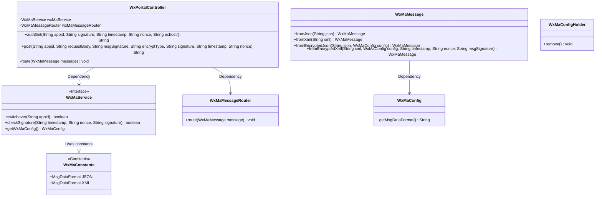
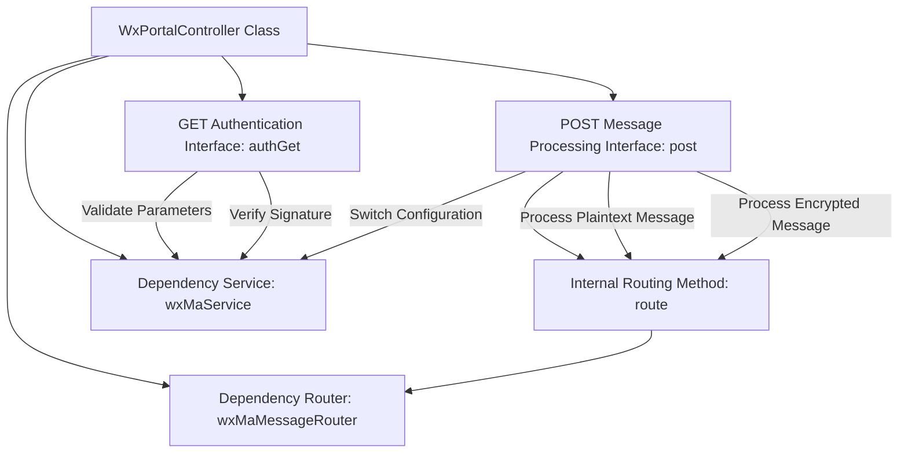
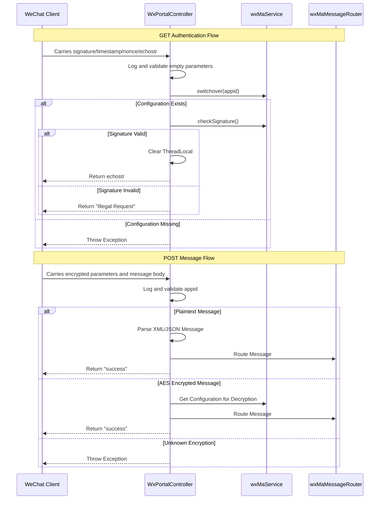

# Basic Information

|      |      |
|------|------|
| Name | WxPortalController |
| Language | .java |
| Code Path | weixin-java-miniapp-demo/src/main/java/com/github/binarywang/demo/wx/miniapp/controller/WxPortalController.java |
| Package Name | com.github.binarywang.demo.wx.miniapp.controller |
| Dependencies | ['cn.binarywang.wx.miniapp.api.WxMaService', 'cn.binarywang.wx.miniapp.bean.WxMaMessage', 'cn.binarywang.wx.miniapp.constant.WxMaConstants', 'cn.binarywang.wx.miniapp.message.WxMaMessageRouter', 'cn.binarywang.wx.miniapp.util.WxMaConfigHolder', 'lombok.AllArgsConstructor', 'lombok.extern.slf4j.Slf4j', 'org.apache.commons.lang3.StringUtils', 'org.springframework.web.bind.annotation', 'java.util.Objects'] |
| Brief Description | WeChat Mini Program Controller, handling authentication and message requests, verifying signatures and routing messages, supporting plaintext and AES encryption, returning success or error responses. |

# Description

This is a backend controller class for a WeChat Mini Program, containing two core interfaces. The GET interface is used for WeChat server authentication, receiving parameters such as signature, timestamp, nonce, and random string, and returns the random string upon successful verification. The POST interface handles WeChat message push, supporting both plaintext and AES-encrypted formats. It automatically parses JSON or XML format messages based on configuration, processes the messages through a message router, and returns "success." Both interfaces will clean up the configuration information stored in ThreadLocal at the end.

# Class Summary

| Name   | Type  | Description |
|-------|------|-------------|
| WxPortalController | class | WeChat Mini Program Controller Class, handling authentication and message requests, verifying signatures and routing messages, supporting plaintext and AES encrypted formats, with automatic cleanup of thread variables. |

## Class WxPortalController

|      |      |
|------|------|
| Access Modifier | @RestController;@AllArgsConstructor;@RequestMapping("/wx/portal/{appid}");@Slf4j;public |
| Type | class |
| Name | WxPortalController |
| Description | WeChat Mini Program Controller Class, handling authentication and message requests, verifying signatures and routing messages, supporting plaintext and AES encrypted formats, with automatic cleanup of thread variables. |

### UML Class Diagram

Class Diagram Description: This diagram illustrates the structure of a WeChat Mini Program Portal Controller (WxPortalController), which utilizes WeChat Mini Program Service (WxMaService) and Message Router (WxMaMessageRouter) through dependency relationships. The controller contains two main methods: authGet() for handling GET authentication requests and post() for processing POST messages. The system employs the WxMaMessage class to handle message conversion in different formats (JSON/XML) and relies on WxMaConfig to retrieve configuration information. All classes adhere to clear separation of responsibilities, achieving loose coupling through interfaces and utility classes.

### Internal Method Call Graph

Flowchart Description: This flowchart illustrates the core structure of a WeChat Mini Program message processing controller, featuring two main interfaces: GET authentication and POST message handling. The GET interface validates the WeChat server signature through configuration switching and signature verification via wxMaService. The POST interface processes plaintext and AES-encrypted messages, utilizing wxMaMessageRouter for message routing. Both flows conclude by clearing ThreadLocal-stored configuration information, demonstrating a complete request lifecycle and exception handling mechanism.

Sequence Diagram Description: The sequence diagram details the interaction between the WeChat client and the controller, divided into authentication and message processing scenarios. The authentication flow strictly validates parameters and signatures, while the message processing flow handles plaintext and encrypted messages separately based on encryption type, ultimately routing messages through the router component. The entire process showcases collaborative service components, configuration management, and exception handling logic, reflecting the secure communication mechanisms of the WeChat ecosystem.

### Field List

| Name  | Type  | Description |
|-------|-------|------|
| wxMaService | WxMaService | WeChat Mini Program Service Instance |
| wxMaMessageRouter | WxMaMessageRouter | Private immutable instance of WeChat Mini Program message router. |

### Method List

| Name  | Type  | Description |
|-------|-------|------|
| route | void | This method is used to route WeChat Mini Program messages, capturing and logging exceptions. |
| post | String | POST interface for processing WeChat messages, supporting plaintext and AES encryption. After verifying the appid, it parses and routes messages based on their format (JSON/XML), then cleans up ThreadLocal and returns success or error. |
| authGet | String | Process WeChat authentication requests, verify parameters and signatures, and return echostr or error messages. |

