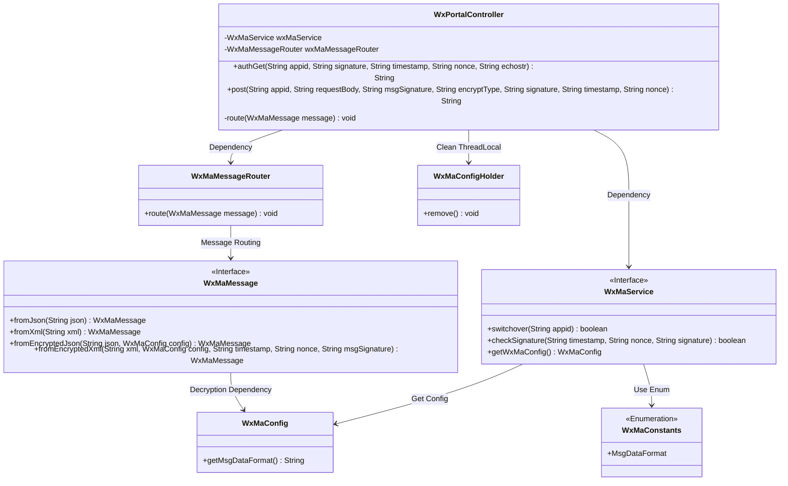
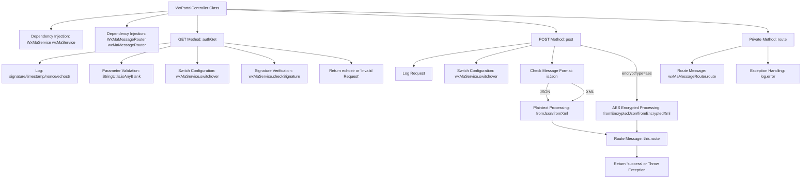

# Basic Information

|      |      |
|------|------|
| Name | WxPortalController |
| Language | .java |
| Code Path | weixin-java-miniapp-demo/src/main/java/com/github/binarywang/demo/wx/miniapp/controller/WxPortalController.java |
| Package Name | com.github.binarywang.demo.wx.miniapp.controller |
| Dependencies | ['cn.binarywang.wx.miniapp.api.WxMaService', 'cn.binarywang.wx.miniapp.bean.WxMaMessage', 'cn.binarywang.wx.miniapp.constant.WxMaConstants', 'cn.binarywang.wx.miniapp.message.WxMaMessageRouter', 'cn.binarywang.wx.miniapp.util.WxMaConfigHolder', 'lombok.AllArgsConstructor', 'lombok.extern.slf4j.Slf4j', 'org.apache.commons.lang3.StringUtils', 'org.springframework.web.bind.annotation', 'java.util.Objects'] |
| Brief Description | WeChat Mini Program controller class, handling GET/POST requests, verifying signatures and routing messages, supporting plaintext and AES encryption, returning error messages on exceptions. |

# Description

The code defines a WeChat Mini Program portal controller class, containing two main interfaces. The GET interface is used for WeChat server authentication verification, receiving parameters such as signature, timestamp, and random string, and returns the original string upon successful validation. The POST interface handles WeChat message push, supporting both plaintext and AES-encrypted formats. It automatically parses JSON or XML format messages based on configuration and processes them through a message router. Both interfaces check the validity of the appid and clean up thread-local storage after processing. The controller logs detailed request information and throws exceptions or returns error prompts for illegal requests.

# Class Summary

| Name   | Type  | Description |
|-------|------|-------------|
| WxPortalController | class | WeChat Mini Program Controller, handling authentication and message requests, verifying signatures and routing messages, supporting plaintext and AES encrypted formats. |

## Class WxPortalController

|      |      |
|------|------|
| Access Modifier | @RestController;@AllArgsConstructor;@RequestMapping("/wx/portal/{appid}");@Slf4j;public |
| Type | class |
| Name | WxPortalController |
| Description | WeChat Mini Program Controller, handling authentication and message requests, verifying signatures and routing messages, supporting plaintext and AES encrypted formats. |

### UML Class Diagram

Class Diagram Description: This diagram illustrates the core structure of a WeChat Mini Program Portal Controller (WxPortalController), which relies on WxMaService for WeChat service switching and signature verification, and uses WxMaMessageRouter for message routing. The controller includes GET/POST request handling methods to process plaintext/AES-encrypted messages, converting message formats via WxMaMessage factory methods. All operations clear the ThreadLocal-stored configuration (WxMaConfigHolder) afterward. The system retrieves message format configurations through WxMaConfig and adheres to the enumeration standards defined by WxMaConstants.

### Internal Method Call Graph

This flowchart illustrates the complete processing logic of the WeChat portal controller. The GET method (authGet) handles WeChat server verification, including parameter validation, configuration switching, and signature verification. The POST method (post) processes business messages, performing different parsing based on encryption type and format (json/xml), ultimately routing for processing. The private method (route) handles actual message routing and exception handling. All methods finally clear the ThreadLocal-stored configuration information.

### Field List

| Name  | Type  | Description |
|-------|-------|------|
| wxMaService | WxMaService | WeChat Mini Program service instance, private and immutable. |
| wxMaMessageRouter | WxMaMessageRouter | Private immutable instance of WeChat Mini Program message router. |

### Method List

| Name  | Type  | Description |
|-------|-------|------|
| post | String | POST interface for handling WeChat requests, verifying the appid and parsing plaintext or AES-encrypted XML/JSON messages, then routing and processing them before returning success or error responses. |
| authGet | String | This is a GET interface for handling WeChat authentication, which verifies the signature parameters and returns the echostr or an error message, including parameter validation and ThreadLocal cleanup. |
| route | void | Route WeChat Mini Program messages and log error messages in case of exceptions. |

