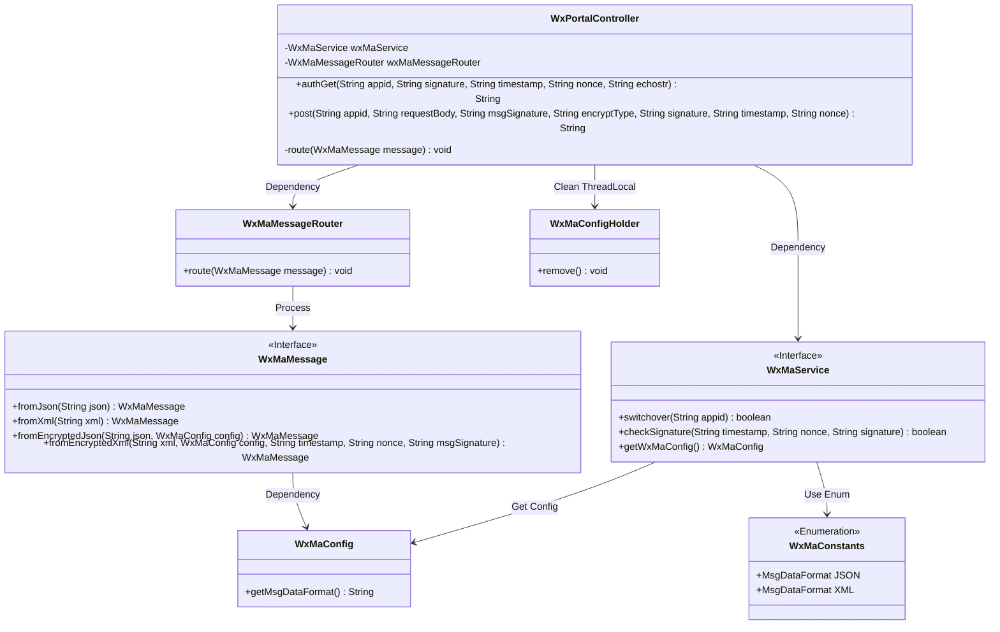
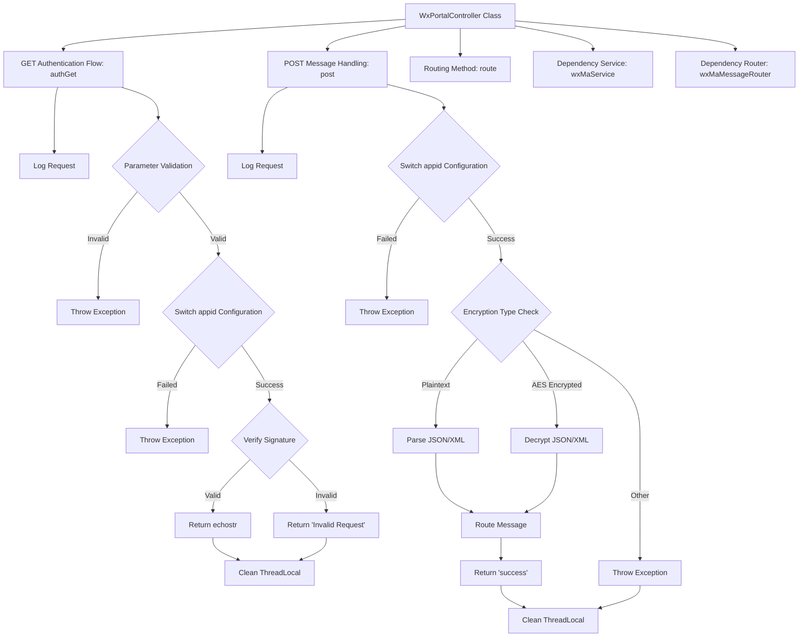
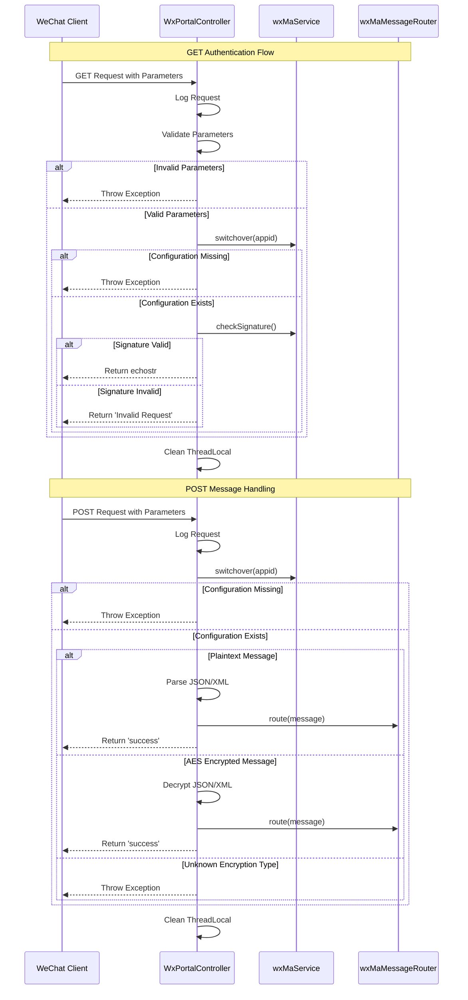

# Basic Information

|      |      |
|------|------|
| Name | WxPortalController |
| Language | .java |
| Code Path | weixin-java-miniapp-demo/src/main/java/com/github/binarywang/demo/wx/miniapp/controller/WxPortalController.java |
| Package Name | com.github.binarywang.demo.wx.miniapp.controller |
| Dependencies | ['cn.binarywang.wx.miniapp.api.WxMaService', 'cn.binarywang.wx.miniapp.bean.WxMaMessage', 'cn.binarywang.wx.miniapp.constant.WxMaConstants', 'cn.binarywang.wx.miniapp.message.WxMaMessageRouter', 'cn.binarywang.wx.miniapp.util.WxMaConfigHolder', 'lombok.AllArgsConstructor', 'lombok.extern.slf4j.Slf4j', 'org.apache.commons.lang3.StringUtils', 'org.springframework.web.bind.annotation', 'java.util.Objects'] |
| Brief Description | WeChat Mini Program controller class, handling GET/POST requests, verifying signatures, and routing messages. GET is used for authentication, POST processes plaintext or AES-encrypted messages, verifies the appid, forwards the message, and returns the result. Clears ThreadLocal after each request. |

# Description

This is a backend controller class for a WeChat Mini Program, containing two main interfaces. The GET interface is used for WeChat server authentication, verifying the signature parameters and returning the echostr string. The POST interface handles WeChat message requests, supporting both plaintext and AES-encrypted formats. It parses the message based on its format, routes it for processing, and returns a success response. Both interfaces check the validity of the appid and clean up the configuration information stored in ThreadLocal after processing.

# Class Summary

| Name   | Type  | Description |
|-------|------|-------------|
| WxPortalController | class | WeChat Mini Program Controller, handling authentication and message requests, verifying signatures and routing messages, supporting plaintext and AES encryption, returning success or error messages. |

## Class WxPortalController

|      |      |
|------|------|
| Access Modifier | @RestController;@AllArgsConstructor;@RequestMapping("/wx/portal/{appid}");@Slf4j;public |
| Type | class |
| Name | WxPortalController |
| Description | WeChat Mini Program Controller, handling authentication and message requests, verifying signatures and routing messages, supporting plaintext and AES encryption, returning success or error messages. |

### UML Class Diagram

Class Diagram Description:
This diagram illustrates the core structure of a WeChat Mini Program Portal Controller (WxPortalController), which handles WeChat server authentication and message encryption/decryption through WxMaService, and routes messages using WxMaMessageRouter. The controller exposes two public methods (GET/POST) for processing verification requests and message pushes respectively, relying on WxMaConfigHolder to manage thread-local variables. The system adheres to the interface segregation principle, with WxMaService and WxMaMessage as key interfaces supporting both JSON/XML data formats, while maintaining constants via the WxMaConstants enumeration. The overall architecture demonstrates clear responsibility division and modular design.

### Internal Method Call Graph

The flowchart and sequence diagram illustrate the complete processing logic of a WeChat Mini Program backend controller. The GET authentication flow includes three key stages: parameter validation, configuration switching, and signature verification. The POST message handling distinguishes between plaintext and encrypted message types for different processing. Both flows incorporate a ThreadLocal cleanup mechanism to ensure thread safety. The sequence diagram clearly presents the interaction sequence and conditional branches between the client, controller, and service components, fully covering the authentication and message handling scenarios for WeChat message push.

### Field List

| Name  | Type  | Description |
|-------|-------|------|
| wxMaService | WxMaService | WeChat Mini Program service instance, private and immutable. |
| wxMaMessageRouter | WxMaMessageRouter | Private immutable instance of the WeChat Mini Program message router. |

### Method List

| Name  | Type  | Description |
|-------|-------|------|
| route | void | The method `route` processes WeChat messages, invokes the routing functionality, and captures exceptions to log them. |
| post | String | POST interface for handling WeChat requests, verifying appid and parsing plaintext or AES-encrypted XML/JSON messages, returning "success" after processing, and clearing ThreadLocal while reporting errors in case of exceptions. |
| authGet | String | This is a GET interface for handling WeChat server authentication requests, which verifies the signature parameters and returns the echostr or an error message. |

