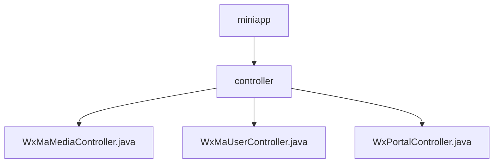

# Basic Information

|      |      |
|------|------|
| Name | controller |
| Language | .java |
| Code Path | weixin-java-miniapp-demo/src/main/java/com/github/binarywang/demo/wx/miniapp/controller |
| Package Name | docs.src.main.java.com.github.binarywang.demo.wx.miniapp.controller |
| Brief Description | WeChat Mini Program Controller Classes: The Media Controller handles file uploads and downloads; the User Controller manages login, user information, and phone numbers; the Portal Controller handles WeChat server authentication and message routing. All include thread-safe cleanup and exception handling. |

# Description

## Overview  
This module serves as the core controller for the WeChat Mini Program backend, providing three major functionalities: media management, user services, and message gateway. It employs ThreadLocal to ensure thread safety, validates the appid for all interfaces, and automatically cleans up resources. Key data structures include MediaId lists, user session information (sessionKey/openid), and WeChat message objects. It relies on WeChat server APIs for operations such as media upload/download and user information decryption. For example, the media controller handles temporary materials, the user controller decrypts sensitive data, and the gateway controller verifies message signatures.  

## Key Business Scenarios  
Media management supports batch upload and download of temporary files, similar to a CDN relay service. User services implement a login chain via code, decrypting sensitive information (e.g., phone numbers) after validation. The message gateway adopts duplex communication, with GET completing server authentication and POST handling encrypted/plaintext message routing. A typical workflow includes: user login → fetching information → uploading media → receiving messages. API types encompass RESTful interfaces and WeChat callback interfaces, such as distinguishing multi-tenant configurations by appid and returning standardized errors in case of exceptions.

### Package Internal Structure View

This flowchart illustrates the controller module structure of a WeChat Mini Program demo project. The top-level node is miniapp, which contains the controller directory. Within the controller directory, there are three Java controller files: WxMaMediaController, WxMaUserController, and WxPortalController, handling media, user, and portal-related functionalities respectively.

# File List

| Name   | Type  | Description |
|-------|------|-------------|
| [WxMaMediaController.java](WxMaMediaController.md) | file | WeChat Mini Program media controller, providing functionality for uploading and downloading temporary materials. Upload requires appid verification, supports multi-file processing, and returns a media_id list. Download requires verification of both appid and media_id, returning the media file. Clears ThreadLocal after operations. |
| [WxMaUserController.java](WxMaUserController.md) | file | WeChat Mini Program User Controller, providing interfaces for login, retrieving user information, and phone number. It requires validation of appid and parameters, returns JSON data, handles exceptions, and cleans up ThreadLocal. |
| [WxPortalController.java](WxPortalController.md) | file | This is a WeChat Mini Program backend controller class that handles authentication and message requests from the WeChat server. It includes GET and POST methods, used for server verification and receiving user messages respectively, supporting plaintext and AES-encrypted messages. After signature verification, it routes the processing and returns a response. |

