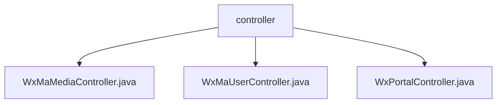

# Basic Information

|      |      |
|------|------|
| Name | controller |
| Language | .java |
| Code Path | weixin-java-miniapp-demo/src/main/java/com/github/binarywang/demo/wx/miniapp/controller |
| Package Name | docs.src.main.java.com.github.binarywang.demo.wx.miniapp.controller |
| Brief Description | The three controller classes in the WeChat Mini Program: the Media Management class handles file uploads and downloads; the User Management class provides interfaces for login, user information, and phone numbers; the Backend class handles WeChat server authentication and message routing. All classes validate the appid and clean up ThreadLocal. |

# Description

## Overview  
This module is a collection of core backend controllers for WeChat Mini Programs, primarily responsible for three major functions: media file management, user session management, and interaction with the WeChat server. The interface specifications uniformly require validation of appid validity and cleanup of configuration information stored in ThreadLocal after processing. Key data structures include media_id (media identifier), user session information objects, and WeChat message encapsulation bodies. External dependencies include the WeChat Open Platform SDK and the Lombok utility library. For example, the media controller handles multi-file uploads and returns a list of media_ids, while the user controller decrypts and returns mobile phone number information.  

## Main Business Scenarios  
The module supports three typical types of interactions: media file upload/download (similar to cloud storage interfaces), user authentication processes (similar to OAuth2.0), and WeChat server message routing (similar to an event bus pattern). The complete business process consists of three stages: credential verification → business processing → resource cleanup. For example, during user login, the code is verified and the openid is returned. Integration use cases cover file transfer, session management, and message push, such as processing encrypted WeChat messages via a POST interface and returning a "success" response.

### Package Internal Structure View

This flowchart illustrates the structure of three controller files within the controller directory of a WeChat Mini Program demo project. The top-level node represents the controller folder, which directly contains three Java controller class files: WxMaMediaController, WxMaUserController, and WxPortalController. These handle the business logic for media management, user management, and portal requests respectively.

# File List

| Name   | Type  | Description |
|-------|------|-------------|
| [WxMaMediaController.java](WxMaMediaController.md) | file | WeChat Mini Program Material Controller, providing upload and download functions for temporary materials. Upload returns a list of media_ids, download returns files. Requires validation of appid validity and cleans up ThreadLocal after operations. |
| [WxMaUserController.java](WxMaUserController.md) | file | WeChat Mini Program User Controller, providing interfaces for login, retrieving user information and phone number, verifying appid and user data, returning JSON results, and cleaning up ThreadLocal. |
| [WxPortalController.java](WxPortalController.md) | file | WeChat Mini Program controller class, handling GET/POST requests, verifying signatures, and routing messages. GET is used for authentication, while POST processes plaintext or AES-encrypted messages, forwards them after validating the appid, and returns the result. Clears ThreadLocal after each request. |

