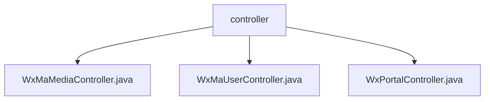

# Basic Information

|      |      |
|------|------|
| Name | controller |
| Language | .java |
| Code Path | weixin-java-miniapp-demo/src/main/java/com/github/binarywang/demo/wx/miniapp/controller |
| Package Name | docs.src.main.java.com.github.binarywang.demo.wx.miniapp.controller |
| Brief Description | The three controller classes in the WeChat Mini Program: The Media Management class handles file uploads and downloads; the User Management class provides interfaces for login, user information, and phone numbers; the Background class handles WeChat authentication and message push. All classes clean up ThreadLocal configurations, log activities, and handle exceptions. |

# Description

## Overview  
This module is a collection of core backend controllers for WeChat Mini Programs, utilizing ThreadLocal to manage thread-safe configurations in a manner similar to an event bus pattern. It primarily provides three major functionalities: media file management (upload/download), user session management (login/info decryption), and interaction with the WeChat server (authentication/message handling). Unified interface specifications include: POST/PGET request processing, AppID validity verification, automatic ThreadLocal cleanup after operations, JSON-formatted responses, and exception handling. Key data structures include MediaID lists, user session information (SessionKey/OpenID), and WeChat message bodies (JSON/XML). It relies on the WeChat JSSDK, AES encryption libraries, and message routers, such as invoking WeChat server interfaces via JNI.

## Core Business Scenarios  
Typical application patterns include: users obtaining SessionKey after login to decrypt personal information or phone numbers; media files being uploaded to WeChat's temporary material library and downloaded via MediaID; and automated backend processing of messages pushed by the WeChat server. Business processes follow a "validate-process-cleanup" model, such as verifying the AppID before calling WeChat APIs during file uploads and clearing thread configurations afterward. Integration examples include: the OAuth2.0 flow for exchanging code for sessionKey, AES-ECB decryption of user data, and batch uploading of multiple files. All interfaces maintain a stateless design, akin to RESTful style, ensuring thread safety under high concurrency.

### Package Internal Structure View

This flowchart illustrates the controller hierarchy in a WeChat Mini Program demo project, which includes three main controller files: WxMaMediaController, WxMaUserController, and WxPortalController. All of them reside under the controller directory and are responsible for handling different types of WeChat Mini Program requests. This structure is a typical controller organization in Spring Boot projects, where each controller implements functionalities for specific business modules.

# File List

| Name   | Type  | Description |
|-------|------|-------------|
| [WxMaMediaController.java](WxMaMediaController.md) | file | This is a WeChat Mini Program media controller class that includes functionalities for uploading and downloading temporary materials. The upload method takes an appid and a request, verifies the configuration, processes multi-file uploads, and returns a list of media_ids. The download method retrieves the material file based on the appid and mediaId. It cleans up ThreadLocal after operations. |
| [WxMaUserController.java](WxMaUserController.md) | file | WeChat Mini Program User Controller, providing interfaces for login, retrieving user information, and phone number. It returns JSON results after verifying the appid and user data, and clears ThreadLocal after each request. |
| [WxPortalController.java](WxPortalController.md) | file | WeChat Mini Program Controller, handling authentication and message requests, verifying signatures and routing messages, supporting plaintext and AES encryption, returning success or error responses. |

