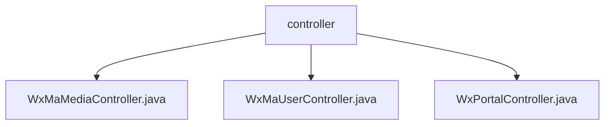

# Basic Information

|      |      |
|------|------|
| Name | controller |
| Language | .java |
| Code Path | weixin-java-miniapp-demo/src/main/java/com/github/binarywang/demo/wx/miniapp/controller |
| Package Name | docs.src.main.java.com.github.binarywang.demo.wx.miniapp.controller |
| Brief Description | The three controller classes in the WeChat Mini Program: the Media Controller handles file uploads and downloads; the User Controller manages login, user information, and phone numbers; the Portal Controller handles authentication and message routing. All include ThreadLocal cleanup and logging. |

# Description

## Overview  
This module is a collection of core backend controllers for WeChat Mini Programs, primarily responsible for three key functions: media file management, user information processing, and message routing. The interface specifications adhere to the WeChat Open Platform standards, incorporating common logic such as signature verification, data decryption, and ThreadLocal cleanup. Key data structures include Media_id lists, user session information (sessionKey/openid), and message routing configurations. External dependencies include WeChat JSSDK, Spring Boot, and Lombok. For example, uploading temporary materials returns a media_id, user login returns a sessionKey, and message processing supports AES encryption.  

## Key Business Scenarios  
The module comprehensively covers typical backend interactions for Mini Programs: media file upload/download (similar to CDN management), user login and information retrieval (similar to the OAuth2.0 flow), and message reception and routing (similar to an event bus pattern). Business processes uniformly consist of three stages: request validation, business processing, and resource cleanup. For instance, user login requires validating the code's effectiveness, and message processing supports both JSON and XML formats. Typical applications include exchanging a code for a user's openid, decrypting encrypted phone numbers, and handling WeChat Official Account message events. API types encompass RESTful interfaces and WeChat callback interfaces.

### Package Internal Structure View

This flowchart illustrates the controller hierarchy in the WeChat Mini Program demo project, which includes three main controller files: WxMaMediaController handles media-related requests, WxMaUserController manages user operations, and WxPortalController serves as the portal entry point. All controllers reside at the same level without deeper subdirectory structures, reflecting a clean MVC architectural design pattern.

# File List

| Name   | Type  | Description |
|-------|------|-------------|
| [WxMaMediaController.java](WxMaMediaController.md) | file | WeChat Mini Program Media Controller, providing functionality for uploading and downloading temporary materials. Upload requires appid verification, supports multi-file processing, and returns a list of media_ids. Download requires verification of both appid and media_id, returning the media file. Clears ThreadLocal after operations. |
| [WxMaUserController.java](WxMaUserController.md) | file | WeChat Mini Program User Controller, providing interfaces for login, user information, and mobile number retrieval. It verifies the appid and user data before returning JSON results, and clears ThreadLocal after each request. |
| [WxPortalController.java](WxPortalController.md) | file | WeChat Mini Program controller class, handling GET/POST requests, verifying signatures, and routing messages. GET is used for WeChat server authentication, while POST processes plaintext or AES-encrypted messages, forwards them after validating the appid, and returns success or error responses. |

