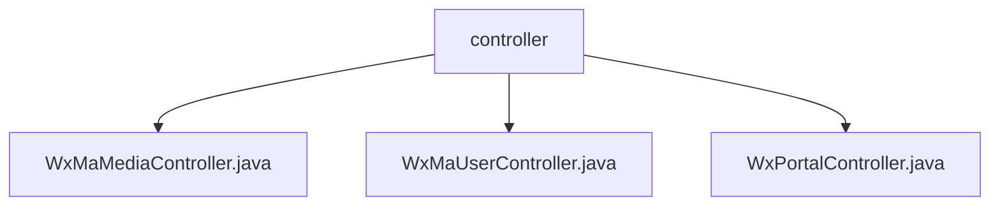

# Basic Information

|      |      |
|------|------|
| Name | controller |
| Language | .java |
| Code Path | weixin-java-miniapp-demo/src/main/java/com/github/binarywang/demo/wx/miniapp/controller |
| Package Name | docs.src.main.java.com.github.binarywang.demo.wx.miniapp.controller |
| Brief Description | WeChat Mini Program Controller Classes: The Media Controller handles file uploads and downloads, the User Controller manages login/information/phone number functionalities, and the Portal Controller is responsible for authentication and message processing. All interfaces validate the appid and ensure thread safety. |

# Description

## Overview  
This module is a collection of core backend controllers for WeChat Mini Programs, primarily responsible for three key functionalities: media file management, user session handling, and WeChat message interaction. The interface specifications uniformly adopt the RESTful style, incorporating appid parameter validation and a ThreadLocal cleanup mechanism, with JSON format data returned. Key data structures include Media_id lists, user session information (sessionKey/openid), and WeChat message bodies (JSON/XML). External dependencies include the WeChat server API, AES encryption library, and message router. For example, the media controller handles file uploads and downloads, the user controller manages login authorization, and the gateway controller validates message legitimacy.  

## Key Business Scenarios  
The module supports three typical types of interactions: media file transfer (similar to FTP services), user identity authentication (similar to the OAuth flow), and WeChat message processing (similar to an event bus pattern). Business processes follow a "validate-process-cleanup" model. For instance, user login first verifies the code, then retrieves session information, and finally cleans up thread data. Integration examples include uploading temporary materials, decrypting user phone numbers, and processing encrypted push messages. All interfaces strictly validate appid to ensure multi-tenant isolation, with detailed logs recorded for troubleshooting in case of exceptions.

### Package Internal Structure View

This flowchart illustrates the structure of three controller files under the controller directory in the WeChat Mini Program demo project. The three Java controller files - WxMaMediaController, WxMaUserController, and WxPortalController - are directly subordinate to the controller directory without any deeper subdirectory hierarchy. These three controllers handle business logic related to media, user, and portal functionalities respectively.

# File List

| Name   | Type  | Description |
|-------|------|-------------|
| [WxMaMediaController.java](WxMaMediaController.md) | file | WeChat Mini Program Media Controller, providing functionality for uploading and downloading temporary materials. Uploading returns a list of media_ids, while downloading returns media files. It verifies the validity of appid, handles multi-file uploads, and cleans up ThreadLocal resources. |
| [WxMaUserController.java](WxMaUserController.md) | file | WeChat Mini Program User Controller, providing interfaces for login, retrieving user information and phone numbers, verifying appid and user data, returning results in JSON format, handling exceptions, and cleaning up ThreadLocal. |
| [WxPortalController.java](WxPortalController.md) | file | WeChat Mini Program controller class, handling GET/POST requests, verifying signatures and routing messages, supporting plaintext and AES encryption, returning error messages on exceptions. |

