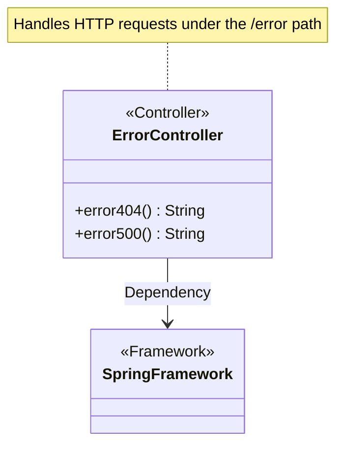
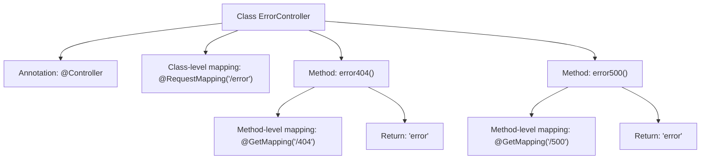

# Basic Information

|      |      |
|------|------|
| Name | ErrorController |
| Language | .java |
| Code Path | weixin-java-miniapp-demo/src/main/java/com/github/binarywang/demo/wx/miniapp/error/ErrorController.java |
| Package Name | com.github.binarywang.demo.wx.miniapp.error |
| Dependencies | ['org.springframework.stereotype.Controller', 'org.springframework.web.bind.annotation.GetMapping', 'org.springframework.web.bind.annotation.RequestMapping'] |
| Brief Description | This is a Spring MVC controller that handles 404 and 500 error requests, returning error pages. |

# Description

This is a Spring MVC controller class specifically designed to handle error page requests. The class is named ErrorController and is mapped to the "/error" path via the @RequestMapping annotation. It contains two GET request handling methods: error404() for the 404 error path "/error/404" and error500() for the 500 error path "/error/500". Both methods return a view string named "error" for rendering the error pages.

# Class Summary

| Name   | Type  | Description |
|-------|------|-------------|
| ErrorController | class | The ErrorController handles 404 and 500 errors, returning a unified error page. |

## Class ErrorController

|      |      |
|------|------|
| Access Modifier | @Controller;@RequestMapping("/error");public |
| Type | class |
| Name | ErrorController |
| Description | The ErrorController handles 404 and 500 errors, returning a unified error page. |

### UML Class Diagram

Class Diagram Description: This diagram illustrates a Spring MVC ErrorController class annotated with @Controller, which handles HTTP requests under the "/error" path. The class contains two public methods, error404() and error500(), corresponding to GET requests for "/404" and "/500" paths respectively, both returning the "error" view string. The class depends on the core functionality of the Spring Framework, representing a typical MVC controller implementation structure.

### Internal Method Call Graph

This flowchart illustrates the structure of the Spring MVC controller `ErrorController`, which includes a class-level `@RequestMapping` and two methods handling different HTTP error codes. Each method specifies path mappings (/404 and /500) via `@GetMapping` and returns the view name "error". The class is annotated with `@Controller`, indicating it is a component that handles HTTP requests. The overall design centralizes routing logic for 404 and 500 error pages.

### Field List

| Name  | Type  | Description |
|-------|-------|------|

### Method List

| Name  | Type  | Description |
|-------|-------|------|
| error500 | String | This is a Spring MVC GET request handling method with the path "/500", which returns the string "error". |
| error404 | String | Spring controller method, handling GET request path "/404", returning the string "error". |

