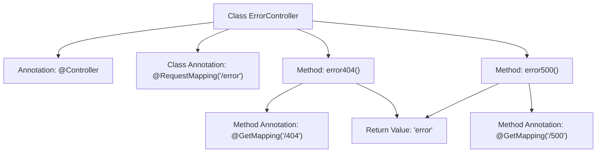

# Basic Information

|      |      |
|------|------|
| Name | ErrorController |
| Language | .java |
| Code Path | weixin-java-miniapp-demo/src/main/java/com/github/binarywang/demo/wx/miniapp/error/ErrorController.java |
| Package Name | com.github.binarywang.demo.wx.miniapp.error |
| Dependencies | ['org.springframework.stereotype.Controller', 'org.springframework.web.bind.annotation.GetMapping', 'org.springframework.web.bind.annotation.RequestMapping'] |
| Brief Description | The ErrorController handles 404 and 500 errors, returning a unified error page. |

# Description

This is a Spring MVC controller class specifically designed to handle error page requests. The class is annotated with `@Controller`, indicating it is a controller component. The `@RequestMapping` annotation specifies the base path as `/error`. The class contains two methods: the `error404` method handles GET requests for HTTP 404 errors, mapped to the path `/error/404`; the `error500` method handles GET requests for HTTP 500 errors, mapped to the path `/error/500`. Both methods return a view string named `error`, indicating that the `error` template page will be rendered to display the error information.

# Class Summary

| Name   | Type  | Description |
|-------|------|-------------|
| ErrorController | class | The ErrorController handles 404 and 500 errors, returning a unified error page. |


## Class ErrorController

|      |      |
|------|------|
| Access Modifier | @Controller;@RequestMapping("/error");public |
| Type | class |
| Name | ErrorController |
| Description | The ErrorController handles 404 and 500 errors, returning a unified error page. |


### UML Class Diagram

```mermaid
classDiagram
    class ErrorController {
        <<Controller>>
        +error404() String
        +error500() String
    }
    ErrorController --> SpringFramework : Dependency
    note for ErrorController "Controller for handling /404 and /500 error requests"

    <<Interface>> SpringFramework {
        <<Spring MVC Framework Interface>>
    }
```

This code demonstrates a Spring MVC error controller class designed to handle 404 and 500 error requests. The ErrorController class is annotated with @Controller, indicating it is a Spring MVC controller, and defines the base path "/error" through @RequestMapping. The class contains two GET request handling methods: error404() and error500(), corresponding to 404 and 500 error paths respectively, both returning the same "error" view name. This class relies on the MVC functionality provided by the Spring framework to implement request mapping and processing.


### Internal Method Call Graph



This flowchart illustrates the structure of a Spring MVC ErrorController, featuring two methods handling different error paths. The class-level annotations @Controller and @RequestMapping define the base path, while the two methods process 404 and 500 error requests respectively via @GetMapping, both returning the view name "error". Arrows clearly indicate the relationships between annotations, methods, and return values.

### Field List

| Name  | Type  | Description |
|-------|-------|------|

### Method List

| Name  | Type  | Description |
|-------|-------|------|
| error500 | String | This is a Spring MVC GET request handling method, mapped to the path "/500", which returns the string "error". |
| error404 | String | This is a Spring MVC GET request handler method with the path "/404", which returns the string "error". |


