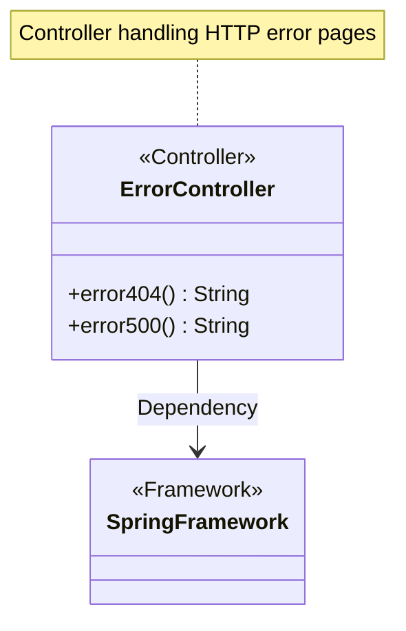
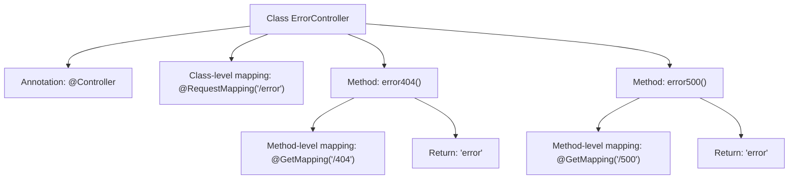

# Basic Information

|      |      |
|------|------|
| Name | ErrorController |
| Language | .java |
| Code Path | weixin-java-miniapp-demo/src/main/java/com/github/binarywang/demo/wx/miniapp/error/ErrorController.java |
| Package Name | com.github.binarywang.demo.wx.miniapp.error |
| Dependencies | ['org.springframework.stereotype.Controller', 'org.springframework.web.bind.annotation.GetMapping', 'org.springframework.web.bind.annotation.RequestMapping'] |
| Brief Description | The ErrorController handles 404 and 500 errors, returning a unified error page. |

# Description

This is a Spring MVC controller class specifically designed to handle error page requests. The class is named ErrorController and is mapped to the "/error" path via the @RequestMapping annotation. The class contains two methods for handling GET requests: the error404 method processes requests for the "/404" path, and the error500 method processes requests for the "/500" path. Both methods return a view string named "error," indicating that they will render the same error page template. This controller is primarily used to display custom error pages corresponding to HTTP error status codes such as 404 and 500.

# Class Summary

| Name   | Type  | Description |
|-------|------|-------------|
| ErrorController | class | The ErrorController class handles 404 and 500 errors, returning the error page. |

## Class ErrorController

|      |      |
|------|------|
| Access Modifier | @Controller;@RequestMapping("/error");public |
| Type | class |
| Name | ErrorController |
| Description | The ErrorController class handles 404 and 500 errors, returning the error page. |

### UML Class Diagram

Class Diagram Description:
This diagram illustrates a Spring MVC controller class ErrorController, annotated with @Controller, which handles HTTP requests under the "/error" path. The class contains two public methods: error404() and error500(), corresponding to 404 and 500 error page requests respectively, both returning the "error" view name. The class relies on the core functionalities of the Spring framework, implementing request routing mappings through @RequestMapping and @GetMapping annotations. This represents a typical Spring Web MVC controller implementation that centrally manages system error page routing.

### Internal Method Call Graph

This flowchart illustrates the structure of the ErrorController class in Spring MVC, including the class-level @RequestMapping annotation and two methods handling different error paths. Each method maps to a specific error code path (/404 and /500) via @GetMapping, both returning the "error" view name. The controller class is marked with @Controller, indicating it's a component handling HTTP requests. The overall design is intended to centralize the logic for system error page redirection.

### Field List

| Name  | Type  | Description |
|-------|-------|------|

### Method List

| Name  | Type  | Description |
|-------|-------|------|
| error500 | String | Spring MVC interface, GET request path "/500", returns the string "error". |
| error404 | String | Spring MVC controller method, handling GET request path "/404", returning the string "error". |

