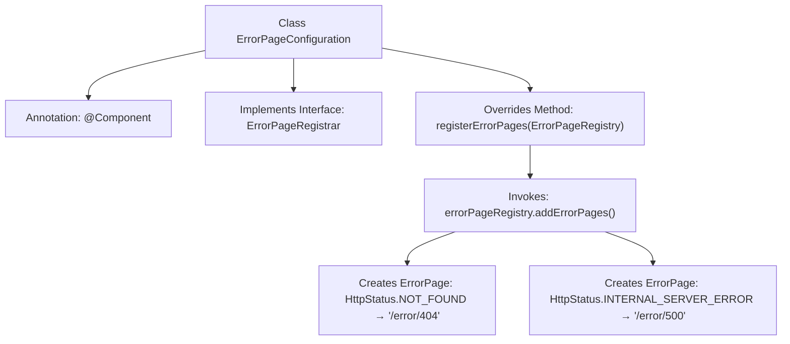

# Basic Information

|      |      |
|------|------|
| Name | ErrorPageConfiguration |
| Language | .java |
| Code Path | weixin-java-miniapp-demo/src/main/java/com/github/binarywang/demo/wx/miniapp/error/ErrorPageConfiguration.java |
| Package Name | com.github.binarywang.demo.wx.miniapp.error |
| Dependencies | ['org.springframework.boot.web.server.ErrorPage', 'org.springframework.boot.web.server.ErrorPageRegistrar', 'org.springframework.boot.web.server.ErrorPageRegistry', 'org.springframework.http.HttpStatus', 'org.springframework.stereotype.Component'] |
| Brief Description | The ErrorPageConfiguration class registers 404 and 500 error pages, pointing to the paths /error/404 and /error/500 respectively. |

# Description

The code defines a Spring component class named `ErrorPageConfiguration`, which implements the `ErrorPageRegistrar` interface. It overrides the `registerErrorPages` method to register two error pages via the `ErrorPageRegistry`: redirecting to the `/error/404` path when a 404 status code occurs, and to the `/error/500` path when a 500 status code occurs. This configuration class is used to handle common HTTP errors in web applications.

# Class Summary

| Name   | Type  | Description |
|-------|------|-------------|
| ErrorPageConfiguration | class | The Java class ErrorPageConfiguration implements the ErrorPageRegistrar interface, registering the handling paths for 404 and 500 error pages. |


## Class ErrorPageConfiguration

|      |      |
|------|------|
| Access Modifier | @Component;public |
| Type | class |
| Name | ErrorPageConfiguration |
| Description | The Java class ErrorPageConfiguration implements the ErrorPageRegistrar interface, registering the handling paths for 404 and 500 error pages. |


### UML Class Diagram

```mermaid
classDiagram
    class ErrorPageConfiguration {
        +registerErrorPages(ErrorPageRegistry errorPageRegistry) void
    }
    <<Interface>> ErrorPageRegistrar
    ErrorPageConfiguration ..|> ErrorPageRegistrar : implements
    class ErrorPageRegistry {
        +addErrorPages(ErrorPage... errorPages) void
    }
    class ErrorPage {
        +ErrorPage(HttpStatus status, String path)
    }
    class HttpStatus {
        <<enumeration>>
        NOT_FOUND
        INTERNAL_SERVER_ERROR
    }
    ErrorPageConfiguration --> ErrorPageRegistry : uses
    ErrorPageConfiguration --> ErrorPage : creates
    ErrorPage --> HttpStatus : depends
```

This code demonstrates a Spring Boot error page configuration class ErrorPageConfiguration, which implements the ErrorPageRegistrar interface. It registers 404 and 500 error handling paths via the registerErrorPages method to ErrorPageRegistry. The class diagram includes core components: configuration class, interface, registry, error page entity, and HTTP status enumeration, clearly reflecting their implementation, dependency, and composition relationships.


### Internal Method Call Graph



This flowchart illustrates the registration process of the Spring component ErrorPageConfiguration. As an implementation class of the ErrorPageRegistrar interface, it registers two error pages with the container by overriding the registerErrorPages method: mapping the 404 status code to the '/error/404' path and the 500 status code to the '/error/500' path. The entire process demonstrates Spring Boot's centralized configuration mechanism for error pages.

### Field List

| Name  | Type  | Description |
|-------|-------|------|

### Method List

| Name  | Type  | Description |
|-------|-------|------|
| registerErrorPages | void | Registration error page, 404 redirects to /error/404, 500 redirects to /error/500. |


