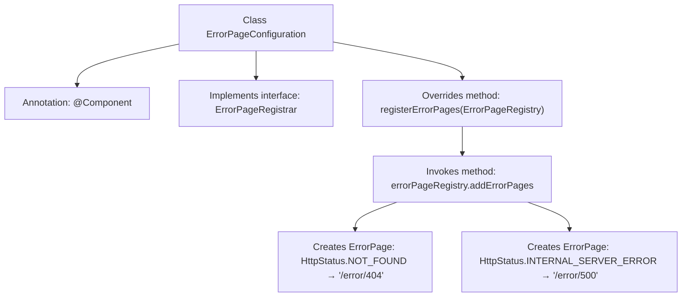

# Basic Information

|      |      |
|------|------|
| Name | ErrorPageConfiguration |
| Language | .java |
| Code Path | weixin-java-miniapp-demo/src/main/java/com/github/binarywang/demo/wx/miniapp/error/ErrorPageConfiguration.java |
| Package Name | com.github.binarywang.demo.wx.miniapp.error |
| Dependencies | ['org.springframework.boot.web.server.ErrorPage', 'org.springframework.boot.web.server.ErrorPageRegistrar', 'org.springframework.boot.web.server.ErrorPageRegistry', 'org.springframework.http.HttpStatus', 'org.springframework.stereotype.Component'] |
| Brief Description | The `ErrorPageConfiguration` class implements the `ErrorPageRegistrar` interface to register the handling paths for 404 and 500 error pages. |

# Description

This is a Spring component class used to configure custom error pages. The class implements the ErrorPageRegistrar interface and overrides the registerErrorPages method to register two error pages: when a 404 status code occurs, it redirects to the /error/404 path, and when a 500 status code occurs, it redirects to the /error/500 path. This configuration adds error page mappings through the ErrorPageRegistry object.

# Class Summary

| Name   | Type  | Description |
|-------|------|-------------|
| ErrorPageConfiguration | class | The Java class ErrorPageConfiguration implements the ErrorPageRegistrar interface, registering 404 and 500 error pages mapped to the paths /error/404 and /error/500 respectively. |


## Class ErrorPageConfiguration

|      |      |
|------|------|
| Access Modifier | @Component;public |
| Type | class |
| Name | ErrorPageConfiguration |
| Description | The Java class ErrorPageConfiguration implements the ErrorPageRegistrar interface, registering 404 and 500 error pages mapped to the paths /error/404 and /error/500 respectively. |


### UML Class Diagram

```mermaid
classDiagram
    class ErrorPageConfiguration {
        +registerErrorPages(ErrorPageRegistry errorPageRegistry) void
    }
    <<Interface>> ErrorPageRegistrar {
        +registerErrorPages(ErrorPageRegistry errorPageRegistry) void
    }
    class ErrorPageRegistry {
        +addErrorPages(ErrorPage... errorPages) void
    }
    class ErrorPage {
        +ErrorPage(HttpStatus status, String path)
    }
    class HttpStatus {
        <<enumeration>>
        NOT_FOUND
        INTERNAL_SERVER_ERROR
    }

    ErrorPageConfiguration --|> ErrorPageRegistrar : implements
    ErrorPageConfiguration --> ErrorPageRegistry : depends on
    ErrorPageConfiguration --> ErrorPage : creates
    ErrorPage --> HttpStatus : uses
```

This code describes a Spring component `ErrorPageConfiguration` that implements the `ErrorPageRegistrar` interface for registering custom error pages. When the system encounters 404 or 500 errors, it automatically redirects to the specified error handling path. The class diagram illustrates relationships between core classes: the configuration class adheres to interface specifications, depends on the registry to add error pages, while error page instances utilize HTTP status code enums to define trigger conditions. The entire structure exemplifies a typical implementation of Spring Boot's error handling mechanism.


### Internal Method Call Graph



This flowchart illustrates the core logic of a Spring Boot error page configuration class. ErrorPageConfiguration is registered as a component in the container. By implementing the registerErrorPages method of the ErrorPageRegistrar interface, it registers custom error page paths for two HTTP error status codes (404 and 500) with the system. The process clearly demonstrates the complete call chain from class definition to specific error page binding, reflecting Spring Boot's error handling mechanism.

### Field List

| Name  | Type  | Description |
|-------|-------|------|

### Method List

| Name  | Type  | Description |
|-------|-------|------|
| registerErrorPages | void | Registration error page, 404 redirects to /error/404, 500 redirects to /error/500. |


