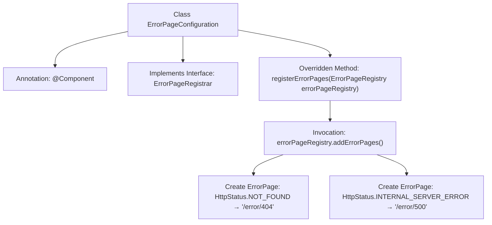

# Basic Information

|      |      |
|------|------|
| Name | ErrorPageConfiguration |
| Language | .java |
| Code Path | weixin-java-miniapp-demo/src/main/java/com/github/binarywang/demo/wx/miniapp/error/ErrorPageConfiguration.java |
| Package Name | com.github.binarywang.demo.wx.miniapp.error |
| Dependencies | ['org.springframework.boot.web.server.ErrorPage', 'org.springframework.boot.web.server.ErrorPageRegistrar', 'org.springframework.boot.web.server.ErrorPageRegistry', 'org.springframework.http.HttpStatus', 'org.springframework.stereotype.Component'] |
| Brief Description | Define the error page configuration class and register the handling paths for 404 and 500 errors. |

# Description

The code defines a Spring component class named ErrorPageConfiguration, which implements the ErrorPageRegistrar interface. It overrides the registerErrorPages method and registers two error pages via the passed-in ErrorPageRegistry object: when a 404 status code occurs, it redirects to the /error/404 path, and when a 500 status code occurs, it redirects to the /error/500 path. This configuration class is used to customize the application's error page handling logic.

# Class Summary

| Name   | Type  | Description |
|-------|------|-------------|
| ErrorPageConfiguration | class | The ErrorPageConfiguration class registers 404 and 500 error pages, pointing to the paths /error/404 and /error/500 respectively. |


## Class ErrorPageConfiguration

|      |      |
|------|------|
| Access Modifier | @Component;public |
| Type | class |
| Name | ErrorPageConfiguration |
| Description | The ErrorPageConfiguration class registers 404 and 500 error pages, pointing to the paths /error/404 and /error/500 respectively. |


### UML Class Diagram

```mermaid
classDiagram
    class ErrorPageConfiguration {
        +registerErrorPages(ErrorPageRegistry errorPageRegistry) void
    }
    <<Interface>> ErrorPageRegistrar {
        +registerErrorPages(ErrorPageRegistry errorPageRegistry) void
    }
    class ErrorPageRegistry {
        +addErrorPages(ErrorPage... errorPages) void
    }
    class ErrorPage {
        -HttpStatus status
        -String path
        +ErrorPage(HttpStatus status, String path)
    }
    class HttpStatus {
        <<enumeration>>
        NOT_FOUND
        INTERNAL_SERVER_ERROR
        // ...other status codes
    }

    ErrorPageConfiguration --> ErrorPageRegistrar : implements
    ErrorPageConfiguration --> ErrorPageRegistry : depends on
    ErrorPageConfiguration --> ErrorPage : creates
    ErrorPage --> HttpStatus : uses enum
```

Class Diagram Description: This diagram illustrates the core structure of Spring Boot's error page configuration. The ErrorPageConfiguration, as a @Component, implements the ErrorPageRegistrar interface and registers multiple ErrorPage instances with the ErrorPageRegistry via the registerErrorPages method. Each ErrorPage binds a specific HTTP status code (e.g., 404/500) to an error handling path, where HttpStatus is an enumeration type. The overall structure demonstrates a declarative registration mechanism for error pages, with clear hierarchies that align with Spring's dependency injection pattern.


### Internal Method Call Graph



This code represents a Spring component class that implements the ErrorPageRegistrar interface for registering custom error pages. When the system encounters 404 or 500 errors, it automatically redirects to specified error handling paths. The flowchart illustrates the complete call chain from class declaration to method implementation, including component annotation marking, interface implementation relationships, error page registration logic, and the configuration process for two specific error pages. The entire process demonstrates Spring Boot's error handling mechanism, which simplifies error page management through centralized configuration.

### Field List

| Name  | Type  | Description |
|-------|-------|------|

### Method List

| Name  | Type  | Description |
|-------|-------|------|
| registerErrorPages | void | Registration error page, 404 redirects to /error/404, 500 redirects to /error/500. |


