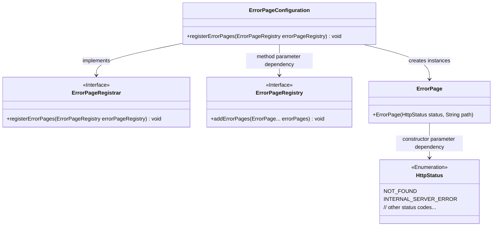
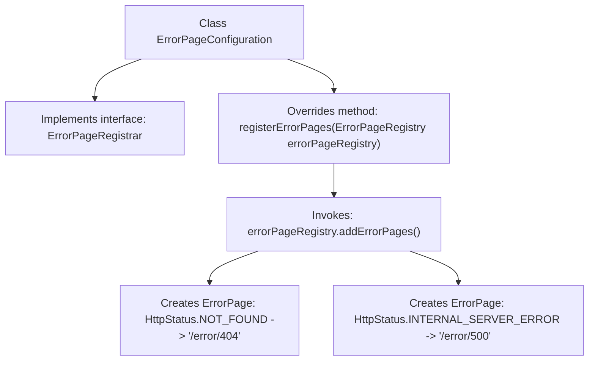

# Basic Information

|      |      |
|------|------|
| Name | ErrorPageConfiguration |
| Language | .java |
| Code Path | weixin-java-miniapp-demo/src/main/java/com/github/binarywang/demo/wx/miniapp/error/ErrorPageConfiguration.java |
| Package Name | com.github.binarywang.demo.wx.miniapp.error |
| Dependencies | ['org.springframework.boot.web.server.ErrorPage', 'org.springframework.boot.web.server.ErrorPageRegistrar', 'org.springframework.boot.web.server.ErrorPageRegistry', 'org.springframework.http.HttpStatus', 'org.springframework.stereotype.Component'] |
| Brief Description | Define the error page configuration class and register the handling paths for 404 and 500 errors. |

# Description

The code defines a Spring component class `ErrorPageConfiguration`, which implements the `ErrorPageRegistrar` interface. By overriding the `registerErrorPages` method, it adds two custom error page mappings to the error page registrar: redirecting to the `/error/404` path when a 404 status code error occurs, and to the `/error/500` path when a 500 status code error occurs. This configuration class is used to centrally manage the system's error page routing.

# Class Summary

| Name   | Type  | Description |
|-------|------|-------------|
| ErrorPageConfiguration | class | Error page configuration class, registering the handling paths for 404 and 500 errors. |

## Class ErrorPageConfiguration

|      |      |
|------|------|
| Access Modifier | @Component;public |
| Type | class |
| Name | ErrorPageConfiguration |
| Description | Error page configuration class, registering the handling paths for 404 and 500 errors. |

### UML Class Diagram

Class Diagram Description: This diagram illustrates the core structure of error page configuration in the Spring framework. The ErrorPageConfiguration component implements the ErrorPageRegistrar interface, registering multiple ErrorPage instances to ErrorPageRegistry via the registerErrorPages method. Each ErrorPage is associated with a specific HttpStatus enumeration value and error handling path, forming a complete error handling mechanism. The diagram clearly demonstrates key relationships including interface implementation, parameter dependencies, and enumeration usage.

### Internal Method Call Graph

This code defines a Spring component ErrorPageConfiguration for registering custom error pages. The class implements the ErrorPageRegistrar interface by overriding the registerErrorPages method, which registers two error pages with the system: the 404 status code maps to the '/error/404' path, and the 500 status code maps to '/error/500'. When corresponding errors occur in the application, it will automatically redirect to the configured paths for handling.

### Field List

| Name  | Type  | Description |
|-------|-------|------|

### Method List

| Name  | Type  | Description |
|-------|-------|------|
| registerErrorPages | void | Registration error page, 404 and 500 errors redirect to /error/404 and /error/500 respectively. |

