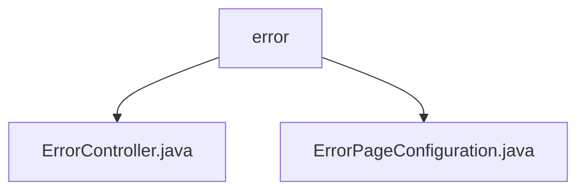

# Basic Information

|      |      |
|------|------|
| Name | error |
| Language | .java |
| Code Path | weixin-java-miniapp-demo/src/main/java/com/github/binarywang/demo/wx/miniapp/error |
| Package Name | docs.src.main.java.com.github.binarywang.demo.wx.miniapp.error |
| Brief Description | The ErrorController class handles requests to the /error path, including 404 and 500 error handling methods, and returns the error view. The ErrorPageConfiguration class registers the redirection paths for 404 and 500 error pages. |

# Description

## Overview  
The core responsibility of this module is to uniformly handle HTTP error status codes (e.g., 404/500) by implementing custom error page routing and rendering through Spring MVC. The interface specification includes path mapping for ErrorController ("/error") and error path registration in ErrorPageConfiguration, which work together to complete error request forwarding. The key data structure is the error page redirection rules managed by ErrorPageRegistry. External dependencies are limited to the Spring Web framework. For example, ErrorController renders a unified error template, while ErrorPageConfiguration binds status codes to paths.  

## Key Business Scenarios  
The module processes errors through the "status code identification → path redirection → template rendering" workflow, similar to the frontend route interception pattern. Typical scenarios include displaying user-friendly pages when a user accesses a non-existent resource (triggering 404) or when a service exception occurs (triggering 500). The interaction mode involves collaboration between Spring's internal error page registration mechanism and controllers, such as automatically routing a 404 status code to /error/404. The complete functionality covers custom display requirements for common HTTP error statuses.

### Package Internal Structure View

This flowchart illustrates the hierarchical structure of the error handling module in the WeChat Mini Program demo project. The root node is the error directory, which contains two subfiles: ErrorController.java (Error Controller) and ErrorPageConfiguration.java (Error Page Configuration). These two files collectively form the core functional module for error handling in the mini program, designed to uniformly manage exception handling and error page display logic.

# File List

| Name   | Type  | Description |
|-------|------|-------------|
| [ErrorController.java](ErrorController.md) | file | The ErrorController handles 404 and 500 errors, returning a unified error page. |
| [ErrorPageConfiguration.java](ErrorPageConfiguration.md) | file | Define the error page configuration class and register the handling paths for 404 and 500 errors. |

