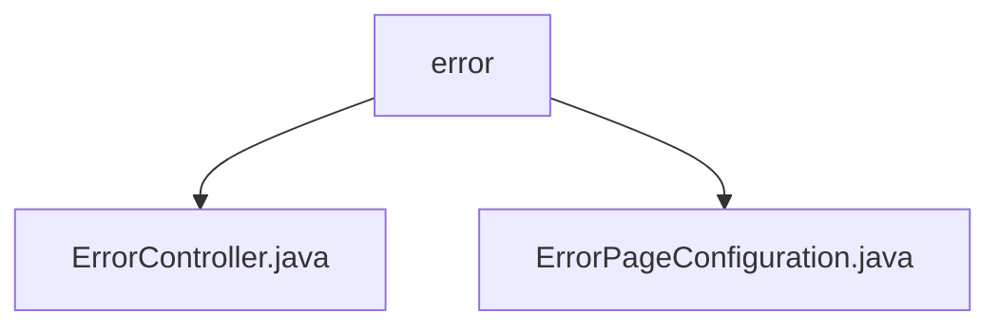

# Basic Information

|      |      |
|------|------|
| Name | error |
| Language | .java |
| Code Path | weixin-java-miniapp-demo/src/main/java/com/github/binarywang/demo/wx/miniapp/error |
| Package Name | docs.src.main.java.com.github.binarywang.demo.wx.miniapp.error |
| Brief Description | The Spring MVC controller handles error pages, mapping the `/error` path and providing methods to handle 404 and 500 errors. The configuration class implements error page registration, redirecting 404 and 500 errors to specified paths respectively. |

# Description

## Overview  
The core responsibility of this module is to uniformly handle HTTP error page responses, including error request routing mapping and view return functionality. The interface specification follows Spring MVC standards, with routes defined using @Controller and @RequestMapping annotations, such as mapping the /404 and /500 paths to corresponding error handling methods. Key data structures include the implementation of the ErrorPageRegistrar interface and the view name "error". External dependencies are limited to the Spring framework. For example, ErrorController returns a unified error view, while ErrorPageConfiguration configures the error path redirection logic.  

## Main Business Scenarios  
The module primarily handles two types of HTTP error scenarios: 404 resource not found and 500 internal server error, similar to the default error page mechanism of web servers. The business process is as follows: when the system throws an exception, ErrorPageConfiguration automatically redirects to a preset path, and ErrorController receives the request and returns a static error view. Typical application patterns include user-friendly prompts for API call failures or non-existent pages, such as unified error handling in WeChat Mini Program backends. All interactions are completed via GET requests.

### Package Internal Structure View

This flowchart illustrates the file structure under the `error` directory in the WeChat Mini Program demo project. The parent node `error` contains two child nodes: `ErrorController.java` and `ErrorPageConfiguration.java`, representing the error handling controller and error page configuration class, respectively. The entire structure is concise and clear, reflecting the basic components of the error handling module.

# File List

| Name   | Type  | Description |
|-------|------|-------------|
| [ErrorController.java](ErrorController.md) | file | Spring controller handles 404 and 500 errors, returning a unified error page. |
| [ErrorPageConfiguration.java](ErrorPageConfiguration.md) | file | Define the error page configuration class and register the handling paths for 404 and 500 errors. |

