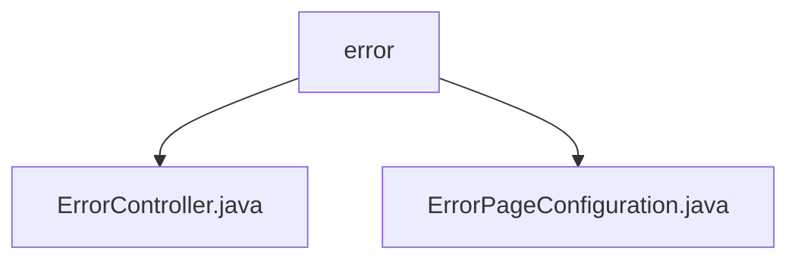

# Basic Information

|      |      |
|------|------|
| Name | error |
| Language | .java |
| Code Path | weixin-java-miniapp-demo/src/main/java/com/github/binarywang/demo/wx/miniapp/error |
| Package Name | docs.src.main.java.com.github.binarywang.demo.wx.miniapp.error |
| Brief Description | The Spring MVC controller ErrorController handles the /error path, including 404 and 500 error handling methods that return the error view. The ErrorPageConfiguration class configures the redirection paths for 404 and 500 error pages. |

# Description

## Overview  
The core responsibility of this module is to uniformly handle error pages in web applications, including error request routing and page redirection configurations. The interface specification adheres to Spring MVC standards, mapping error paths (e.g., /error/404) via Controller and configuring status code redirection logic through Registrar. The key data structure is the ErrorPage object, which maintains the mapping relationship between status codes and paths. The only external dependency is the Spring Web framework. For example, ErrorController handles specific error requests, while ErrorPageConfiguration implements global error routing.  

## Primary Business Scenarios  
The module primarily implements standardized processing workflows for HTTP error status codes (404/500), similar to the gateway error interception pattern. Business interactions are divided into two layers: the Controller responds to specific error requests by returning views, and the Registrar predefines status code redirection rules to form a closed loop. Typical application scenarios include user-friendly prompts for non-existent pages or service exceptions, such as automatically redirecting to a 404 page when accessing an invalid URL. All APIs are server-side rendering interfaces, and integration examples can be seen in the error handling subsystem of the WeChat Mini Program Demo.

### Package Internal Structure View

This flowchart illustrates the directory structure of the error handling module in the WeChat Mini Program demo project. The root node is the 'error' folder, which contains two sub-files: ErrorController.java (Error Controller) and ErrorPageConfiguration.java (Error Page Configuration Class). These two files collectively form the core functional module for error handling in the mini program, designed to uniformly manage exception handling and error page display logic.

# File List

| Name   | Type  | Description |
|-------|------|-------------|
| [ErrorController.java](ErrorController.md) | file | This is a Spring MVC controller that handles 404 and 500 error requests and returns error pages. |
| [ErrorPageConfiguration.java](ErrorPageConfiguration.md) | file | The ErrorPageConfiguration class implements the ErrorPageRegistrar interface to register the handling paths for 404 and 500 error pages. |

