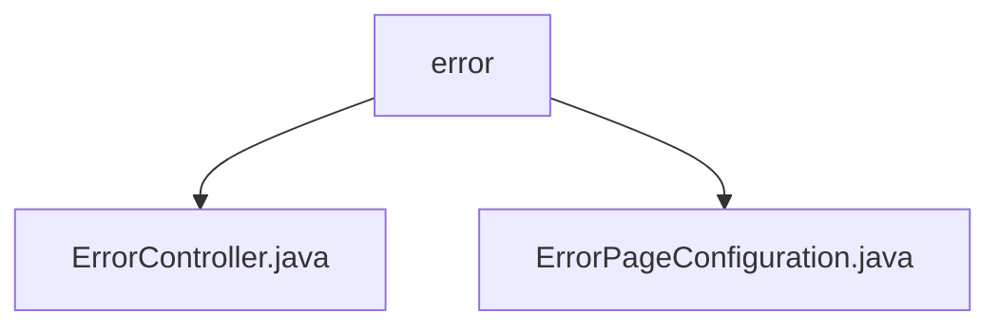

# Basic Information

|      |      |
|------|------|
| Name | error |
| Language | .java |
| Code Path | weixin-java-miniapp-demo/src/main/java/com/github/binarywang/demo/wx/miniapp/error |
| Package Name | docs.src.main.java.com.github.binarywang.demo.wx.miniapp.error |
| Brief Description | The Spring MVC controller handles 404/500 errors and returns the error view. The configuration class registers error pages, with 404 redirecting to /error/404 and 500 redirecting to /error/500. |

# Description

## Overview  
The core responsibility of this module is to uniformly handle HTTP error responses for web applications, including error page routing configuration and view rendering functionality. The interface specification follows the Spring MVC pattern, exposing two endpoints `/error/404` and `/error/500` through the Controller, and implements automatic error path redirection in conjunction with ErrorPageRegistrar. The key data structure is Spring's ErrorPageRegistry, which binds status codes to error paths. The only external dependency required is the Spring Web framework. For example, ErrorController renders the error template, while ErrorPageConfiguration registers the 404/500 redirection logic.  

## Primary Business Scenarios  
The module handles exception flows through the "error code mapping + unified view" pattern, similar to a front-end routing interceptor. When a user accesses a non-existent URL triggering a 404, the system automatically redirects to `/error/404` and renders the error page; server-side exceptions triggering a 500 are directed to `/error/500`. Typical applications include error fallback for WeChat Mini Program backend services, such as displaying a user-friendly error page when an API timeout returns a 500 status code. All API types are synchronous HTTP GET requests, and integration examples can be seen in the error handling chain of the WeChat Mini Program Demo.

### Package Internal Structure View

This flowchart illustrates the file structure under the `error` directory in the WeChat Mini Program demo project. The `error` node serves as the parent, containing two child nodes: `ErrorController.java` and `ErrorPageConfiguration.java`. These files handle error control and error page configuration functionalities, respectively. The overall structure is concise and clear, reflecting the basic components of the error handling module.

# File List

| Name   | Type  | Description |
|-------|------|-------------|
| [ErrorController.java](ErrorController.md) | file | The ErrorController handles 404 and 500 errors, returning a unified error page. |
| [ErrorPageConfiguration.java](ErrorPageConfiguration.md) | file | The ErrorPageConfiguration class registers 404 and 500 error pages, pointing to the paths /error/404 and /error/500 respectively. |

