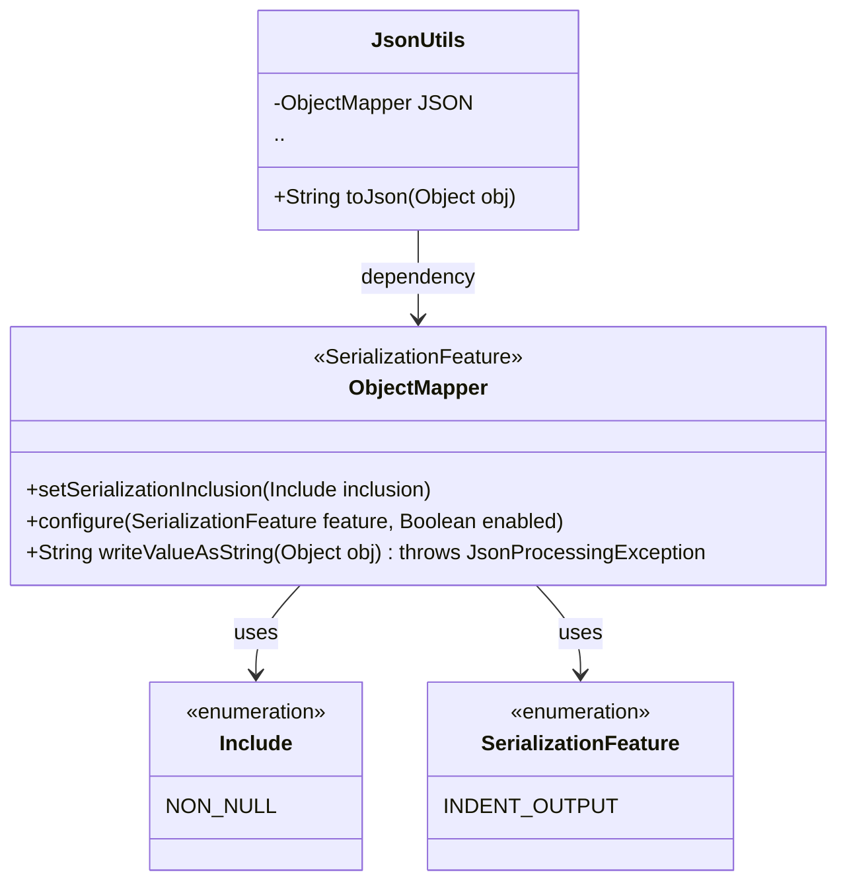
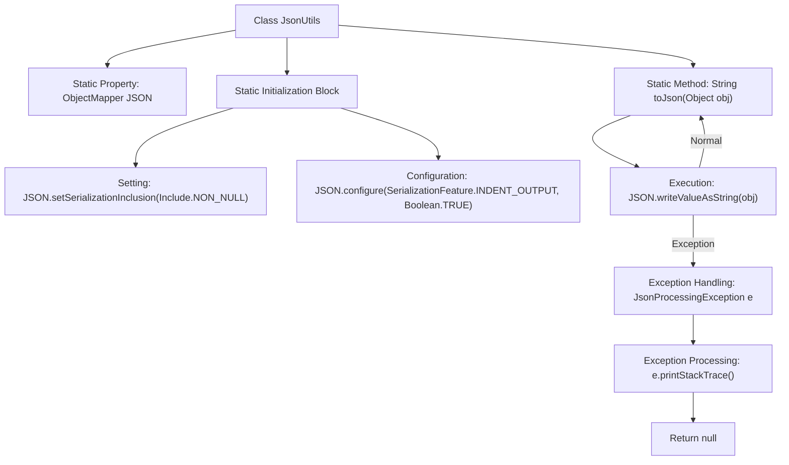

# Basic Information

|      |      |
|------|------|
| Name | JsonUtils |
| Language | .java |
| Code Path | weixin-java-miniapp-demo/src/main/java/com/github/binarywang/demo/wx/miniapp/utils/JsonUtils.java |
| Package Name | com.github.binarywang.demo.wx.miniapp.utils |
| Dependencies | ['com.fasterxml.jackson.annotation.JsonInclude.Include', 'com.fasterxml.jackson.core.JsonProcessingException', 'com.fasterxml.jackson.databind.ObjectMapper', 'com.fasterxml.jackson.databind.SerializationFeature'] |
| Brief Description | The JsonUtils class provides a static method `toJson`, which uses ObjectMapper to convert an object into a JSON string, automatically ignoring null values and formatting the output. |

# Description

JsonUtils is a utility class designed for handling JSON serialization. It utilizes ObjectMapper as its core component and configures two key options in the static initialization block: ignoring null fields and enabling indented formatting for output. The class provides a static method `toJson` to convert any object into a JSON string. If a JsonProcessingException occurs during the conversion, the exception stack trace will be printed, and null will be returned. The entire class is designed to be a concise and practical JSON serialization tool.

# Class Summary

| Name   | Type  | Description |
|-------|------|-------------|
| JsonUtils | class | The JsonUtils class provides a static method `toJson`, which uses ObjectMapper to convert an object into a JSON string, ignoring null values and formatting the output. Returns null if an exception occurs. |

## Class JsonUtils

|      |      |
|------|------|
| Access Modifier | public |
| Type | class |
| Name | JsonUtils |
| Description | The JsonUtils class provides a static method `toJson`, which uses ObjectMapper to convert an object into a JSON string, ignoring null values and formatting the output. Returns null if an exception occurs. |

### UML Class Diagram

This code demonstrates a JSON utility class `JsonUtils` that utilizes `ObjectMapper` for object serialization operations. The class diagram consists of four main components: `JsonUtils` serves as a utility class encapsulating the core method `toJson()`; `ObjectMapper` is the core serialization class from the Jackson library, configured with non-null value filtering and indented output features; `Include` and `SerializationFeature` are enumeration types used to configure serialization behaviors. The overall structure reflects the encapsulation pattern of a utility class around a third-party library, with global configurations applied through static initialization blocks and handling of potential `JsonProcessingException` exceptions.

### Internal Method Call Graph

This code flowchart illustrates the structure and workflow of the JsonUtils utility class. The class implements JSON serialization functionality through a static ObjectMapper instance, configured in the static initialization block to ignore null values and enable pretty-printing. The core method toJson converts objects to JSON strings via writeValueAsString, while handling potential JsonProcessingException exceptions. The flowchart clearly presents the complete path from class initialization to method invocation, including both normal flow and exception handling branches.

### Field List

| Name  | Type  | Description |
|-------|-------|------|
| JSON = new ObjectMapper() | ObjectMapper | Define a private static immutable JSON object mapper instance. |

### Method List

| Name  | Type  | Description |
|-------|-------|------|
| toJson | String | Convert the object to a JSON string, return null if failed. |

