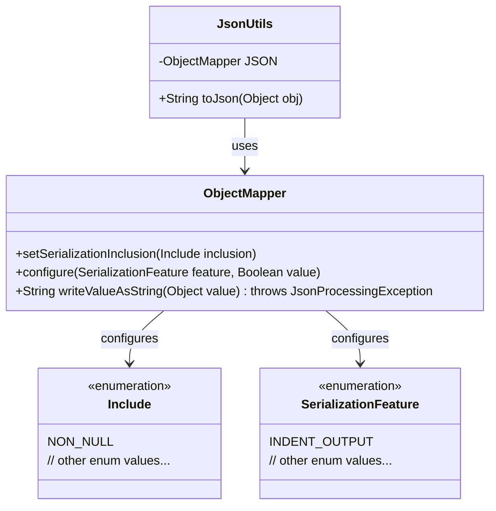
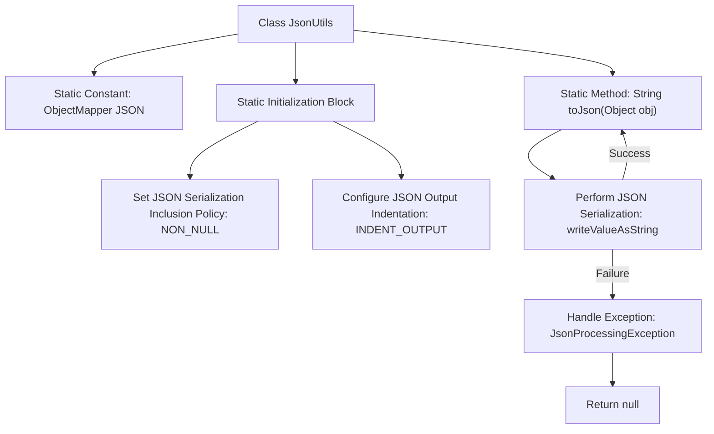

# Basic Information

|      |      |
|------|------|
| Name | JsonUtils |
| Language | .java |
| Code Path | weixin-java-miniapp-demo/src/main/java/com/github/binarywang/demo/wx/miniapp/utils/JsonUtils.java |
| Package Name | com.github.binarywang.demo.wx.miniapp.utils |
| Dependencies | ['com.fasterxml.jackson.annotation.JsonInclude.Include', 'com.fasterxml.jackson.core.JsonProcessingException', 'com.fasterxml.jackson.databind.ObjectMapper', 'com.fasterxml.jackson.databind.SerializationFeature'] |
| Brief Description | The JsonUtils utility class, configured with ObjectMapper for non-NULL field serialization and formatted output, provides a toJson method to convert objects into JSON strings, returning null in case of exceptions. |

# Description

JsonUtils is a utility class designed for handling JSON serialization. It utilizes an ObjectMapper for configuration, with static initialization setting serialization rules to exclude null-value fields and enabling formatted output. The class provides a toJson method to convert objects into JSON strings, internally invoking the writeValueAsString method. If conversion fails, it prints the exception and returns null.

# Class Summary

| Name   | Type  | Description |
|-------|------|-------------|
| JsonUtils | class | The JsonUtils class provides a static method `toJson`, which uses ObjectMapper to convert an object into a JSON string, automatically ignores null values, and formats the output. It returns null in case of an exception. |

## Class JsonUtils

|      |      |
|------|------|
| Access Modifier | public |
| Type | class |
| Name | JsonUtils |
| Description | The JsonUtils class provides a static method `toJson`, which uses ObjectMapper to convert an object into a JSON string, automatically ignores null values, and formats the output. It returns null in case of an exception. |

### UML Class Diagram

This class diagram illustrates the relationship between the JsonUtils utility class and core components of the Jackson library. JsonUtils provides JSON serialization functionality through a static ObjectMapper instance, configured with non-null value filtering and indented output features. The ObjectMapper relies on enumeration classes Include and SerializationFeature to implement serialization configurations. This design encapsulates the complexity of JSON processing, though directly printing stack traces for exception handling may be insufficient, making it suitable for simple use cases.

### Internal Method Call Graph

This flowchart illustrates the core structure of the JsonUtils utility class, including the static initialization block configuring the ObjectMapper instance and the execution flow of the toJson method. The static initialization phase sets non-null value serialization and indented output, while the toJson method attempts to convert an object to a JSON string, printing exceptions and returning null upon failure. The entire design reflects the robustness and configuration flexibility of JSON processing.

### Field List

| Name  | Type  | Description |
|-------|-------|------|
| JSON = new ObjectMapper() | ObjectMapper | Create a static immutable JSON object mapper instance. |

### Method List

| Name  | Type  | Description |
|-------|-------|------|
| toJson | String | The static method `toJson` converts an object into a JSON string, prints the exception on failure, and returns null. |

