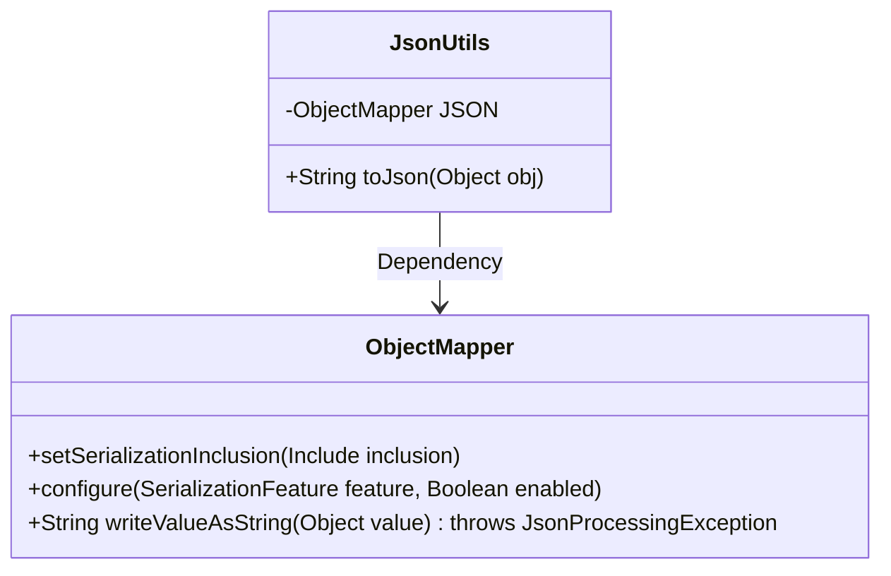
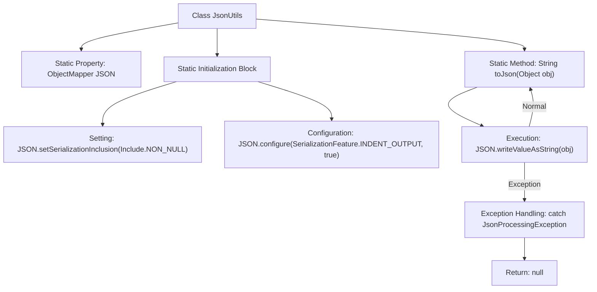

# Basic Information

|      |      |
|------|------|
| Name | JsonUtils |
| Language | .java |
| Code Path | weixin-java-miniapp-demo/src/main/java/com/github/binarywang/demo/wx/miniapp/utils/JsonUtils.java |
| Package Name | com.github.binarywang.demo.wx.miniapp.utils |
| Dependencies | ['com.fasterxml.jackson.annotation.JsonInclude.Include', 'com.fasterxml.jackson.core.JsonProcessingException', 'com.fasterxml.jackson.databind.ObjectMapper', 'com.fasterxml.jackson.databind.SerializationFeature'] |
| Brief Description | The JsonUtils class provides static JSON serialization methods, configuring ObjectMapper to ignore null values and format the output, returning null in case of exceptions. |

# Description

JsonUtils is a utility class designed for JSON serialization. It employs ObjectMapper as its core component and configures two key options in the static initialization block: one is to ignore null values during serialization, and the other is to enable indented output for improved readability. The class provides a static method `toJson` to convert any object into a JSON string. If a JsonProcessingException occurs during the conversion, the exception stack trace will be printed and null will be returned. The entire class is designed to be concise, focusing on the fundamental functionality of JSON serialization.

# Class Summary

| Name   | Type  | Description |
|-------|------|-------------|
| JsonUtils | class | The JsonUtils class provides static JSON serialization methods, utilizing ObjectMapper to configure non-null field output and formatting, returning null on exceptions. |

## Class JsonUtils

|      |      |
|------|------|
| Access Modifier | public |
| Type | class |
| Name | JsonUtils |
| Description | The JsonUtils class provides static JSON serialization methods, utilizing ObjectMapper to configure non-null field output and formatting, returning null on exceptions. |

### UML Class Diagram

Class Diagram Description: This diagram illustrates a JsonUtils utility class that encapsulates the Jackson library's ObjectMapper for JSON serialization operations. JsonUtils configures the ObjectMapper instance via a static initialization block (ignoring NULL values, enabling indented output) and provides a toJson() method to convert objects into JSON strings. The ObjectMapper class displays key configuration and serialization methods, with a clear dependency relationship between the two.

### Internal Method Call Graph

The flowchart illustrates the structure and execution flow of the JsonUtils utility class. It configures an ObjectMapper instance through a static initialization block, enabling null-value exclusion and indented output. The core method toJson() converts objects to JSON strings via writeValueAsString, returning null on exceptions. The diagram showcases the complete path from class initialization to method invocation, highlighting the exception handling branch.

### Field List

| Name  | Type  | Description |
|-------|-------|------|
| JSON = new ObjectMapper() | ObjectMapper | Define a private static immutable JSON object mapper instance. |

### Method List

| Name  | Type  | Description |
|-------|-------|------|
| toJson | String | Convert the object to a JSON string, returns null on failure. |

