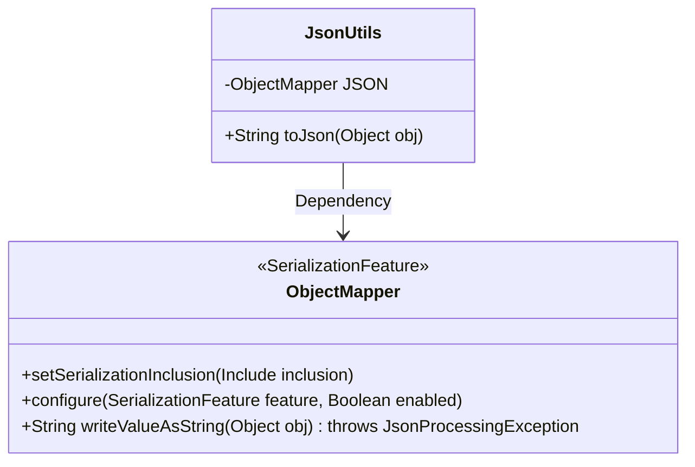
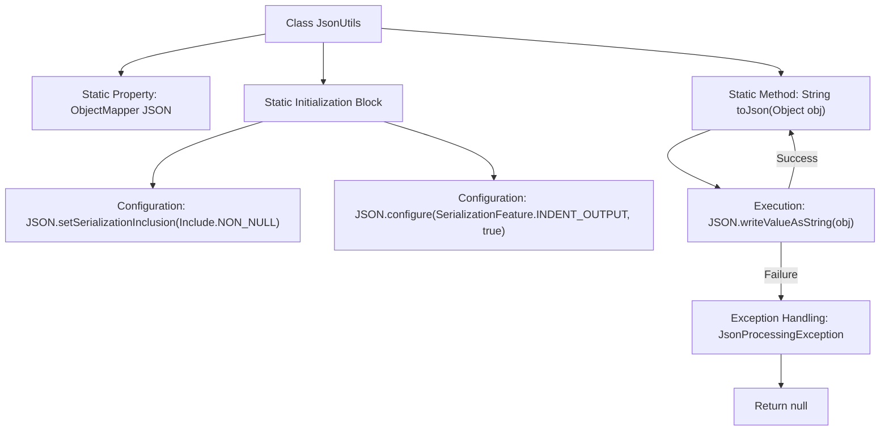

# Basic Information

|      |      |
|------|------|
| Name | JsonUtils |
| Language | .java |
| Code Path | weixin-java-miniapp-demo/src/main/java/com/github/binarywang/demo/wx/miniapp/utils/JsonUtils.java |
| Package Name | com.github.binarywang.demo.wx.miniapp.utils |
| Dependencies | ['com.fasterxml.jackson.annotation.JsonInclude.Include', 'com.fasterxml.jackson.core.JsonProcessingException', 'com.fasterxml.jackson.databind.ObjectMapper', 'com.fasterxml.jackson.databind.SerializationFeature'] |
| Brief Description | The JsonUtils utility class uses ObjectMapper to convert objects to JSON strings, automatically ignoring null values and formatting the output, returning null in case of exceptions. |

# Description

JsonUtils is a utility class designed for handling JSON serialization. It employs ObjectMapper as its core component and configures two key options in the static initialization block: ignoring null fields and enabling indented formatted output. The class provides a static method `toJson` that converts any object into a JSON string. If a JsonProcessingException occurs during the conversion, the exception stack trace is printed, and null is returned. The entire class is designed concisely, focusing solely on JSON serialization functionality.

# Class Summary

| Name   | Type  | Description |
|-------|------|-------------|
| JsonUtils | class | The JsonUtils class provides static JSON serialization methods, configured to ignore null values and format the output, returning null in case of exceptions. |

## Class JsonUtils

|      |      |
|------|------|
| Access Modifier | public |
| Type | class |
| Name | JsonUtils |
| Description | The JsonUtils class provides static JSON serialization methods, configured to ignore null values and format the output, returning null in case of exceptions. |

### UML Class Diagram

This class diagram illustrates the relationship between the JsonUtils utility class and the ObjectMapper class. JsonUtils is a JSON processing utility class containing a static ObjectMapper instance named JSON, and provides a toJson method for serializing objects into JSON strings. The ObjectMapper class offers core JSON serialization functionalities, including setting serialization inclusion rules and configuring output formats. JsonUtils relies on ObjectMapper through composition to implement its features, demonstrating the encapsulation pattern of utility classes for third-party library usage.

### Internal Method Call Graph

This flowchart illustrates the structure and workflow of the JsonUtils class. The class contains a static ObjectMapper instance configured in the static initialization block for non-null serialization and indented output. The core method toJson converts objects to JSON strings via writeValueAsString, printing stack traces and returning null on exceptions. The process clearly shows the complete path from initialization to method invocation, particularly highlighting the exception handling branch.

### Field List

| Name  | Type  | Description |
|-------|-------|------|
| JSON = new ObjectMapper() | ObjectMapper | Create a static immutable JSON object mapper instance. |

### Method List

| Name  | Type  | Description |
|-------|-------|------|
| toJson | String | Convert the object to a JSON string, print the error and return null if an exception occurs. |

