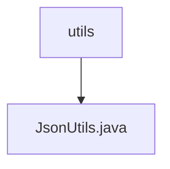

# Basic Information

|      |      |
|------|------|
| Name | utils |
| Language | .java |
| Code Path | weixin-java-miniapp-demo/src/main/java/com/github/binarywang/demo/wx/miniapp/utils |
| Package Name | docs.src.main.java.com.github.binarywang.demo.wx.miniapp.utils |
| Brief Description | The JsonUtils class provides static JSON serialization methods, using ObjectMapper configuration to ignore null values and format output, returning null in case of exceptions. |

# Description

JsonUtils is a utility class designed for handling JSON serialization. It employs ObjectMapper as its core component and configures two key options in the static initialization block: one is to ignore null values during serialization, and the other is to enable indented output for improved readability. The class provides a static method `toJson` to convert any object into a JSON string. If a JsonProcessingException occurs during the conversion process, the exception stack trace will be printed and null will be returned. The entire class is designed to be concise, focusing on the fundamental functionality of JSON serialization.

### Package Internal Structure View

This flowchart illustrates the hierarchical relationship of utility classes in the WeChat Mini Program demo project. The top-level node is the utils directory, which contains a JsonUtils.java utility class file for handling JSON-related operations. This concise hierarchical structure is a typical organizational approach for utility class modules, facilitating centralized management of common functional components.

# File List

| Name   | Type  | Description |
|-------|------|-------------|
| [JsonUtils.java](JsonUtils.md) | file | The JsonUtils class provides static JSON serialization methods, using an ObjectMapper configured to ignore null values and format the output, returning null in case of exceptions. |

