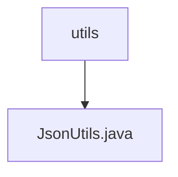

# Basic Information

|      |      |
|------|------|
| Name | utils |
| Language | .java |
| Code Path | weixin-java-miniapp-demo/src/main/java/com/github/binarywang/demo/wx/miniapp/utils |
| Package Name | docs.src.main.java.com.github.binarywang.demo.wx.miniapp.utils |
| Brief Description | JsonUtils utility class, which uses ObjectMapper to configure non-NULL field serialization and formatted output, provides the toJson method to convert objects into JSON strings, and returns null in case of exceptions. |

# Description

JsonUtils is a utility class designed for handling JSON serialization. It utilizes an ObjectMapper for configuration, with static initialization settings that exclude null-value fields during serialization and enable formatted output. The class provides a toJson method to convert objects into JSON strings, internally invoking the writeValueAsString method. If the conversion fails, it prints the exception and returns null.

### Package Internal Structure View

This flowchart illustrates the structural relationship within the utils directory of a WeChat Mini Program demo project. The top-level node is the utils directory, which contains a utility class file named JsonUtils.java. This concise hierarchical structure exemplifies the typical organization of utility class modules, where related utility methods are centralized under the utils directory for unified management and invocation.

# File List

| Name   | Type  | Description |
|-------|------|-------------|
| [JsonUtils.java](JsonUtils.md) | file | JsonUtils utility class, which configures ObjectMapper for non-NULL field serialization and formatted output, provides the toJson method to convert objects into JSON strings, and returns null in case of exceptions. |

