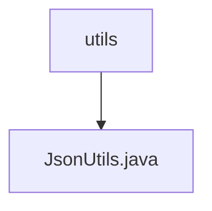

# Basic Information

|      |      |
|------|------|
| Name | utils |
| Language | .java |
| Code Path | weixin-java-miniapp-demo/src/main/java/com/github/binarywang/demo/wx/miniapp/utils |
| Package Name | docs.src.main.java.com.github.binarywang.demo.wx.miniapp.utils |
| Brief Description | The JsonUtils utility class, configured with ObjectMapper to serialize non-NULL fields and format output, provides the toJson method to convert objects into JSON strings, returning null in case of exceptions. |

# Description

JsonUtils is a utility class designed for JSON serialization. It utilizes an ObjectMapper for configuration, with static initialization setting serialization rules to exclude null fields and enabling formatted output. The class provides a toJson method to convert objects into JSON strings, internally invoking the writeValueAsString method. If conversion fails, it prints the exception and returns null.

### Package Internal Structure View

This flowchart illustrates the structural relationship within the utils directory of the WeChat Mini Program demo project. The top-level node is the utils directory, which contains a utility class file named JsonUtils.java. This concise hierarchical structure exemplifies the typical organization of utility class modules, where related utility methods are centralized under the utils directory for unified management and invocation.

# File List

| Name   | Type  | Description |
|-------|------|-------------|
| [JsonUtils.java](JsonUtils.md) | file | The JsonUtils utility class configures ObjectMapper for non-NULL field serialization and formatted output, providing a toJson method to convert objects into JSON strings, which returns null in case of exceptions. |

