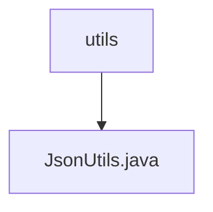

# Basic Information

|      |      |
|------|------|
| Name | utils |
| Language | .java |
| Code Path | weixin-java-miniapp-demo/src/main/java/com/github/binarywang/demo/wx/miniapp/utils |
| Package Name | docs.src.main.java.com.github.binarywang.demo.wx.miniapp.utils |
| Brief Description | The JsonUtils utility class uses ObjectMapper to convert objects into JSON strings, automatically ignoring null values and formatting the output, returning null in case of exceptions. |

# Description

JsonUtils is a utility class designed for handling JSON serialization. It employs ObjectMapper as its core component and configures two key options in the static initialization block: ignoring null fields and enabling indented formatting for output. The class provides a static method, toJson, which converts any object into a JSON string. If a JsonProcessingException occurs during the conversion process, the exception stack trace is printed, and null is returned. The entire class is designed concisely, focusing solely on JSON serialization functionality.

### Package Internal Structure View

This flowchart illustrates the hierarchical relationship between the utils directory and the JsonUtils.java file in the WeChat Mini Program demo project. The utils node, as a directory, contains a child node JsonUtils.java, indicating that this is a utility class file located under the utils directory, used for handling JSON-related operations. The entire structure is concise and clear, conforming to the typical directory structure of a Java project.

# File List

| Name   | Type  | Description |
|-------|------|-------------|
| [JsonUtils.java](JsonUtils.md) | file | The JsonUtils utility class uses ObjectMapper to convert objects into JSON strings, automatically ignoring null values and formatting the output, returning null in case of exceptions. |

