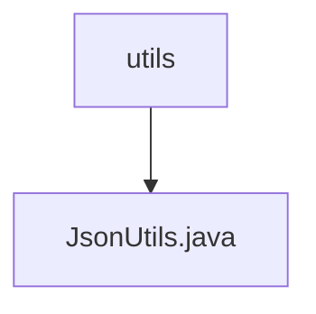

# Basic Information

|      |      |
|------|------|
| Name | utils |
| Language | .java |
| Code Path | weixin-java-miniapp-demo/src/main/java/com/github/binarywang/demo/wx/miniapp/utils |
| Package Name | docs.src.main.java.com.github.binarywang.demo.wx.miniapp.utils |
| Brief Description | The JsonUtils class provides a static method `toJson`, which uses ObjectMapper to convert an object into a JSON string, automatically ignoring null values and formatting the output. |

# Description

JsonUtils is a utility class designed for handling JSON serialization. It employs ObjectMapper as its core component and configures two key options in the static initialization block: ignoring null fields and enabling indented formatting for output. The class provides a static method `toJson` to convert any object into a JSON string. If a JsonProcessingException occurs during the conversion, the exception stack trace will be printed, and null will be returned. The entire class is designed as a concise and practical JSON serialization tool.

### Package Internal Structure View

This flowchart illustrates the hierarchical structure of the utils directory in the WeChat Mini Program demo project. The root node is the utils folder, which contains a single utility class file, JsonUtils.java. This is a typical single-layer file structure, indicating that the utils directory in this project currently includes only one JSON utility class file, designed to provide JSON-related utility methods.

# File List

| Name   | Type  | Description |
|-------|------|-------------|
| [JsonUtils.java](JsonUtils.md) | file | The JsonUtils class provides a static method `toJson`, which uses ObjectMapper to convert an object into a JSON string, automatically ignoring null values and formatting the output. |

