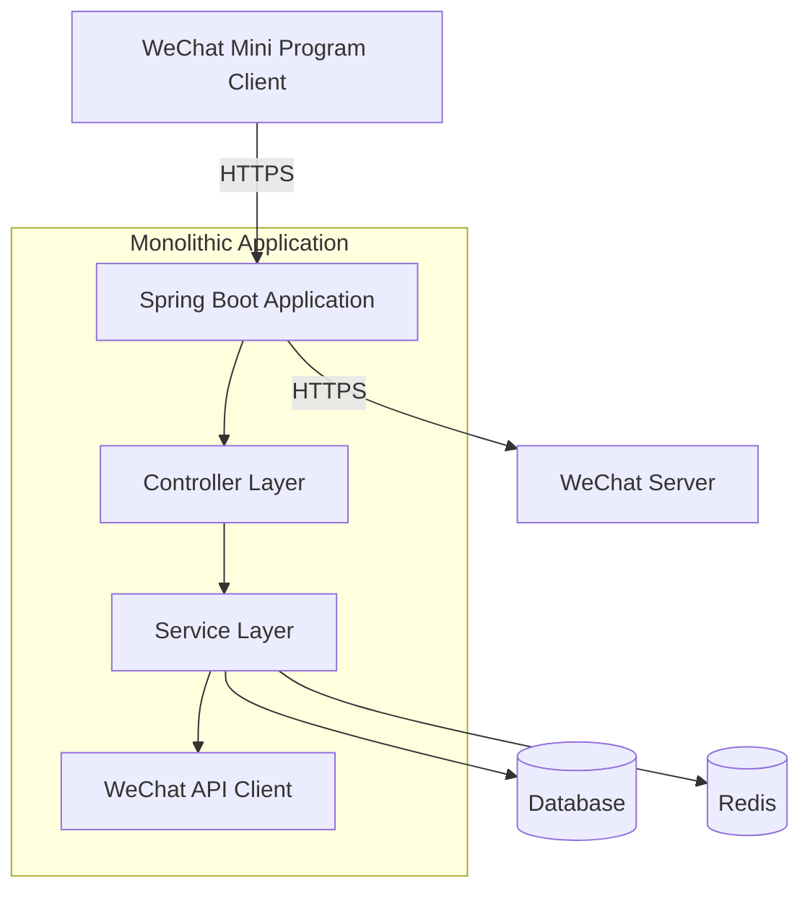

## System Architecture

## System Overview

This section outlines the core functionalities, business domains, and architectural patterns of the WeChat Mini Program Java backend project.

* **Core Functionalities and Business Domains:** This project serves as the backend service for a WeChat Mini Program, primarily handling API requests from the mini program, message server configuration, and integration with the WeChat ecosystem. The business domain focuses on providing backend support for the mini program, including user authentication, message processing, and proxy functionalities for WeChat APIs.
* **Architectural Pattern:** The project adopts a **monolithic application** architecture.
* **Supporting Evidence for Architectural Pattern:**
    * The `Dockerfile` indicates the build of a single JAR file (`weixin-java-miniapp-demo-1.0.0-SNAPSHOT.jar`), suggesting all functionalities are packaged into one executable.
    * The project uses the Spring Boot framework, a typical monolithic application technology stack.
    * No microservice-specific directory structures (e.g., `services/` or `libs/`) were found, nor a `docker-compose.yml` file defining multiple services.
    * Configuration files only include settings for a single application (`application.yml.template`), with no signs of multi-service configurations.

## Core Components and Functional Diagram

This section details the system's main components and their responsibilities, supplemented with industry best practices.

* **Traffic Entry Layer:**
    * **Components and Responsibilities:** The embedded Tomcat server in Spring Boot is expected to serve as the traffic entry point, handling HTTP requests. A standalone API gateway or load balancer is likely absent, as monolithic architectures typically expose application services directly.
    * **Implementation Considerations:** In monolithic architectures, traffic entry is usually managed by the framework's built-in web server, simplifying deployment.
* **Application Service Layer:**
    * **Service Inventory and Core Functionalities:**
        * **WeChat Mini Program Service:**
            * **Primary Responsibilities:** Handles API requests from the mini program, including user authentication, message reception and replies, and proxy calls to WeChat APIs.
            * **Technical Foundation:** Uses Java with the Spring Boot framework, leveraging the WxJava library (WeChat development Java SDK).
            * **Internal Structure Insights:** While full code is unavailable, it likely includes a controller layer (for HTTP requests), a service layer (for business logic), and a WeChat API client layer.
    * **Asynchronous Tasks and Background Processing:** No clear evidence of asynchronous task handling exists. However, WeChat message processing might require asynchronous mechanisms, suggesting future integration of message queues (e.g., RabbitMQ) and background workers.
* **Data Management Layer:**
    * **Data Storage Components and Responsibilities:** Configuration files do not explicitly specify a database, but backend services for mini programs typically store user sessions and configuration data. Possible choices include relational databases (e.g., MySQL) or key-value stores (e.g., Redis).
    * **Data Responsibilities and Selection Rationale:** If a database is used, it likely stores user information and session tokens. Redis is suitable for caching short-lived data like WeChat access tokens.

## Container Configuration Overview

This section lists key containerization configurations identified through deployment file analysis.

| Service Name | Container Image | Exposed Ports | Volumes | Key Env Vars | Startup Command/Entrypoint |
| :----------- | :-------------- | :------------ | :------ | :----------- | :------------------------- |
| `weixin-java-miniapp-demo` | `openjdk:8-jdk-alpine` (built from Dockerfile) | Not specified (Spring Boot defaults to 8080) | `/tmp` | No explicit env vars | `java -Djava.security.egd=file:/dev/./urandom -jar /app.jar` |

## Service Collaboration and Data Flow

This section depicts data flow paths and interaction patterns between internal components and external users.

* **Core Communication Paths:** The WeChat Mini Program client communicates directly with the backend service, which acts as a proxy to interact with WeChat servers.
* **Interaction Patterns and Protocols:** Uses RESTful HTTP APIs for synchronous communication. WeChat message processing might employ Webhook patterns.
* **Sharing and Isolation:** The monolithic architecture shares a single data store across all functionalities, eliminating the need for inter-service data isolation.

## Overall Architecture Diagram (Mermaid Syntax)



## Architect's Key Insights and Future Outlook

This section analyzes critical architectural considerations and outlines future evolution directions.

* **Resilience and Scalability Strategies:** The current monolithic architecture can scale vertically (increasing instance resources) for performance gains. Future horizontal scaling may require transitioning to a microservices architecture.
* **High Availability and Resilience Design:** Deploying multiple instances with a load balancer is recommended. Database master-slave replication can enhance data availability.
* **Security Defenses:** Ensure HTTPS encryption, secure storage of WeChat API keys (e.g., using Vault), and implement input validation to prevent injection attacks.
* **Operational Observability and Automation:** Integrate Prometheus for monitoring and ELK for logging. Establish CI/CD pipelines for automated builds and deployments.
* **Performance Optimization Potential:** Introduce Redis for caching WeChat access tokens and frequently accessed data, and optimize database queries.
* **Technology Stack Rationale Assessment:** Java + Spring Boot is suitable for enterprise applications, and the WxJava library simplifies WeChat integration, making the stack well-justified.
* **Data Consistency Strategies (If Applicable):** The monolithic architecture simplifies data consistency management. Future asynchronous processing may require event sourcing or Saga patterns.
* **Future Evolution Paths and Technology Integration:** As complexity grows, consider splitting into independent services (e.g., messaging, user, and WeChat API gateway). Introduce message queues for asynchronous tasks and service meshes (e.g., Istio) for inter-service communication management.

You are a professional translation assistant. Please accurately translate the following content into the target language.  
Please strictly adhere to the following guidelines:  
1. Maintain consistency with the original text in terms of semantics, context, and style.  
2. Preserve the original hierarchical structure and numbering system in full.  
3. Strictly retain all formatting elements from the original text, such as code block identifiers (```text/```, ```mermaid/```), etc.  
4. Only translate natural language content; do not perform format adjustments, content additions, or explanatory processing.  
5. Output only the translated result of the original text, without any additional prompt information.  

Content to be translated:  

Target language code: en

