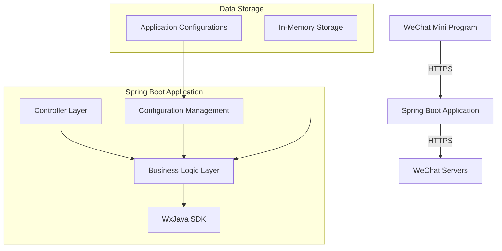

## System Architecture

## System Overview

This section outlines the core functionalities, business domains, and architectural patterns of the WeChat Mini Program Java backend project.

* **Core Functionalities and Business Domains:**  
  This project serves as the backend for a WeChat Mini Program, with core functionalities including:
  - Integration with WeChat Mini Program APIs (authentication, message handling, data exchange)
  - Mini Program business logic processing
  - Encryption/decryption for communication with WeChat servers
  - Mini Program user session management

* **Architectural Pattern:**  
  Adopts a **monolithic application architecture**, built on the Spring Boot framework.

* **Architectural Justification:**  
  - Single Dockerfile builds an executable JAR
  - Uses Spring Boot's embedded Tomcat as the application server
  - Application configuration centralized in a single application.yml file
  - No microservice-specific service discovery or API gateway configurations
  - Project structure follows standard Maven monolithic layout

## Core Components and Functional Map

This section details the system's main components and their responsibilities.

* **Traffic Entry Layer:**
    * **Components and Responsibilities:**  
      - Directly exposes Spring Boot's embedded Tomcat server
      - Handles all HTTPS requests from WeChat Mini Programs and WeChat servers
      - Responsible for request routing and load balancing (if scaling is required)

* **Application Service Layer:**
    * **Service Catalog and Core Functions:**  
      - **WeChat Mini Program Integration Service**:
        * Primary Role: Processes WeChat Mini Program API calls, including user authentication, message encryption/decryption, and business logic
        * Tech Stack: Java 8 + Spring Boot + WxJava SDK
        * Internal Structure: Includes controllers, service layer, and WeChat SDK integration module
      - **Configuration Management Service**:
        * Primary Role: Manages WeChat Mini Program configurations (appid, secret, etc.)
        * Tech Stack: Spring Boot configuration management
      - **Logging and Monitoring Service**:
        * Primary Role: Logs request and WeChat SDK interaction data
        * Tech Stack: Spring Boot Logging

* **Data Management Layer:**
    * **Data Storage Components and Responsibilities:**  
      - No explicit external database configuration; may use in-memory or simple file storage
      - WeChat user session data may be stored in memory or Redis (requires further confirmation)
      - WeChat configuration data is stored in application configuration files

## Container Configuration Overview

This section lists key configurations for containerized deployment.

| Service Name | Container Image | Exposed Ports | Mounted Volumes | Key Environment Variables | Startup Command/Entry Point |
| :---------- | :-------------- | :------------ | :-------------- | :------------------------ | :-------------------------- |
| WeChat Mini Program Service | Built on openjdk:8-jdk-alpine | Not specified | /tmp | Java security configurations | java -jar /app.jar |

## Service Collaboration and Data Flow

This section describes the system's internal data movement and interaction patterns.

* **Core Communication Paths:**  
  1. WeChat Mini Program → HTTPS → Backend Service
  2. Backend Service ↔ HTTPS ↔ WeChat Servers

* **Interaction Patterns and Protocols:**  
  - All external communications use HTTPS
  - Internal modules interact via direct Spring Bean calls
  - WxJava SDK handles WeChat protocols

* **Sharing and Isolation:**  
  - Monolithic architecture shares the same JVM and memory space
  - Configuration data is shared via Spring environment

## Overall Architecture Diagram



## Architect's Key Insights and Future Outlook

This section analyzes the architecture's key considerations and future development directions.

* **Resilience and Scalability Strategies:**  
  - Horizontal scaling achievable via multi-instance deployment
  - Recommended to add an API gateway for load balancing
  - Consider migrating stateful data to Redis clusters

* **High Availability and Fault Tolerance:**  
  - Requires health check mechanisms
  - Recommended to configure multi-availability zone deployment
  - WeChat configurations should support dynamic loading instead of hardcoding

* **Security Framework:**  
  - Ensure all WeChat communications use HTTPS
  - Sensitive configurations (appid/secret) should use key management services
  - Implement request signature verification

* **Operational Observability and Automation:**  
  - Add Prometheus monitoring metrics
  - Implement centralized log collection
  - Enhance CI/CD pipelines

* **Performance Optimization Potential:**  
  - Add Redis caching for frequently accessed WeChat data
  - Optimize WxJava SDK calls
  - Consider asynchronous processing for non-real-time operations

* **Tech Stack Rationality Assessment:**  
  - Java 8 + Spring Boot is suitable for enterprise WeChat development
  - Consider upgrading to Java 11/17 for better performance
  - WxJava SDK is a mature choice for WeChat ecosystem

* **Future Evolution Paths and Tech Adoption:**  
  - Transition toward microservices architecture, separating core functionalities
  - Add message queues for asynchronous task processing
  - Introduce service mesh for inter-service communication
  - Consider serverless architecture to handle traffic fluctuations

You are a professional translation assistant. Please accurately translate the following content into the target language.  
Please strictly adhere to the following guidelines:  
1. Maintain consistency with the original text in terms of semantics, context, and style.  
2. Preserve the complete hierarchical structure and numbering system of the original text.  
3. Strictly retain all formatting elements of the original text, such as code block identifiers (```text/```, ```mermaid/```), etc.  
4. Only translate natural language content; do not perform format adjustments, content additions, or explanatory processing.  
5. Output only the translated result of the original text, without any additional prompt information.  

Content to be translated:  

Target language code: en

