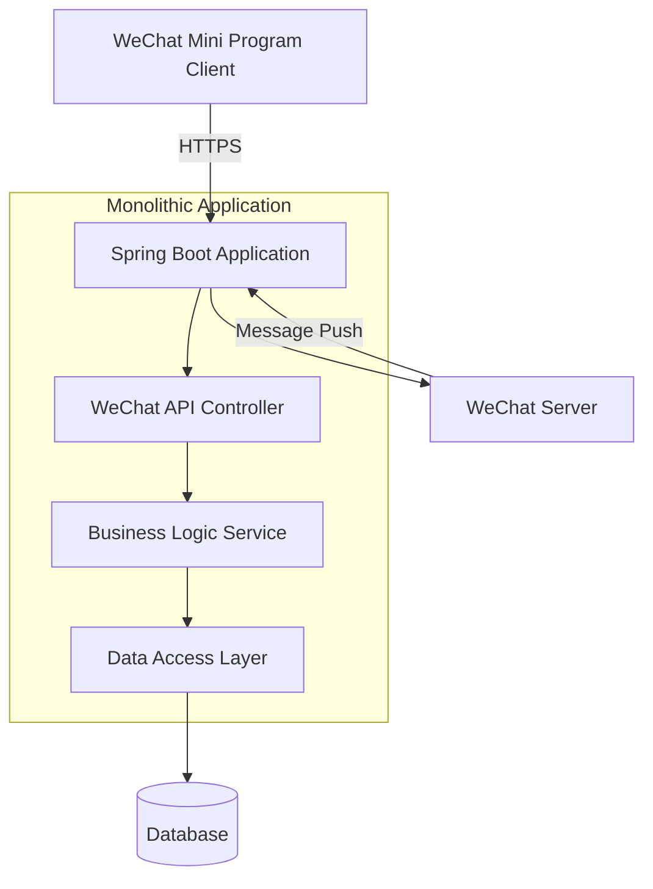

## System Architecture

## System Overview  

This section outlines the core functionalities, business domains, and architectural patterns of the WeChat Mini Program Java backend project.  

* **Core Functionalities and Business Domains:** This project serves as the backend for a WeChat Mini Program, primarily handling API requests, message server configurations, and integration with the WeChat ecosystem. The business domain focuses on WeChat Mini Program development, providing core functionalities such as authentication, message processing, and configuration management.  
* **Architectural Pattern:** The project adopts a **monolithic application** architecture.  
* **Supporting Evidence for Architectural Pattern:**  
    * The `Dockerfile` indicates the project is built as a single JAR file and runs in a single container.  
    * The project structure lacks a `services/` directory or similar microservices-related folders, with all functional modules packaged into a single application.  
    * Dependency management files (e.g., `.travis.yml`) show a single build process without signs of independent builds for multiple services.  
    * Code snippets reveal no inter-service communication mechanisms, suggesting all functionalities are handled within the same process.  

## Core Components and Functional Diagram  

This section details the system's main components and their responsibilities, supplemented with insights specific to WeChat Mini Program backends.  

* **Traffic Entry Layer:**  
    * **Components and Responsibilities:** As a monolithic application, the traffic entry layer is likely handled by an embedded Spring Boot web server (e.g., Tomcat) or fronted by an Nginx reverse proxy and load balancer.  
    * **Implementation Considerations:** Monolithic architectures typically expose application server ports directly or manage traffic through simple reverse proxies.  
* **Application Service Layer:**  
    * **Service List and Core Functionalities:**  
        * **WeChat Mini Program API Service:**  
            * **Primary Responsibilities:** Handles API requests from the WeChat Mini Program, including authentication, message processing, and configuration management.  
            * **Technical Foundation:** Built with Java and the Spring Boot framework, leveraging the `wx-java-miniapp` SDK for WeChat ecosystem integration.  
            * **Internal Structure Insights:** Follows a typical Spring Boot structure, likely comprising `controller`, `service`, and `repository` layers.  
    * **Asynchronous Tasks and Background Processing:** The current architecture shows no explicit asynchronous task handling mechanisms, though WeChat message processing may require task queues for high-concurrency scenarios.  
* **Data Management Layer:**  
    * **Data Storage Components and Responsibilities:** Configuration files do not explicitly specify database settings, but Spring Boot applications commonly use relational databases (e.g., MySQL) or embedded databases (e.g., H2).  
    * **Data Responsibilities and Selection Rationale:** WeChat Mini Program backends typically store user sessions, configuration data, and message logs, making relational databases suitable for such structured data.  

## Container Configuration Overview  

This section lists containerized service configurations identified through deployment file analysis.  

| Service Name (Service Name) | Container Image (Container Image) | Exposed Ports (Exposed Ports) | Volumes (Volumes) | Key Environment Variables (Key Env Vars) | Startup Command/Entrypoint (Startup Command/Entrypoint) |  
| :------------------------- | :-------------------------------- | :---------------------------- | :---------------- | :--------------------------------------- | :------------------------------------------------------ |  
| `wx-miniapp-service`       | `openjdk:8-jdk-alpine` (built from Dockerfile) | Not explicitly specified, typically `8080` | `/tmp` | `wx.miniapp.configs.*` (appid, secret, token, aesKey) | `java -Djava.security.egd=file:/dev/./urandom -jar /app.jar` |  

## Inter-Service Collaboration and Data Flow  

This section describes data movement and interaction patterns between internal components and external users.  

* **Core Communication Paths:** The WeChat Mini Program client communicates directly with the backend service via HTTPS, with all requests uniformly handled by the Spring Boot application.  
* **Interaction Patterns and Protocols:** Uses RESTful HTTP APIs for synchronous communication, adhering to WeChat's official API specifications.  
* **Sharing and Isolation:** In a monolithic architecture, all modules share the same database connection and memory space, eliminating the need for inter-service isolation.  

## Overall Architecture Diagram (Mermaid Syntax)  



## Architect's Key Insights and Future Outlook  

This section analyzes critical architectural considerations and future evolution directions.  

* **Resilience and Scalability Strategies:** The current monolithic architecture can improve performance through vertical scaling (increasing container resources) but has limited horizontal scalability. Stateless design is recommended for future horizontal scaling.  
* **High Availability and Fault Tolerance:** Deploying multiple instances with load balancing ensures single points of failure do not disrupt the service.  
* **Security Defenses:** Focus on secure storage of WeChat credentials (using secrets management), enforcing HTTPS, and request signature validation.  
* **Operational Observability and Automation:** Recommend adding Spring Boot Actuator for health monitoring and integrating Prometheus/Grafana for metrics collection.  
* **Performance Optimization Potential:** Temporary credentials like WeChat access_token should be cached in Redis to avoid frequent requests to WeChat servers.  
* **Technology Stack Rationale Assessment:** Java + Spring Boot suits enterprise-level WeChat ecosystem integration but may lack agility for rapid Mini Program iterations due to longer startup times.  
* **Future Evolution Path and Technology Adoption:** As complexity grows, consider isolating message processing into microservices and introducing message queues (e.g., RabbitMQ) for asynchronous handling.

You are a professional translation assistant. Please accurately translate the following content into the target language.  
Please strictly adhere to the following guidelines:  
1. Maintain consistency with the original text's semantics, context, and style.  
2. Preserve the original hierarchical structure and numbering system in full.  
3. Strictly retain all formatting elements from the original text, such as code block identifiers (```text/```, ```mermaid/```), etc.  
4. Only translate natural language content; do not perform format adjustments, content additions, or explanatory processing.  
5. Output only the translated result of the original text, without any additional prompt information.  

Content to be translated:  

Target language code: en

