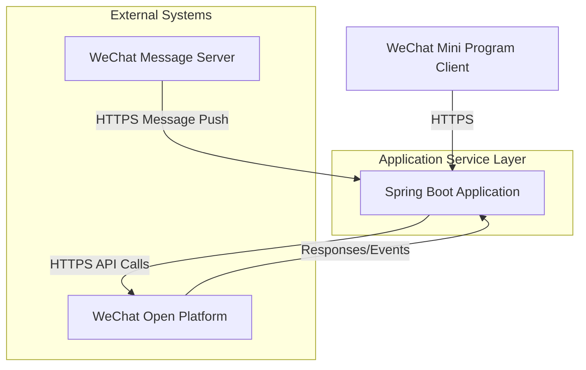

## System Architecture

## System Overview

This section outlines the core functionalities, business domains, and architectural patterns of the WeChat Mini Program Java backend project.

* **Core Functionalities and Business Domains:**
    * The project serves as a backend service for a WeChat Mini Program, with primary functionalities including:
        * Handling API requests from the WeChat Mini Program
        * Managing Mini Program configuration information (appid, secret, token, aesKey)
        * Processing events and messages from the Mini Program message server
    * The business domain focuses on Mini Program development within the WeChat ecosystem, providing foundational capabilities for interfacing with WeChat's official APIs.

* **Architectural Pattern:**
    * **Monolithic Application Architecture**
    
* **Architectural Pattern Justification:**
    * The project uses a single Dockerfile to build a JAR package containing all functionalities
    * Application configurations are centralized in a single application.yml file
    * No microservice-specific directory structures or inter-service communication mechanisms were identified
    * Developed using the Spring Boot framework, which is typical for monolithic applications
    * Simple deployment configuration involving only containerization of a single Java service

## Core Components and Functional Map

This section details the system's main components and their responsibilities, including the traffic entry layer, application service layer, and data management layer.

* **Traffic Entry Layer:**
    * **Components and Responsibilities:**
        * The WeChat Mini Program client communicates directly with the backend service via HTTPS
        * No explicit API gateway or load balancer configuration was found, possibly handled by WeChat Cloud or a simple deployment solution
    * **Implementation Considerations:**
        * In a monolithic architecture, traffic flows directly into the application service
        * Production environments may require adding Nginx as a reverse proxy and load balancer

* **Application Service Layer:**
    * **Service Inventory and Core Functionalities:**
        * **WeChat Mini Program Backend Service**
            * **Primary Responsibilities:**
                * Handling all API requests from the WeChat Mini Program
                * Verifying WeChat message signatures
                * Processing message server events
                * Interfacing with WeChat Open Platform APIs
            * **Technical Foundation:**
                * Java 8
                * Spring Boot framework
                * WxJava WeChat Development SDK
            * **Internal Structure Insights:**
                * Follows conventional Spring Boot structure
                * Likely includes Controller, Service, and Repository layers
                * WeChat-related configurations are centrally managed

* **Data Management Layer:**
    * **Data Storage Components and Responsibilities:**
        * Current configuration does not explicitly define database dependencies
        * May use in-memory storage or simple file storage for configuration data
        * Production environments may require adding:
            * MySQL/PostgreSQL as the primary database
            * Redis for caching
    * **Data Responsibilities and Selection Considerations:**
        * Mini Program configuration information requires secure storage
        * User session data may need persistence
        * WeChat API calls may benefit from caching for performance optimization

## Container Configuration Overview

This section lists the containerized service configurations identified through deployment file analysis.

| Service Name | Container Image | Exposed Ports | Volumes | Key Env Vars | Startup Command/Entrypoint |
| :---------------------- | :-------------------------- | :----------------------- | :--------------- | :-------------------------- | :------------------------------------------- |
| weixin-java-miniapp | Built on openjdk:8-jdk-alpine | Not explicitly specified | /tmp (temporary volume) | WeChat parameters configured via application.yml | java -Djava.security.egd=file:/dev/./urandom -jar /app.jar |

## Service Collaboration and Data Flow

This section describes the data flow paths and interaction patterns between internal system components and external users.

* **Core Communication Paths:**
    * WeChat Mini Program Client → HTTPS → Backend Service → WeChat Open Platform API
    * WeChat Message Server → HTTPS → Backend Service Message Handler

* **Interaction Patterns and Protocols:**
    * All communications are HTTPS-based
    * Primarily synchronous request-response mode
    * WeChat server message pushes use an event-driven model

* **Sharing and Isolation:**
    * All functionalities share the same runtime in the monolithic architecture
    * Configuration data is centrally managed
    * No explicit data isolation requirements were identified

## Overall Architecture Overview (Mermaid Syntax)



## Architect's Key Insights and Future Outlook

This section analyzes critical architectural considerations and future evolution directions.

* **Elasticity and Scalability Strategies:**
    * Current monolithic architecture can scale horizontally via multi-instance deployment
    * Stateless design facilitates scalability
    * May require adding a load balancer for traffic distribution

* **High Availability and Resilience Design:**
    * Need to ensure retry mechanisms for WeChat API calls
    * Message processing requires idempotent design
    * Critical configurations need backup mechanisms

* **Security Defense System:**
    * Sensitive WeChat configurations (appid/secret etc.) require secure storage
    * All communications must be HTTPS encrypted
    * WeChat message signature verification is essential

* **Operational Observability and Automation:**
    * Add Spring Boot Actuator endpoints
    * Integrate log collection and analysis systems
    * Implement CI/CD automated deployment pipelines

* **Performance Optimization Potential:**
    * Cache results of WeChat API calls
    * Asynchronize message processing
    * Optimize database queries (e.g., by adding indexes)

* **Technology Stack Rationality Assessment:**
    * Java + Spring Boot is suitable for enterprise-level WeChat ecosystem development
    * WxJava SDK provides excellent encapsulation of WeChat APIs
    * The technology stack is mature, stable, and well-supported by the community

* **Future Evolution Path and Technology Introduction:**
    * Add extended functionalities like user management and data analysis
    * Consider microservice decomposition (e.g., independent message processing service)
    * Introduce Redis for performance optimization and distributed locking
    * Add message queues for handling high-concurrency events

You are a professional translation assistant. Please accurately translate the following content into the target language.  
Please strictly adhere to the following guidelines:  
1. Maintain consistency with the original text's semantics, context, and style.  
2. Preserve the original hierarchical structure and numbering system in full.  
3. Strictly retain all formatting elements from the original text, such as code block identifiers (```text/```, ```mermaid/```), etc.  
4. Translate only the natural language content, without making any format adjustments, content additions, or explanatory processing.  
5. Output only the translated result of the original text, without any additional prompt information.  

Content to be translated:  

Target language code: en

