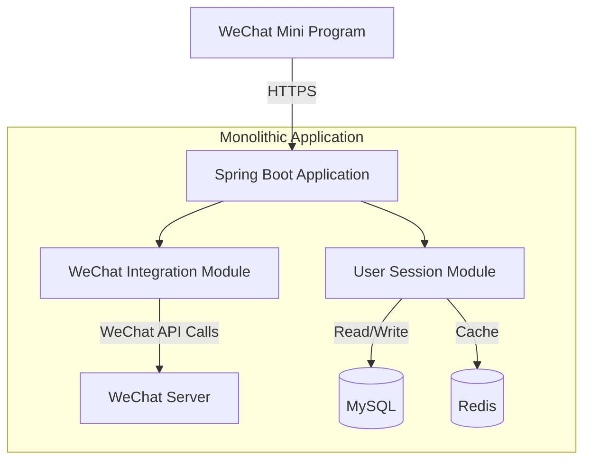

## System Architecture

## System Overview

This section outlines the core functionalities, business domains, and architectural patterns of the WeChat Mini Program Java backend project.

* **Core Functionalities and Business Domains:**  
  This project serves as the backend service for a WeChat Mini Program. Its core functionalities include integration with the WeChat Mini Program platform, handling the mini program's message server configuration, user authentication, and data interactions. The business domain focuses on providing backend support for WeChat Mini Programs, encompassing message processing, user session management, and mini program configuration management.

* **Architectural Pattern:**  
  The project adopts a **monolithic application architecture**.

* **Supporting Evidence for Architectural Pattern:**  
  - The `Dockerfile` builds only a single Java application image (`weixin-java-miniapp-demo-1.0.0-SNAPSHOT.jar`), indicating all functional modules are packaged as a monolithic application.  
  - No `services/` directory or similar microservices structure exists in the project root.  
  - Configuration items in the configuration file (`application.yml.template`) are centrally managed, with no independent configurations for separate services.  
  - The use of the Spring Boot framework, a typical monolithic application technology stack.

## Core Components and Functional Diagram

This section elaborates on the system's main components and their responsibilities, supplemented with characteristics specific to WeChat Mini Program backends.

* **Traffic Entry Layer:**  
    * **Components and Responsibilities:**  
      As a monolithic application, the traffic entry layer is likely handled directly by the Tomcat server embedded in Spring Boot, exposing HTTP ports to receive API requests and message pushes from the WeChat Mini Program.  
    * **Implementation Considerations:**  
      The embedded server simplifies deployment, making it suitable for small to medium-sized mini program backends. For higher performance or complex routing, Nginx can be introduced as a reverse proxy.

* **Application Service Layer:**  
    * **Service List and Core Functionalities:**  
      - **WeChat Mini Program Integration Service:**  
        - **Primary Responsibilities:** Handles API calls from the WeChat Mini Program (e.g., login credential verification, user data decryption), message server configuration validation, and message push processing.  
        - **Technical Foundation:** Java + Spring Boot + WxJava library (`cn.binarywang.wx.miniapp` package).  
        - **Internal Structure Insights:** Based on log configurations, it likely includes `controller` (handling HTTP requests), `service` (business logic), and `config` (WeChat configuration) modules.  
      - **User Session Service:**  
        - **Primary Responsibilities:** Manages user login states and session information.  
        - **Technical Foundation:** Likely uses Spring Session or a custom Token mechanism.  
    * **Asynchronous Tasks and Background Processing:**  
      The current architecture does not explicitly showcase asynchronous processing components, but WeChat message pushes may involve asynchronous handling (e.g., message queuing). Future implementations could introduce RabbitMQ or Redis Streams.

* **Data Management Layer:**  
    * **Data Storage Components and Responsibilities:**  
      - **Relational Database (e.g., MySQL):** Stores user information, session data, and mini program configurations.  
      - **Redis:** Serves as a cache for session Tokens or frequently accessed data.  
    * **Data Responsibilities and Selection Rationale:**  
      - WeChat Mini Program backends typically require rapid response to user requests, with Redis providing low-latency data access.  
      - Relational databases ensure data persistence and transaction support for user data.

## Container Configuration Overview

This section lists the containerized service configurations identified through deployment file analysis.

| Service Name (Service Name) | Container Image (Container Image) | Exposed Ports (Exposed Ports) | Volumes (Volumes) | Key Environment Variables (Key Env Vars) | Startup Command/Entrypoint (Startup Command/Entrypoint) |
| :---------------------- | :-------------------------- | :----------------------- | :--------------- | :-------------------------- | :------------------------------------------- |
| `wx-miniapp-service`    | `openjdk:8-jdk-alpine` (built from Dockerfile) | Not explicitly specified (typically `8080`) | `/tmp` (temporary volume) | `wx.miniapp.configs.*` (WeChat configurations) | `java -jar /app.jar` |

## Inter-Service Collaboration and Data Flow

This section describes the data movement and interaction patterns between internal system components and external users.

* **Core Communication Paths:**  
  1. The WeChat Mini Program sends HTTPS requests to the backend service.  
  2. The Spring Boot application processes the requests, invoking the WxJava library to interact with the WeChat server.  
  3. After business logic processing, a JSON response is returned to the mini program.  

* **Interaction Patterns and Protocols:**  
  - External: HTTPS RESTful API.  
  - Internal: Spring MVC's synchronous request-response model.  

* **Sharing and Isolation:**  
  In a monolithic architecture, all modules share the same database connection pool and cache instances. Data isolation is achieved through table prefixes or Schemas.

## Overall Architecture Diagram (Mermaid Syntax)



## Architect's Key Insights and Future Outlook

This section provides an in-depth analysis of the architecture's critical considerations and future evolution directions.

* **Resilience and Scalability Strategies:**  
  The current monolithic architecture is suitable for the initial phase, allowing horizontal scaling by adding instances and load balancing. However, the lack of isolation between modules may lead to mutual interference under high load.

* **High Availability and Robustness Design:**  
  It is recommended to introduce database master-slave replication and Redis Sentinel to enhance data layer availability. The Spring Boot application can be configured with health checks and automatic restarts.

* **Security Defense System:**  
  - HTTPS must be enabled with regular certificate updates.  
  - WeChat configurations (AppID/Secret) should be managed via Vault or K8s Secrets.  
  - Implement request signature verification to prevent forgery.  

* **Operational Observability and Automation:**  
  Integrate Prometheus + Grafana to monitor JVM metrics and API performance. Automate builds and deployments via GitHub Actions or Travis CI.  

* **Performance Optimization Potential:**  
  - Add multi-level caching for high-frequency interfaces (e.g., login verification).  
  - Optimize database slow queries and adjust indexes.  

* **Technology Stack Rationality Assessment:**  
  Java + Spring Boot is suitable for scenarios requiring high stability and performance. The WxJava library is mature but requires timely updates to accommodate WeChat API changes.  

* **Future Evolution Paths and Technology Introductions:**  
  - Split into microservices (e.g., standalone message processing service) as user base grows.  
  - Introduce Kafka for high-concurrency message pushes.  
  - Explore Serverless architecture to handle sudden traffic spikes.

You are a professional translation assistant. Please accurately translate the following content into the target language.  
Strictly adhere to the following guidelines:  
1. Maintain consistency with the original semantics, context, and style.  
2. Preserve the original hierarchical structure and numbering system in full.  
3. Strictly retain all original formatting elements, such as code block identifiers (```text/```, ```mermaid/```), etc.  
4. Translate only the natural language content, without adjusting formats, adding content, or providing explanatory notes.  
5. Output only the translated result of the original text, without any additional prompts or information.  

Content to be translated:  

Target language code: en

