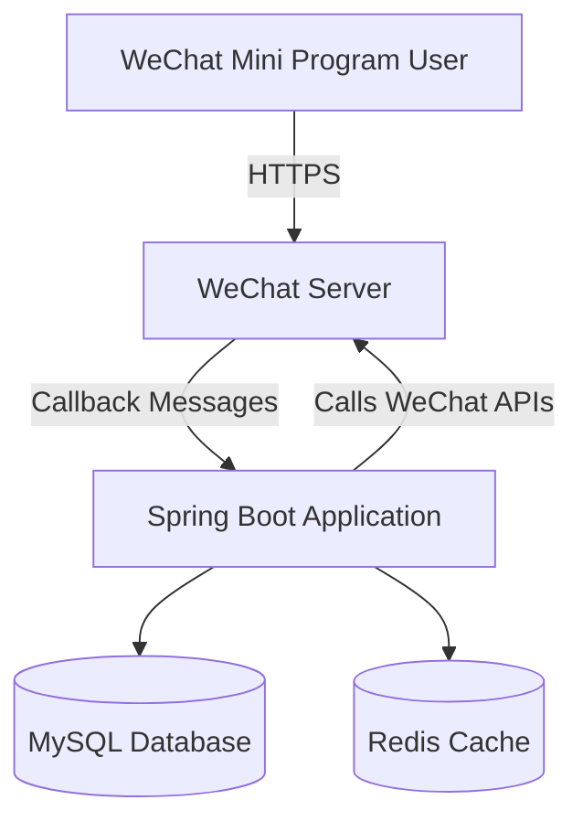

## System Architecture

## System Overview

This section outlines the core functionalities, business domains, and architectural patterns adopted in the WeChat Mini Program Java backend project.

* **Core Functionalities and Business Domains:** This project serves as the backend service for a WeChat Mini Program, primarily handling interactions with the WeChat Mini Program platform, such as message server configuration, user authentication, and Mini Program API calls. The business domain focuses on providing backend support for WeChat Mini Programs, including but not limited to user management, message processing, and integration with the WeChat ecosystem.
* **Architectural Pattern:** The project adopts a **monolithic application** architectural pattern.
* **Supporting Evidence for Architectural Pattern:**
    * The `Dockerfile` indicates that the project is built as a single JAR file (`weixin-java-miniapp-demo-1.0.0-SNAPSHOT.jar`) and launched via a single entry point (`java -jar`).
    * The project directory structure does not reveal a `services/` directory or similar microservice divisions, suggesting all functional modules are packaged within the same application.
    * The configuration in `application.yml.template` is centrally managed, with no indication of independent configuration needs for multiple services.
    * Deployment configurations (e.g., `.travis.yml`) involve only the build and packaging of a single application, without the complexity of multi-service collaborative deployment.

## Core Components and Functional Diagram

This section details the system's main components and their responsibilities, supplemented with characteristics specific to WeChat Mini Program backends.

* **Traffic Entry Layer:**
    * **Components and Responsibilities:** As the project is a monolithic application, the traffic entry layer is likely handled directly by an embedded Servlet container (e.g., Tomcat) for HTTP requests. External traffic is forwarded from the WeChat Mini Program platform to the backend service, eliminating the need for a standalone API gateway or load balancer.
    * **Implementation Considerations:** In a monolithic architecture, the traffic entry layer is tightly coupled with the application service layer, typically managed by Spring Boot's embedded web server.
* **Application Service Layer:**
    * **Service Inventory and Core Functionalities:**
        * **WeChat Mini Program Integration Service:** Handles interactions with the WeChat Mini Program platform, including message reception and response, user authentication, and API calls.
            * **Primary Responsibilities:** Processes messages pushed by the WeChat server, verifies signatures, parses and encapsulates message bodies, and invokes WeChat Open APIs.
            * **Technical Foundation:** Built on the Java/Spring Boot framework, using the `WxJava` SDK for WeChat ecosystem integration.
            * **Internal Structure Insights:** Code organization likely includes modules such as `controller` (handling HTTP requests), `service` (business logic), and `config` (WeChat configuration).
    * **Asynchronous Tasks and Background Processing:** The current architecture does not explicitly show requirements for asynchronous task processing. However, given the real-time nature of WeChat message handling, complex background task queues may be unnecessary.
* **Data Management Layer:**
    * **Data Storage Components and Responsibilities:** The configuration file does not explicitly specify database settings, but a WeChat Mini Program backend typically requires storage for user sessions, message logs, etc.
        * **Possible Data Storage:** A relational database (e.g., MySQL) for persisting user and business data; Redis for caching temporary data like WeChat access tokens.
    * **Data Responsibilities and Selection Considerations:** WeChat ecosystem integration often requires efficient caching mechanisms (e.g., Redis) to manage access tokens for WeChat APIs, reducing frequent calls to WeChat servers.

## Container Configuration Overview

This section lists containerized service configurations identified through deployment file analysis.

| Service Name | Container Image | Exposed Ports | Volumes | Key Environment Variables | Startup Command/Entrypoint |
| :----------- | :-------------- | :------------ | :------ | :------------------------- | :-------------------------- |
| `weixin-java-miniapp` | `openjdk:8-jdk-alpine` (built from Dockerfile) | Not specified (typically `8080`) | `/tmp` | Not specified (configured via `application.yml`) | `java -Djava.security.egd=file:/dev/./urandom -jar /app.jar` |

## Inter-Service Collaboration and Data Flow

This section describes data movement and interaction patterns between internal system components and external users.

* **Core Communication Path:** WeChat Mini Program user initiates a request → WeChat server forwards it to the backend service → Spring Boot application processes the request and responds → Result is returned to the WeChat server → User receives the response.
* **Interaction Patterns and Protocols:** Primarily uses HTTP/HTTPS protocols, adhering to WeChat Mini Program API specifications. Inter-service communication is not applicable due to the monolithic architecture.
* **Sharing and Isolation:** All functional modules share the same application context and data storage, with no isolation requirements typical of microservices.

## Overall Architecture Diagram (Mermaid Syntax)



## Architect's Key Insights and Future Outlook

This section analyzes critical architectural considerations and potential future evolution directions.

* **Elasticity and Scalability Strategies:** The current monolithic architecture can handle load growth through vertical scaling (increasing resources for a single instance). If horizontal scaling is needed, ensure the application is stateless and introduce external session management.
* **High Availability and Resilience Design:** Deploy multiple instances with a load balancer for traffic distribution. Database master-slave replication and Redis clusters can enhance data layer availability.
* **Security Defense System:** Securely store WeChat configuration details (e.g., `appid`, `secret`) using environment variables or secret management tools. HTTPS encryption is mandatory.
* **Operational Observability and Automation:** Integrate Spring Boot Actuator for health monitoring, combined with Prometheus and Grafana for metrics visualization. CI/CD pipelines are already automated via Travis CI.
* **Performance Optimization Potential:** Optimize caching strategies for WeChat access tokens to reduce unnecessary API calls. Database query optimization and index tuning can improve data access efficiency.
* **Technology Stack Rationale Assessment:** Java/Spring Boot is suitable for stable, high-performance backend services. The WxJava SDK simplifies WeChat ecosystem integration, making the technology stack well-chosen.
* **Future Evolution Path and Technology Introduction:** As business complexity grows, consider transitioning to a microservices architecture, such as decoupling user services and message services. Introduce message queues (e.g., RabbitMQ) for asynchronous task processing to enhance system responsiveness.

You are a professional translation assistant. Please accurately translate the following content into the target language.  
Please strictly adhere to the following guidelines:  
1. Maintain consistency with the original semantics, context, and style.  
2. Preserve the original hierarchical structure and numbering system in full.  
3. Strictly retain all original formatting elements, such as code block identifiers (```text/```, ```mermaid/```), etc.  
4. Translate only the natural language content, without any format adjustments/content additions/explanatory processing.  
5. Output only the translation of the original text, without any additional prompt information.  

Content to be translated:  

Target language code: en

