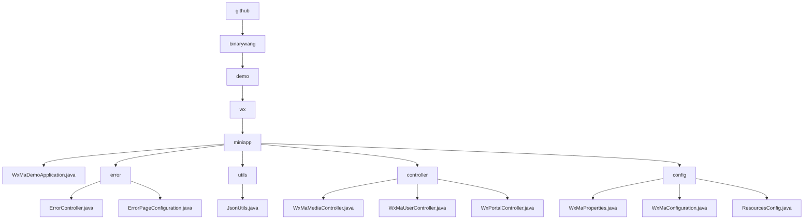

# 基础信息

|      |      |
|------|------|
| 名称 | github |
| 编码语言 | .java |
| 代码路径 | weixin-java-miniapp-demo/src/main/java/com/github |
| 包名 | docs.src.main.java.com.github |
| 概述说明 | Spring Boot微信小程序Demo入口类，含错误处理、JSON工具、控制器和配置模块。错误处理含404/500跳转，JSON工具序列化对象，控制器管理媒体、用户和消息，配置模块管理账号和路由。 |

# 说明

## 概述  
该模块是微信小程序后端服务的核心系统，采用Spring Boot框架实现，主要职责包括小程序账号配置管理、微信消息路由处理、用户会话维护及错误统一处理。系统遵循RESTful接口规范，通过Controller暴露媒体管理、用户认证等API，并集成JSON序列化工具。关键数据结构涵盖微信消息体、用户会话信息和错误状态码映射。外部依赖包括Spring Web、微信SDK、AES加密库和Lombok。例如通过`WxMaProperties.Config`管理多租户配置，或使用`ErrorController`渲染统一错误页。

## 主要业务场景  
模块支持四类典型场景：1)多账号配置初始化（类似微服务配置中心），2)媒体文件传输（如临时素材上传），3)用户OAuth式登录（校验code获取openid），4)微信消息处理（类似事件总线路由）。业务流程均采用"校验-处理-清理"模式，例如用户登录需验证appid并清理ThreadLocal数据。交互方式包含同步HTTP请求（如GET获取二维码）和消息回调（如处理加密推送）。典型应用案例包括群发消息配置、手机号解密及404错误兜底页展示。

### 包内部结构视图

该流程图展示了微信小程序Demo项目的Java代码目录结构，从根目录github开始逐级展开，最终到达具体的Java类文件。主要包含miniapp主模块及其下属的error、utils、controller和config子模块，每个子模块下又包含相应的功能类文件，如控制器类、配置类和工具类等，完整呈现了项目代码的组织架构。

# 文件列表

| 名称   | 类型  | 说明 |
|-------|------|-------------|
| [binarywang](binarywang/_module.md) | package | Spring Boot微信小程序Demo入口类，含错误处理、JSON工具、控制器和配置模块。错误处理含404/500跳转，JSON工具序列化对象，控制器管理媒体、用户和消息，配置模块管理账号和路由。 |

