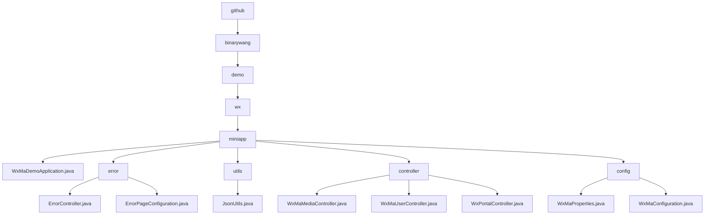

# 基础信息

|      |      |
|------|------|
| 名称 | github |
| 编码语言 | .java |
| 代码路径 | weixin-java-miniapp-demo/src/main/java/com/github |
| 包名 | docs.src.main.java.com.github |
| 概述说明 | Spring Boot微信小程序Demo包含启动类、错误处理、JSON工具、控制器和配置模块。启动类标准结构，错误模块处理404/500跳转，工具类提供JSON序列化，控制器管理媒体用户消息，配置模块管理多账号初始化。 |

# 说明

## 概述  
该模块是微信小程序后端服务集合，核心职责包括应用启动配置、错误处理、业务逻辑控制和多租户管理。采用Spring Boot框架构建，遵循标准MVC模式，通过Controller暴露RESTful接口和微信回调接口。关键数据结构涵盖错误页面映射(ErrorPage)、用户会话信息(sessionKey/openid)和微信消息对象。外部依赖包括Spring Web、微信小程序Java SDK及JSON处理工具。例如WxMaDemoApplication作为启动入口，JsonUtils处理序列化，WxMaProperties管理多账号配置。

## 主要业务场景  
模块实现完整的微信小程序后端流程，类似SaaS服务架构。主要业务线包括：1)错误拦截链处理404/500等状态码；2)媒体管理实现临时文件上传下载；3)用户服务完成登录授权与敏感数据解密；4)配置中心初始化多租户实例。典型交互如用户登录→媒体操作→消息处理，通过ThreadLocal保证线程安全。API集成案例可见错误处理子系统、多格式消息路由（XML/JSON）及微信API异常统一捕获。

### 包内部结构视图

该流程图展示了微信小程序Demo项目的完整目录结构，从根目录github开始逐级展开到最底层文件。核心模块miniapp包含5个子节点：主应用文件、错误处理模块、工具类、控制器和配置模块。每个子模块又进一步细分为具体实现文件，如控制器包含3个不同功能的Controller，配置模块包含2个配置类，完整呈现了项目的基础架构和功能划分。

# 文件列表

| 名称   | 类型  | 说明 |
|-------|------|-------------|
| [binarywang](binarywang/_module.md) | package | Spring Boot微信小程序Demo包含启动类、错误处理、JSON工具、控制器和配置模块。启动类标准结构，错误模块处理404/500跳转，工具类提供JSON序列化，控制器管理媒体用户消息，配置模块管理多账号初始化。 |

