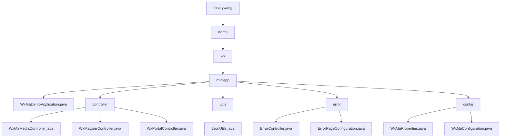

# 基础信息

|      |      |
|------|------|
| 名称 | binarywang |
| 编码语言 | .java |
| 代码路径 | weixin-java-miniapp-demo/src/main/java/com/github/binarywang |
| 包名 | docs.src.main.java.com.github.binarywang |
| 概述说明 | Spring Boot微信小程序Demo，含启动类、控制器、JSON工具、错误处理和配置模块。控制器处理媒体、用户和消息，工具类处理JSON序列化，错误模块统一处理HTTP错误，配置模块管理多账号和消息服务。 |

# 说明

## 概述  
该模块是微信小程序后端服务的Spring Boot实现，核心职责包括媒体文件管理、用户会话处理、微信消息交互和错误统一处理。采用RESTful接口规范，支持JSON/XML数据格式，关键数据结构涵盖Media_id列表、用户会话信息（sessionKey/openid）和微信消息体。外部依赖微信服务器API、AES加密库、Spring Web框架和Lombok。例如媒体控制器处理文件上传，用户控制器管理登录授权，配置模块初始化多账号服务。

## 主要业务场景  
模块支持四类典型交互：媒体传输（类似FTP）、身份认证（类似OAuth）、消息处理（类似事件总线）和错误兜底（类似路由拦截器）。业务流程遵循"校验-处理-清理"模式，例如用户登录先验证code再获取会话信息。典型应用包括上传临时素材、解密用户手机号和处理加密消息，所有接口严格校验appid确保多租户隔离。集成案例可见订阅消息推送和500错误页渲染。

### 包内部结构视图

该流程图展示了微信小程序Demo项目的目录结构，从根目录binarywang开始，逐级展开到miniapp模块，包含应用程序主类、控制器、工具类、错误处理及配置等子模块。各子模块下分别包含对应的实现类文件，形成清晰的层级关系。

# 文件列表

| 名称   | 类型  | 说明 |
|-------|------|-------------|
| [demo](demo/_module.md) | package | Spring Boot微信小程序Demo，含启动类、控制器、JSON工具、错误处理和配置模块。控制器处理媒体、用户和消息，工具类处理JSON序列化，错误模块统一处理HTTP错误，配置模块管理多账号和消息服务。 |

