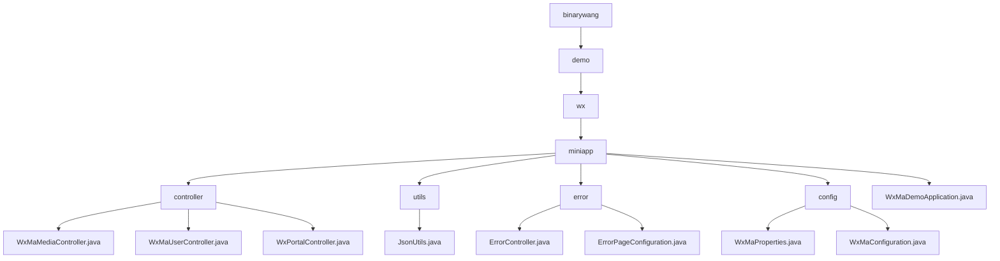

# 基础信息

|      |      |
|------|------|
| 名称 | binarywang |
| 编码语言 | .java |
| 代码路径 | weixin-java-miniapp-demo/src/main/java/com/github/binarywang |
| 包名 | docs.src.main.java.com.github.binarywang |
| 概述说明 | 微信小程序后端核心模块，包含媒体管理、用户会话和微信交互功能，依赖微信SDK和Lombok。支持文件上传、身份认证和消息路由，流程包括校验、处理和清理。错误处理模块统一管理404/500响应。配置模块管理小程序属性和消息服务初始化。Spring Boot应用入口类启动整个Demo。 |

# 说明

## 概述  
该模块是微信小程序后端服务的集成解决方案，核心职责包括媒体文件管理、用户会话管理、微信服务器交互和统一错误处理。接口规范要求验证AppID有效性，遵循Spring MVC标准，并通过`wx.miniapp`前缀注入配置。关键数据结构涵盖media_id、用户会话对象、微信消息封装体和WxMaProperties.Config配置类。外部依赖微信SDK、Spring框架和Lombok工具库。例如媒体控制器处理多文件上传，错误控制器返回统一视图，配置类实现多账号管理。

## 主要业务场景  
模块支持四类典型交互：媒体文件传输（类似网盘接口）、用户认证（类似OAuth2.0）、微信消息路由（类似事件总线模式）和HTTP错误处理（类似Web服务器错误页）。完整业务流程包含凭证校验→业务处理→资源清理三阶段，例如用户登录验证code或异常时重定向错误页。集成案例覆盖文件上传、会话解密、消息响应和错误提示，如POST接口处理加密消息或GET返回404视图。所有交互通过标准Spring MVC控制器实现。

### 包内部结构视图

该流程图展示了微信小程序Demo项目的核心结构，从根目录binarywang开始，逐级展开到miniapp模块，包含controller、utils、error、config等子模块及其对应的Java类文件。其中controller模块包含三个控制器类，utils和error各有两个工具类和错误处理类，config模块有两个配置类，顶层还有主应用类WxMaDemoApplication.java。

# 文件列表

| 名称   | 类型  | 说明 |
|-------|------|-------------|
| [demo](demo/_module.md) | package | 微信小程序后端核心模块，包含媒体管理、用户会话和微信交互功能，依赖微信SDK和Lombok。支持文件上传、身份认证和消息路由，流程包括校验、处理和清理。错误处理模块统一管理404/500响应。配置模块管理小程序属性和消息服务初始化。Spring Boot应用入口类启动整个Demo。 |

