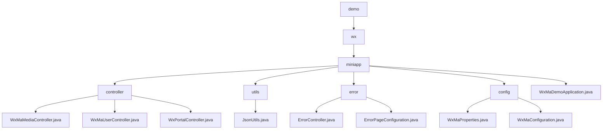

# 基础信息

|      |      |
|------|------|
| 名称 | demo |
| 编码语言 | .java |
| 代码路径 | weixin-java-miniapp-demo/src/main/java/com/github/binarywang/demo |
| 包名 | docs.src.main.java.com.github.binarywang.demo |
| 概述说明 | 微信小程序后端核心模块，含媒体管理、用户信息处理和消息路由功能，遵循微信标准，依赖微信JSSDK和Spring Boot。错误处理模块统一管理HTTP错误状态码，自定义错误页面。多账号配置模块动态管理小程序账号和消息路由。应用入口类基于Spring Boot启动。 |

# 说明

## 概述  
该模块是微信小程序后端核心系统，整合了媒体管理、用户认证、消息路由和错误处理四大功能。采用Spring Boot框架，遵循微信开放平台规范，关键结构包括Media_id列表、用户会话信息和消息处理器映射。依赖微信JSSDK、Lombok和Spring Web组件。例如上传素材返回media_id，用户登录通过code换取openid，错误处理支持自定义404页面。JSON序列化工具采用配置化的ObjectMapper实现高效转换。

## 主要业务场景  
系统实现小程序全生命周期管理：媒体文件类似CDN操作，用户认证遵循OAuth2.0流程，消息路由采用事件总线模式，错误处理仿前端路由拦截。典型流程包括校验请求→业务处理→资源清理三阶段，例如解密加密手机号需验证会话密钥。集成案例覆盖五类消息处理，异常通过日志降级处理。启动类通过@SpringBootApplication初始化多账号配置服务。

### 包内部结构视图

该流程图展示了微信小程序Demo项目的核心代码结构。根节点"demo"下包含"wx"模块，其子模块"miniapp"作为核心容器，包含控制器、工具类、错误处理、配置等子目录及主应用类。控制器目录下有三个API控制器，工具类包含JSON处理工具，错误处理包含全局异常控制，配置目录存放小程序相关参数配置类。

# 文件列表

| 名称   | 类型  | 说明 |
|-------|------|-------------|
| [wx](wx/_module.md) | package | 微信小程序后端核心模块，含媒体管理、用户信息处理和消息路由功能，遵循微信标准，依赖微信JSSDK和Spring Boot。错误处理模块统一管理HTTP错误状态码，自定义错误页面。多账号配置模块动态管理小程序账号和消息路由。应用入口类基于Spring Boot启动。 |

