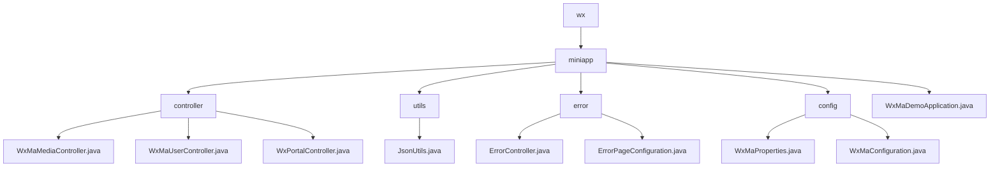

# 基础信息

|      |      |
|------|------|
| 名称 | wx |
| 编码语言 | .java |
| 代码路径 | weixin-java-miniapp-demo/src/main/java/com/github/binarywang/demo/wx |
| 包名 | docs.src.main.java.com.github.binarywang.demo.wx |
| 概述说明 | 微信小程序后端核心模块，含媒体管理、用户会话和微信交互功能，采用ThreadLocal确保线程安全。配置中心管理多账号和消息路由，错误处理模块统一处理404/500等状态码。依赖微信SDK和Spring框架，支持高并发无状态设计。 |

# 说明

## 概述  
该模块是微信小程序后端服务集合，包含核心控制器、配置中心和错误处理系统。核心职责包括媒体文件管理、用户会话维护、微信服务器交互及统一错误路由，采用ThreadLocal保证线程安全，类似事件总线模式。统一接口规范涵盖POST/PGET请求处理、AppID校验、JSON响应及Spring MVC错误路由。关键数据结构包含MediaID列表、用户会话信息（SessionKey/OpenID）、微信消息体和ErrorPage映射。依赖微信JSSDK、AES加密库及Spring Web框架，例如通过JNI调用微信API或动态加载多账号配置。

## 主要业务场景  
典型应用模式为：用户登录获取SessionKey后解密数据，媒体文件通过MediaID中转，错误请求自动路由至预设页面。业务流程均遵循"校验-处理-清理"模式，例如上传文件时校验AppID后调用微信API，最后清除线程配置。完整功能覆盖OAuth2.0授权、AES-ECB解密、多文件批量上传及消息路由（如二维码处理）。交互设计类似RESTful风格，包含服务端渲染接口（错误页）和客服消息响应，确保高并发下的线程安全与状态管理。

### 包内部结构视图

该流程图展示了微信小程序Demo项目的目录结构。根节点为wx，包含miniapp子目录，miniapp下分controller、utils、error、config四个子目录及主应用文件。每个子目录包含对应的功能类文件，如控制器类、工具类、错误处理类和配置类，形成清晰的模块化结构。

# 文件列表

| 名称   | 类型  | 说明 |
|-------|------|-------------|
| [miniapp](miniapp/_module.md) | package | 微信小程序后端核心模块，含媒体管理、用户会话和微信交互功能，采用ThreadLocal确保线程安全。配置中心管理多账号和消息路由，错误处理模块统一处理404/500等状态码。依赖微信SDK和Spring框架，支持高并发无状态设计。 |

