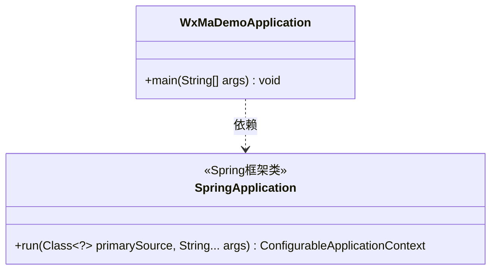
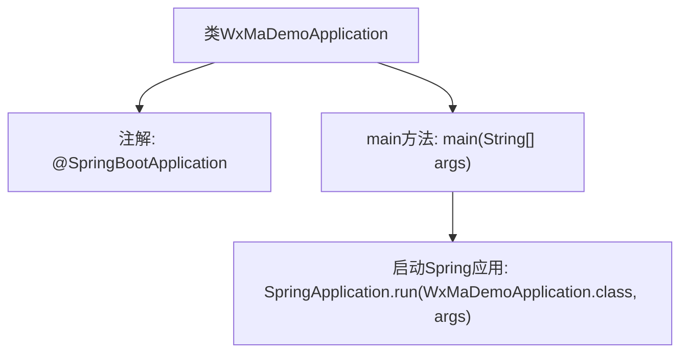

# 基础信息

|      |      |
|------|------|
| 名称 | WxMaDemoApplication |
| 编码语言 | .java |
| 代码路径 | weixin-java-miniapp-demo/src/main/java/com/github/binarywang/demo/wx/miniapp/WxMaDemoApplication.java |
| 包名 | com.github.binarywang.demo.wx.miniapp |
| 依赖项 | ['org.springframework.boot.SpringApplication', 'org.springframework.boot.autoconfigure.SpringBootApplication'] |
| 概述说明 | 这是一个Spring Boot应用启动类，包含主方法以运行微信小程序示例程序。 |

# 说明

这是一个基于Spring Boot框架的微信小程序Demo应用入口类。类上标注了@SpringBootApplication注解，表明这是一个Spring Boot应用的主配置类，会自动启用自动配置和组件扫描。main方法作为程序启动入口，通过SpringApplication.run方法启动整个Spring Boot应用，并传入当前类对象和命令行参数。该类的结构遵循了标准Spring Boot应用的启动模式。

# 类列表 Class Summary

| 名称   | 类型  | 说明 |
|-------|------|-------------|
| WxMaDemoApplication | class | 这是一个Spring Boot应用的主类，使用@SpringBootApplication注解标记，通过main方法启动应用。 |

## 类 WxMaDemoApplication

|      |      |
|------|------|
| 访问范围 | @SpringBootApplication;public |
| 类型 | class |
| 名称 | WxMaDemoApplication |
| 说明 | 这是一个Spring Boot应用的主类，使用@SpringBootApplication注解标记，通过main方法启动应用。 |

### UML类图

这段代码展示了一个标准的Spring Boot应用启动类结构。WxMaDemoApplication类通过@SpringBootApplication注解标记为Spring Boot应用入口，其main方法通过SpringApplication.run()启动整个应用。类图中清晰显示了WxMaDemoApplication对SpringApplication类的依赖关系，以及SpringApplication作为框架核心类提供的run方法，该方法接收主配置类和命令行参数，返回应用上下文对象。这种结构体现了Spring Boot约定优于配置的设计理念。

### 内部方法调用关系图

该流程图描述了基于Spring Boot的微信小程序Demo应用启动流程。类WxMaDemoApplication通过@SpringBootApplication注解标记为Spring Boot应用入口，main方法调用SpringApplication.run()启动嵌入式服务器并加载应用配置，箭头清晰展示了从类定义到应用启动的完整调用链。

### 字段列表 Field List

| 名称  | 类型  | 说明 |
|-------|-------|------|

### 方法列表

| 名称  | 类型  | 说明 |
|-------|-------|------|
| main | void | 这是一个Java Spring Boot应用的启动方法，通过SpringApplication运行主类WxMaDemoApplication。 |

