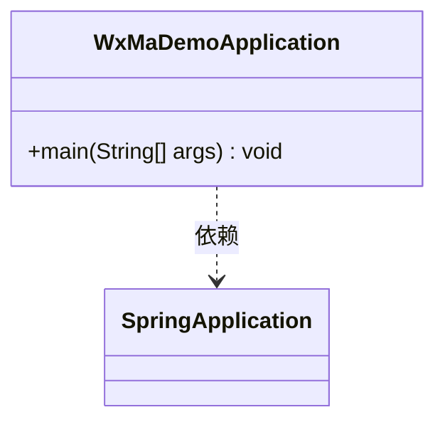
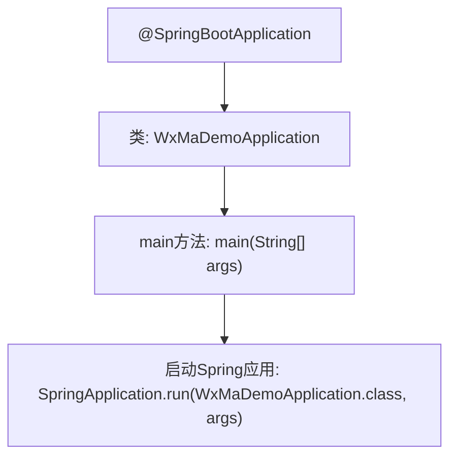

# 基础信息

|      |      |
|------|------|
| 名称 | WxMaDemoApplication |
| 编码语言 | .java |
| 代码路径 | weixin-java-miniapp-demo/src/main/java/com/github/binarywang/demo/wx/miniapp/WxMaDemoApplication.java |
| 包名 | com.github.binarywang.demo.wx.miniapp |
| 依赖项 | ['org.springframework.boot.SpringApplication', 'org.springframework.boot.autoconfigure.SpringBootApplication'] |
| 概述说明 | 这是一个Spring Boot应用的主类，使用@SpringBootApplication注解标记，通过main方法启动应用。 |

# 说明

这是一个基于Spring Boot框架的微信小程序应用入口类。类名为WxMaDemoApplication，使用@SpringBootApplication注解标记，表明这是一个Spring Boot应用的主配置类。该类包含一个标准的main方法，通过调用SpringApplication.run方法来启动整个Spring Boot应用，传入的参数是当前类名和命令行参数。这个类是应用的启动入口，负责初始化Spring容器和自动配置相关组件。

# 类列表 Class Summary

| 名称   | 类型  | 说明 |
|-------|------|-------------|
| WxMaDemoApplication | class | 这是一个Spring Boot应用的主类，使用@SpringBootApplication注解标记，通过main方法启动应用。 |

## 类 WxMaDemoApplication

|      |      |
|------|------|
| 访问范围 | @SpringBootApplication;public |
| 类型 | class |
| 名称 | WxMaDemoApplication |
| 说明 | 这是一个Spring Boot应用的主类，使用@SpringBootApplication注解标记，通过main方法启动应用。 |

### UML类图

类图描述：  
该图展示了一个简单的Spring Boot应用启动类WxMaDemoApplication，其中包含main方法作为程序入口。该类通过依赖关系调用SpringApplication.run()方法启动应用。图中清晰体现了Spring Boot应用的启动流程核心结构，即主类与SpringApplication框架类之间的调用关系。

### 内部方法调用关系图

该流程图描述了基于Spring Boot的微信小程序Demo应用的启动过程。`@SpringBootApplication`注解标记主配置类，`main`方法作为入口调用`SpringApplication.run`启动嵌入式容器并加载应用上下文。整个过程体现了Spring Boot的约定优于配置理念，通过注解自动完成大部分初始化工作。

### 字段列表 Field List

| 名称  | 类型  | 说明 |
|-------|-------|------|

### 方法列表

| 名称  | 类型  | 说明 |
|-------|-------|------|
| main | void | Java主方法，使用SpringApplication启动WxMaDemoApplication类。 |

