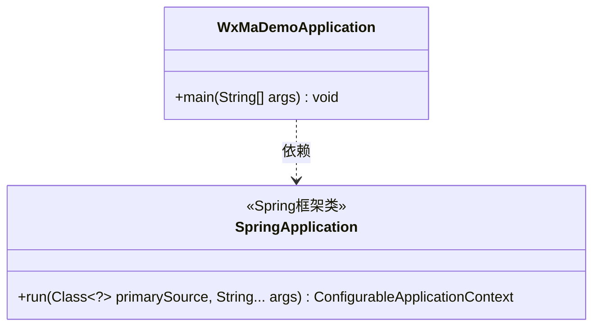
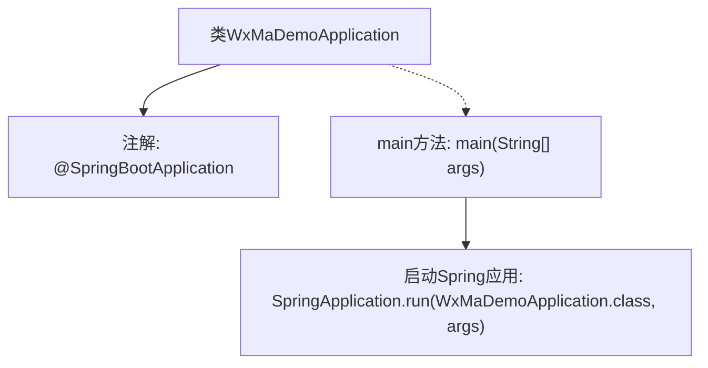

# 基础信息

|      |      |
|------|------|
| 名称 | WxMaDemoApplication |
| 编码语言 | .java |
| 代码路径 | weixin-java-miniapp-demo/src/main/java/com/github/binarywang/demo/wx/miniapp/WxMaDemoApplication.java |
| 包名 | com.github.binarywang.demo.wx.miniapp |
| 依赖项 | ['org.springframework.boot.SpringApplication', 'org.springframework.boot.autoconfigure.SpringBootApplication'] |
| 概述说明 | SpringBoot应用启动类，包含主方法运行Spring应用。 |

# 说明

这是一个基于Spring Boot框架的微信小程序Demo应用启动类。类名为WxMaDemoApplication，使用@SpringBootApplication注解标记，表明这是一个Spring Boot应用的主配置类。该注解组合了@Configuration、@EnableAutoConfiguration和@ComponentScan三个核心注解的功能。main方法作为程序入口，通过SpringApplication.run方法启动Spring Boot应用，传入当前类对象和命令行参数args。这个类结构是标准的Spring Boot应用启动模板。

# 类列表 Class Summary

| 名称   | 类型  | 说明 |
|-------|------|-------------|
| WxMaDemoApplication | class | 这是一个Spring Boot应用的主类，使用@SpringBootApplication注解标记，通过main方法启动应用。 |

## 类 WxMaDemoApplication

|      |      |
|------|------|
| 访问范围 | @SpringBootApplication;public |
| 类型 | class |
| 名称 | WxMaDemoApplication |
| 说明 | 这是一个Spring Boot应用的主类，使用@SpringBootApplication注解标记，通过main方法启动应用。 |

### UML类图

这段类图展示了一个基于Spring Boot的微信小程序Demo应用启动类WxMaDemoApplication，它通过main方法依赖SpringApplication类的run方法来启动整个Spring Boot应用。图中明确标注了SpringApplication作为Spring框架核心启动类的角色，以及WxMaDemoApplication作为用户自定义启动类的简单结构，体现了Spring Boot应用的标准启动模式。

### 内部方法调用关系图

这段代码是一个典型的Spring Boot应用启动类，通过@SpringBootApplication注解标记主配置类，main方法中调用SpringApplication.run()启动嵌入式Web服务器并加载应用上下文。流程图展示了类与注解的从属关系，以及main方法作为入口触发Spring应用启动的核心流程，体现了Spring Boot的约定优于配置特性。

### 字段列表 Field List

| 名称  | 类型  | 说明 |
|-------|-------|------|

### 方法列表

| 名称  | 类型  | 说明 |
|-------|-------|------|
| main | void | Java主方法启动Spring Boot应用，参数为WxMaDemoApplication类和命令行参数。 |

