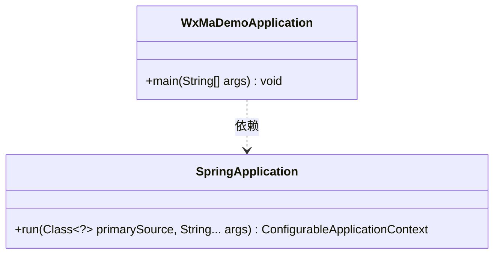
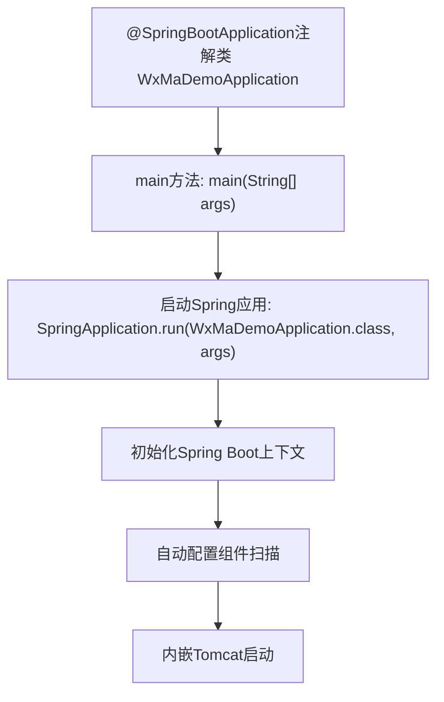

# 基础信息

|      |      |
|------|------|
| 名称 | WxMaDemoApplication |
| 编码语言 | .java |
| 代码路径 | weixin-java-miniapp-demo/src/main/java/com/github/binarywang/demo/wx/miniapp/WxMaDemoApplication.java |
| 包名 | com.github.binarywang.demo.wx.miniapp |
| 依赖项 | ['org.springframework.boot.SpringApplication', 'org.springframework.boot.autoconfigure.SpringBootApplication'] |
| 概述说明 | SpringBoot应用启动类，包含主方法运行Spring应用。 |

# 说明

这是一个基于Spring Boot框架的微信小程序Demo应用入口类。类上标注了@SpringBootApplication注解，表明这是一个Spring Boot应用的主配置类。main方法作为程序启动入口，通过SpringApplication.run方法启动整个应用，并传入当前类作为主配置类。该结构是标准Spring Boot应用的典型启动方式。

# 类列表 Class Summary

| 名称   | 类型  | 说明 |
|-------|------|-------------|
| WxMaDemoApplication | class | SpringBoot应用启动类，包含主方法运行Spring应用。 |

## 类 WxMaDemoApplication

|      |      |
|------|------|
| 访问范围 | @SpringBootApplication;public |
| 类型 | class |
| 名称 | WxMaDemoApplication |
| 说明 | SpringBoot应用启动类，包含主方法运行Spring应用。 |

### UML类图

这段代码展示了一个简单的Spring Boot应用启动类WxMaDemoApplication，它通过main方法调用SpringApplication.run()来启动应用。类图中包含WxMaDemoApplication和SpringApplication两个类，前者依赖后者提供的run方法完成应用启动。这是一个典型的Spring Boot应用入口类结构，遵循了Spring Boot的约定优于配置原则。

### 内部方法调用关系图

该流程图描述了基于Spring Boot的微信小程序Demo应用的启动过程。从标注@SpringBootApplication的主类开始，通过main方法调用SpringApplication.run启动应用，依次展示Spring上下文初始化、自动配置加载和内嵌服务器启动的关键流程。整个过程体现了Spring Boot的约定优于配置理念，仅需一个注解和启动调用即可完成应用部署准备。

### 字段列表 Field List

| 名称  | 类型  | 说明 |
|-------|-------|------|

### 方法列表

| 名称  | 类型  | 说明 |
|-------|-------|------|
| main | void | Java主方法启动Spring Boot应用，运行WxMaDemoApplication类。 |

