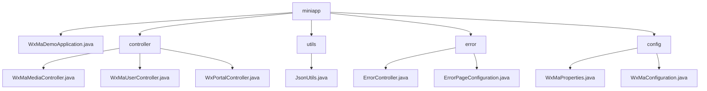

# 基础信息

|      |      |
|------|------|
| 名称 | miniapp |
| 编码语言 | .java |
| 代码路径 | weixin-java-miniapp-demo/src/main/java/com/github/binarywang/demo/wx/miniapp |
| 包名 | docs.src.main.java.com.github.binarywang.demo.wx.miniapp |
| 概述说明 | 微信小程序后端核心模块，包含媒体管理、用户会话和微信交互功能，依赖微信SDK和Lombok。支持文件上传、身份认证和消息路由，流程包括校验、处理和清理。错误处理模块统一管理404/500响应。配置模块管理小程序属性和消息服务初始化。Spring Boot应用入口类启动整个Demo。 |

# 说明

## 概述  
该模块是微信小程序后端服务的集成解决方案，核心职责包括媒体文件管理、用户会话管理、微信服务器交互和统一错误处理。接口规范要求验证AppID有效性，遵循Spring MVC标准，并通过`wx.miniapp`前缀注入配置。关键数据结构涵盖media_id、用户会话对象、微信消息封装体和WxMaProperties.Config配置类。外部依赖微信SDK、Spring框架和Lombok工具库。例如媒体控制器处理多文件上传，错误控制器返回统一视图，配置类实现多账号管理。

## 主要业务场景  
模块支持四类典型交互：媒体文件传输（类似网盘接口）、用户认证（类似OAuth2.0）、微信消息路由（类似事件总线模式）和HTTP错误处理（类似Web服务器错误页）。完整业务流程包含凭证校验→业务处理→资源清理三阶段，例如用户登录验证code或异常时重定向错误页。集成案例覆盖文件上传、会话解密、消息响应和错误提示，如POST接口处理加密消息或GET返回404视图。所有交互通过标准Spring MVC控制器实现。

### 包内部结构视图

该流程图展示了微信小程序Demo项目的目录结构，根目录miniapp下包含主应用文件、控制器、工具类、错误处理和配置模块。控制器目录包含三个功能控制器，错误处理目录包含错误控制器和页面配置，配置目录包含属性配置和主配置类。整体结构清晰，符合典型Spring Boot应用的分层架构。

# 文件列表

| 名称   | 类型  | 说明 |
|-------|------|-------------|
| [WxMaDemoApplication.java](WxMaDemoApplication.md) | file | 这是一个Spring Boot应用启动类，包含主方法以运行微信小程序示例程序。 |
| [config](config/_module.md) | package | 微信小程序Java配置类：WxMaProperties绑定小程序配置项（ID、密钥等），WxMaConfiguration初始化服务并处理消息路由（文本、图片等回复逻辑）。 |
| [error](error/_module.md) | package | Spring MVC控制器处理错误页面，映射/error路径，提供404和500错误处理方法。配置类实现错误页面注册，将404和500错误分别重定向到指定路径。 |
| [utils](utils/_module.md) | package | JsonUtils类提供静态JSON序列化方法，使用ObjectMapper配置忽略null值并格式化输出，异常时返回null。 |
| [controller](controller/_module.md) | package | 微信小程序三个控制器类：媒体管理类处理文件上传下载；用户管理类提供登录、用户信息和手机号接口；后台类处理微信服务器认证和消息路由。均验证appid并清理ThreadLocal。 |

