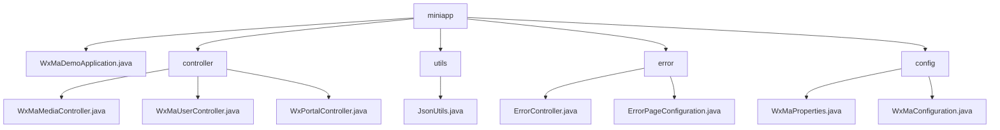

# 基础信息

|      |      |
|------|------|
| 名称 | miniapp |
| 编码语言 | .java |
| 代码路径 | weixin-java-miniapp-demo/src/main/java/com/github/binarywang/demo/wx/miniapp |
| 包名 | docs.src.main.java.com.github.binarywang.demo.wx.miniapp |
| 概述说明 | 微信小程序后端核心模块，含媒体管理、用户信息处理和消息路由功能，遵循微信标准，依赖微信JSSDK和Spring Boot。错误处理模块统一管理HTTP错误状态码，自定义错误页面。多账号配置模块动态管理小程序账号和消息路由。应用入口类基于Spring Boot启动。 |

# 说明

## 概述  
该模块是微信小程序后端核心系统，整合了媒体管理、用户认证、消息路由和错误处理四大功能。采用Spring Boot框架，遵循微信开放平台规范，关键结构包括Media_id列表、用户会话信息和消息处理器映射。依赖微信JSSDK、Lombok和Spring Web组件。例如上传素材返回media_id，用户登录通过code换取openid，错误处理支持自定义404页面。JSON序列化工具采用配置化的ObjectMapper实现高效转换。

## 主要业务场景  
系统实现小程序全生命周期管理：媒体文件类似CDN操作，用户认证遵循OAuth2.0流程，消息路由采用事件总线模式，错误处理仿前端路由拦截。典型流程包括校验请求→业务处理→资源清理三阶段，例如解密加密手机号需验证会话密钥。集成案例覆盖五类消息处理，异常通过日志降级处理。启动类通过@SpringBootApplication初始化多账号配置服务。

### 包内部结构视图

该流程图展示了微信小程序Demo项目的目录结构，根目录miniapp下包含主应用类、控制器包、工具包、错误处理包和配置包。控制器包中包含三个微信媒体、用户和门户控制器，工具包包含JSON工具类，错误处理包包含错误控制器和页面配置，配置包包含属性配置和主配置类。结构清晰展示了典型的Spring Boot项目分层架构。

# 文件列表

| 名称   | 类型  | 说明 |
|-------|------|-------------|
| [WxMaDemoApplication.java](WxMaDemoApplication.md) | file | 这是一个Spring Boot应用的主类，使用@SpringBootApplication注解标记，通过main方法启动应用。 |
| [controller](controller/_module.md) | package | 微信小程序三个控制器类：媒体控制器处理文件上传下载；用户控制器管理登录、用户信息和手机号；门户控制器处理认证和消息路由。均包含ThreadLocal清理和日志记录。 |
| [config](config/_module.md) | package | 微信小程序配置类WxMaProperties绑定wx.miniapp前缀，含多小程序配置列表，每个配置含appid、secret等字段。WxMaConfiguration类初始化小程序服务并配置消息路由，处理文本、图片等消息类型，含上传和生成功能。 |
| [error](error/_module.md) | package | ErrorController类处理/error路径请求，包含404和500错误处理方法，返回error视图。ErrorPageConfiguration类注册404和500错误页面的跳转路径。 |
| [utils](utils/_module.md) | package | JsonUtils类提供静态方法toJson，使用ObjectMapper将对象转为JSON字符串，自动忽略null值并格式化输出。 |

