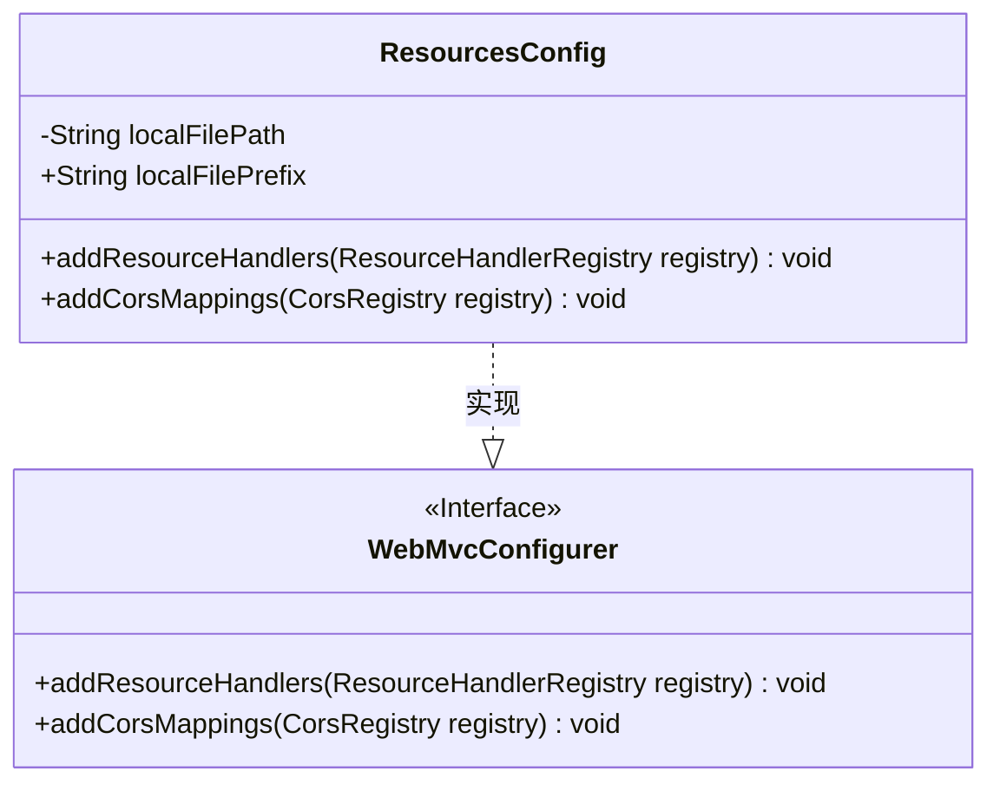
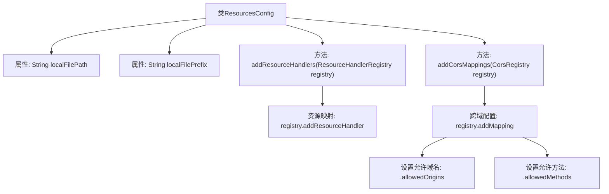

# 基础信息

|      |      |
|------|------|
| 名称 | ResourcesConfig |
| 编码语言 | .java |
| 代码路径 | weixin-java-miniapp-demo/src/main/java/com/github/binarywang/demo/wx/miniapp/config/ResourcesConfig.java |
| 包名 | com.leaniss.file.config |
| 依赖项 | ['java.io.File', 'org.springframework.beans.factory.annotation.Value', 'org.springframework.context.annotation.Configuration', 'org.springframework.web.servlet.config.annotation.CorsRegistry', 'org.springframework.web.servlet.config.annotation.ResourceHandlerRegistry', 'org.springframework.web.servlet.config.annotation.WebMvcConfigurer'] |
| 概述说明 | 资源配置类，定义本地文件路径和前缀，映射资源路径并启用跨域支持，允许GET请求访问。 |

# 说明

这是一个Spring Boot的资源配置类，实现了WebMvcConfigurer接口。主要功能包括配置本地文件存储路径和跨域访问。通过注解从配置文件中读取文件存储根路径和资源映射前缀。重写addResourceHandlers方法，将指定前缀的URL请求映射到本地文件路径。同时重写addCorsMappings方法，为文件路径开启跨域访问，允许所有域名通过GET方法访问该路径下的资源。整个配置实现了文件资源的本地存储与网络访问功能。

# 类列表 Class Summary

| 名称   | 类型  | 说明 |
|-------|------|-------------|
| ResourcesConfig | class | 资源映射配置类，设置本地文件存储路径和前缀，并配置跨域访问权限。 |

## 类 ResourcesConfig

|      |      |
|------|------|
| 访问范围 | @Configuration;public |
| 类型 | class |
| 名称 | ResourcesConfig |
| 说明 | 资源映射配置类，设置本地文件存储路径和前缀，并配置跨域访问权限。 |

### UML类图

类图描述：ResourcesConfig类实现了WebMvcConfigurer接口，用于配置Spring MVC的资源处理和跨域设置。该类包含两个成员变量：localFilePath（本地文件存储路径）和localFilePrefix（资源映射前缀），并重写了接口中的addResourceHandlers方法（配置静态资源映射）和addCorsMappings方法（配置跨域访问规则）。通过@Value注解从配置文件中注入参数值。

### 内部方法调用关系图

这段代码是一个Spring Boot配置类，主要用于配置静态资源映射和跨域设置。它通过`addResourceHandlers`方法将本地文件路径映射到指定的URL前缀，实现文件访问服务；同时通过`addCorsMappings`方法允许所有来源的GET请求跨域访问这些资源。配置类通过`@Value`注解从配置文件中注入路径参数，实现了资源路径的动态配置。

### 字段列表 Field List

| 名称  | 类型  | 说明 |
|-------|-------|------|
| localFilePath | String | 代码片段使用Spring的@Value注解，将配置文件中的file.path属性值注入到localFilePath变量中。 |
| localFilePrefix | String | 配置注入本地文件前缀路径 |

### 方法列表

| 名称  | 类型  | 说明 |
|-------|-------|------|
| addResourceHandlers | void | 该方法配置本地文件上传路径，将指定URL前缀映射到本地文件系统路径。 |
| addCorsMappings | void | 该方法配置跨域请求，允许所有域名通过GET方法访问指定路由下的资源。 |

