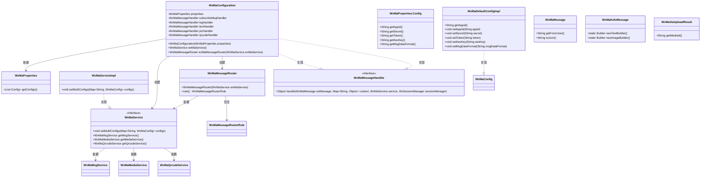
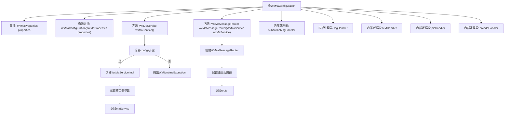
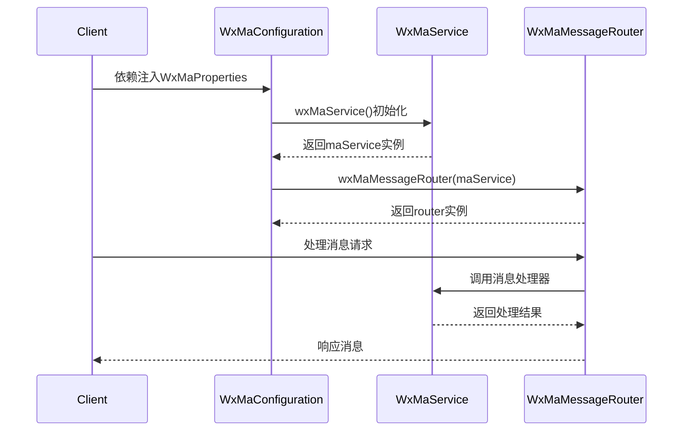

# 基础信息

|      |      |
|------|------|
| 名称 | WxMaConfiguration |
| 编码语言 | .java |
| 代码路径 | weixin-java-miniapp-demo/src/main/java/com/github/binarywang/demo/wx/miniapp/config/WxMaConfiguration.java |
| 包名 | com.github.binarywang.demo.wx.miniapp.config |
| 依赖项 | ['cn.binarywang.wx.miniapp.api.WxMaService', 'cn.binarywang.wx.miniapp.api.impl.WxMaServiceImpl', 'cn.binarywang.wx.miniapp.bean.WxMaKefuMessage', 'cn.binarywang.wx.miniapp.bean.WxMaSubscribeMessage', 'cn.binarywang.wx.miniapp.config.impl.WxMaDefaultConfigImpl', 'cn.binarywang.wx.miniapp.config.impl.WxMaRedisConfigImpl', 'cn.binarywang.wx.miniapp.message.WxMaMessageHandler', 'cn.binarywang.wx.miniapp.message.WxMaMessageRouter', 'com.google.common.collect.Lists', 'lombok.extern.slf4j.Slf4j', 'me.chanjar.weixin.common.bean.result.WxMediaUploadResult', 'me.chanjar.weixin.common.error.WxErrorException', 'me.chanjar.weixin.common.error.WxRuntimeException', 'org.springframework.beans.factory.annotation.Autowired', 'org.springframework.boot.context.properties.EnableConfigurationProperties', 'org.springframework.context.annotation.Bean', 'org.springframework.context.annotation.Configuration', 'redis.clients.jedis.JedisPool', 'java.io.File', 'java.util.List', 'java.util.stream.Collectors'] |
| 概述说明 | 微信小程序配置类，初始化服务及消息路由，处理订阅、文本、图片和二维码消息。 |

# 说明

这是一个微信小程序后端服务的配置类，主要功能包括初始化微信小程序服务和多账号配置，以及设置消息路由规则。类通过构造函数注入配置属性，检查配置有效性后创建WxMaService实例，并为每个小程序账号设置应用ID、密钥等参数。消息路由器定义了不同内容类型（如文本、图片、二维码）的处理逻辑，包括日志记录、订阅消息回复、图片上传和二维码生成等功能。各类消息处理器通过客服接口向用户返回相应内容，例如上传临时图片或生成二维码后发送给用户。配置类确保所有微信小程序相关服务正确初始化并按规则处理用户消息。

# 类列表 Class Summary

| 名称   | 类型  | 说明 |
|-------|------|-------------|
| WxMaConfiguration | class | 这是一个微信小程序配置类，包含服务初始化和消息路由设置。通过WxMaProperties配置多个小程序参数，创建WxMaService服务。消息路由处理订阅、文本、图片和二维码消息，并定义相应处理器。 |

## 类 WxMaConfiguration

|      |      |
|------|------|
| 访问范围 | @Slf4j;@Configuration;@EnableConfigurationProperties(WxMaProperties.class);public |
| 类型 | class |
| 名称 | WxMaConfiguration |
| 说明 | 这是一个微信小程序配置类，包含服务初始化和消息路由设置。通过WxMaProperties配置多个小程序参数，创建WxMaService服务。消息路由处理订阅、文本、图片和二维码消息，并定义相应处理器。 |

### UML类图

这段代码是一个微信小程序的后端配置类，主要功能是初始化微信小程序服务(WxMaService)和消息路由器(WxMaMessageRouter)。WxMaConfiguration类通过@Configuration注解表明这是一个Spring配置类，它会读取WxMaProperties中的配置信息来初始化WxMaService，并创建消息路由器来处理不同类型的微信消息。消息路由器配置了多个规则，分别处理订阅消息、文本消息、图片消息和二维码消息等。整个设计采用了依赖注入和策略模式，通过WxMaMessageHandler接口来实现不同类型消息的处理逻辑。

### 内部方法调用关系图

该流程图展示了微信小程序配置类WxMaConfiguration的核心结构，包含服务初始化流程和消息路由配置。时序图描述了从属性注入到消息处理的完整调用链，重点呈现了wxMaService的多配置初始化和wxMaMessageRouter的规则链构建过程，以及最终的消息处理响应流程。代码通过流式API配置了5种消息处理器，分别处理订阅、日志、文本、图片和二维码消息类型。

### 字段列表 Field List

| 名称  | 类型  | 说明 |
|-------|-------|------|
| properties | WxMaProperties | 私有不可变的微信小程序配置属性对象。 |
| picHandler = (wxMessage, context, service, sessionManager) -> {        try {            WxMediaUploadResult uploadResult = service.getMediaService()                .uploadMedia("image", "png",                    ClassLoader.getSystemResourceAsStream("tmp.png"));            service.getMsgService().sendKefuMsg(                WxMaKefuMessage                    .newImageBuilder()                    .mediaId(uploadResult.getMediaId())                    .toUser(wxMessage.getFromUser())                    .build());        } catch (WxErrorException e) {            e.printStackTrace();        }        return null;    } | WxMaMessageHandler | 定义微信小程序图片消息处理器，上传临时图片并作为客服消息返回给用户，异常时打印错误。 |
| subscribeMsgHandler = (wxMessage, context, service, sessionManager) -> {        service.getMsgService().sendSubscribeMsg(WxMaSubscribeMessage.builder()            .templateId("此处更换为自己的模板id")            .data(Lists.newArrayList(                new WxMaSubscribeMessage.MsgData("keyword1", "339208499")))            .toUser(wxMessage.getFromUser())            .build());        return null;    } | WxMaMessageHandler | 定义微信小程序订阅消息处理器，使用指定模板ID和用户数据发送订阅消息，接收方为消息发送者。 |
| logHandler = (wxMessage, context, service, sessionManager) -> {        log.info("收到消息：" + wxMessage.toString());        service.getMsgService().sendKefuMsg(WxMaKefuMessage.newTextBuilder().content("收到信息为：" + wxMessage.toJson())            .toUser(wxMessage.getFromUser()).build());        return null;    } | WxMaMessageHandler | 定义了一个微信小程序消息处理器logHandler，用于记录接收到的消息并通过客服接口返回消息内容给用户。 |
| textHandler = (wxMessage, context, service, sessionManager) -> {        service.getMsgService().sendKefuMsg(WxMaKefuMessage.newTextBuilder().content("回复文本消息")            .toUser(wxMessage.getFromUser()).build());        return null;    } | WxMaMessageHandler | 微信小程序消息处理：收到文本消息后自动回复"回复文本消息"，通过客服接口发送给用户。 |
| qrcodeHandler = (wxMessage, context, service, sessionManager) -> {        try {            final File file = service.getQrcodeService().createQrcode("123", 430);            WxMediaUploadResult uploadResult = service.getMediaService().uploadMedia("image", file);            service.getMsgService().sendKefuMsg(                WxMaKefuMessage                    .newImageBuilder()                    .mediaId(uploadResult.getMediaId())                    .toUser(wxMessage.getFromUser())                    .build());        } catch (WxErrorException e) {            e.printStackTrace();        }        return null;    } | WxMaMessageHandler | 微信小程序消息处理器，生成二维码并上传为图片消息发送给用户，异常时打印错误。 |

### 方法列表

| 名称  | 类型  | 说明 |
|-------|-------|------|
| wxMaService | WxMaService | 创建微信小程序服务实例，检查配置后初始化多账号配置，包含appid、密钥等参数，配置缺失则抛出异常提示。 |
| wxMaMessageRouter | WxMaMessageRouter | 定义微信小程序消息路由规则，包含日志、订阅消息、文本、图片和二维码处理。 |

