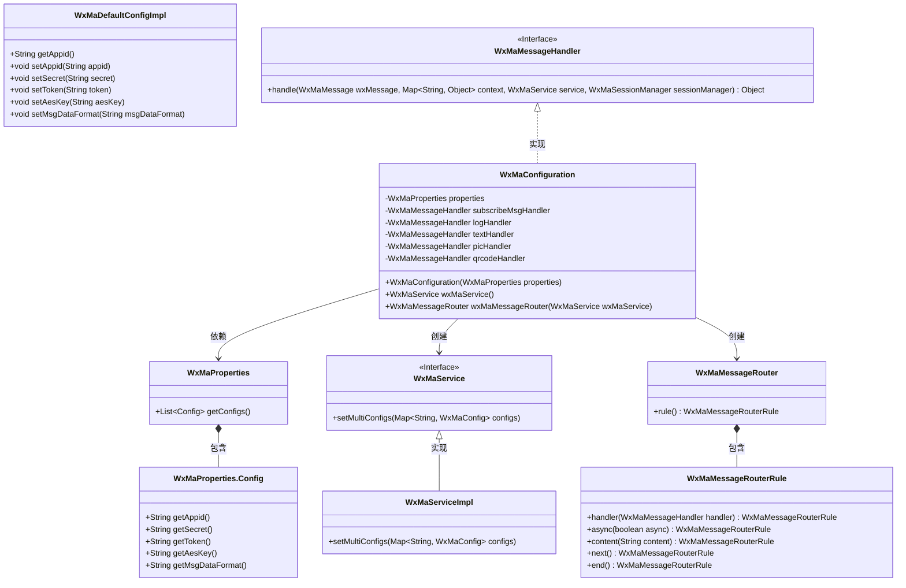
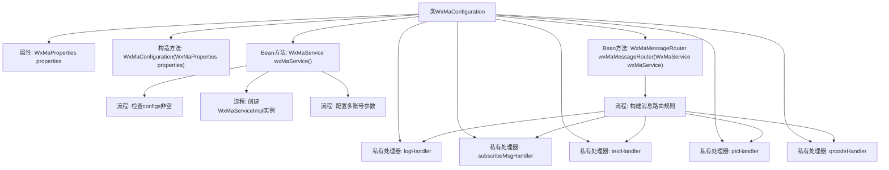

# 基础信息

|      |      |
|------|------|
| 名称 | WxMaConfiguration |
| 编码语言 | .java |
| 代码路径 | weixin-java-miniapp-demo/src/main/java/com/github/binarywang/demo/wx/miniapp/config/WxMaConfiguration.java |
| 包名 | com.github.binarywang.demo.wx.miniapp.config |
| 依赖项 | ['cn.binarywang.wx.miniapp.api.WxMaService', 'cn.binarywang.wx.miniapp.api.impl.WxMaServiceImpl', 'cn.binarywang.wx.miniapp.bean.WxMaKefuMessage', 'cn.binarywang.wx.miniapp.bean.WxMaSubscribeMessage', 'cn.binarywang.wx.miniapp.config.impl.WxMaDefaultConfigImpl', 'cn.binarywang.wx.miniapp.config.impl.WxMaRedisConfigImpl', 'cn.binarywang.wx.miniapp.message.WxMaMessageHandler', 'cn.binarywang.wx.miniapp.message.WxMaMessageRouter', 'com.google.common.collect.Lists', 'lombok.extern.slf4j.Slf4j', 'me.chanjar.weixin.common.bean.result.WxMediaUploadResult', 'me.chanjar.weixin.common.error.WxErrorException', 'me.chanjar.weixin.common.error.WxRuntimeException', 'org.springframework.beans.factory.annotation.Autowired', 'org.springframework.boot.context.properties.EnableConfigurationProperties', 'org.springframework.context.annotation.Bean', 'org.springframework.context.annotation.Configuration', 'redis.clients.jedis.JedisPool', 'java.io.File', 'java.util.List', 'java.util.stream.Collectors'] |
| 概述说明 | 微信小程序配置类，包含服务初始化和消息路由设置。通过WxMaProperties加载配置，创建WxMaService处理多账号，定义消息处理器处理订阅、文本、图片和二维码消息。 |

# 说明

这是一个微信小程序后端服务的配置类，主要功能包括初始化微信小程序服务和配置消息路由。类通过注解启用配置属性，并注入WxMaProperties来获取多账号配置。wxMaService方法检查配置有效性后，创建多账号的小程序服务实例。wxMaMessageRouter方法定义了消息处理规则，包括订阅消息、文本、图片和二维码等类型的处理逻辑。每个消息处理器实现了不同的业务逻辑，如发送客服消息、记录日志、上传媒体文件和生成二维码等。异常处理通过捕获WxErrorException实现。

# 类列表 Class Summary

| 名称   | 类型  | 说明 |
|-------|------|-------------|
| WxMaConfiguration | class | 微信小程序配置类，初始化服务及消息路由，处理订阅、文本、图片和二维码消息，包含日志记录和错误处理。 |

## 类 WxMaConfiguration

|      |      |
|------|------|
| 访问范围 | @Slf4j;@Configuration;@EnableConfigurationProperties(WxMaProperties.class);public |
| 类型 | class |
| 名称 | WxMaConfiguration |
| 说明 | 微信小程序配置类，初始化服务及消息路由，处理订阅、文本、图片和二维码消息，包含日志记录和错误处理。 |

### UML类图

这段代码是一个微信小程序的后端配置类，主要功能包括初始化微信小程序服务(WxMaService)和消息路由器(WxMaMessageRouter)。WxMaConfiguration类通过读取WxMaProperties中的配置信息，创建并配置WxMaServiceImpl实例，同时定义了多种消息处理器(WxMaMessageHandler)来处理不同类型的微信消息。类图展示了配置类与微信SDK核心类之间的关系，包括配置属性、服务实现、消息路由和处理器等组件，体现了微信小程序后端消息处理的基本架构。

### 内部方法调用关系图

该流程图展示了微信小程序配置类的核心结构。WxMaConfiguration类通过构造函数注入配置属性，提供两个关键Bean：wxMaService()负责初始化多账号服务并校验配置，wxMaMessageRouter()构建包含5种消息处理规则的路由链。私有处理器分别处理订阅消息、日志记录、文本/图片/二维码消息，形成完整的消息处理管道，其中图片和二维码处理器还涉及媒体文件上传操作。

### 字段列表 Field List

| 名称  | 类型  | 说明 |
|-------|-------|------|
| logHandler = (wxMessage, context, service, sessionManager) -> {        log.info("收到消息：" + wxMessage.toString());        service.getMsgService().sendKefuMsg(WxMaKefuMessage.newTextBuilder().content("收到信息为：" + wxMessage.toJson())            .toUser(wxMessage.getFromUser()).build());        return null;    } | WxMaMessageHandler | 定义微信小程序消息处理器，记录接收消息并自动回复用户消息内容。 |
| textHandler = (wxMessage, context, service, sessionManager) -> {        service.getMsgService().sendKefuMsg(WxMaKefuMessage.newTextBuilder().content("回复文本消息")            .toUser(wxMessage.getFromUser()).build());        return null;    } | WxMaMessageHandler | 微信小程序消息处理：文本消息自动回复客服消息，内容为"回复文本消息"，返回用户发送者。 |
| subscribeMsgHandler = (wxMessage, context, service, sessionManager) -> {        service.getMsgService().sendSubscribeMsg(WxMaSubscribeMessage.builder()            .templateId("此处更换为自己的模板id")            .data(Lists.newArrayList(                new WxMaSubscribeMessage.MsgData("keyword1", "339208499")))            .toUser(wxMessage.getFromUser())            .build());        return null;    } | WxMaMessageHandler | 微信小程序订阅消息处理器代码：使用模板ID发送订阅消息给用户，包含关键字和数据。 |
| picHandler = (wxMessage, context, service, sessionManager) -> {        try {            WxMediaUploadResult uploadResult = service.getMediaService()                .uploadMedia("image", "png",                    ClassLoader.getSystemResourceAsStream("tmp.png"));            service.getMsgService().sendKefuMsg(                WxMaKefuMessage                    .newImageBuilder()                    .mediaId(uploadResult.getMediaId())                    .toUser(wxMessage.getFromUser())                    .build());        } catch (WxErrorException e) {            e.printStackTrace();        }        return null;    } | WxMaMessageHandler | 定义微信小程序图片处理器，上传临时图片并发送客服消息给用户，异常时打印错误。 |
| properties | WxMaProperties | 私有不可变的微信小程序配置属性对象。 |
| qrcodeHandler = (wxMessage, context, service, sessionManager) -> {        try {            final File file = service.getQrcodeService().createQrcode("123", 430);            WxMediaUploadResult uploadResult = service.getMediaService().uploadMedia("image", file);            service.getMsgService().sendKefuMsg(                WxMaKefuMessage                    .newImageBuilder()                    .mediaId(uploadResult.getMediaId())                    .toUser(wxMessage.getFromUser())                    .build());        } catch (WxErrorException e) {            e.printStackTrace();        }        return null;    } | WxMaMessageHandler | 处理微信小程序消息，生成二维码并上传为图片，通过客服消息发送给用户。异常时打印错误。 |

### 方法列表

| 名称  | 类型  | 说明 |
|-------|-------|------|
| wxMaService | WxMaService | 创建微信小程序服务实例，检查配置后初始化多账号配置，包含appid、secret等参数，未配置则抛出异常。 |
| wxMaMessageRouter | WxMaMessageRouter | 创建微信小程序消息路由，配置处理订阅、文本、图片和二维码消息的同步处理器。 |

