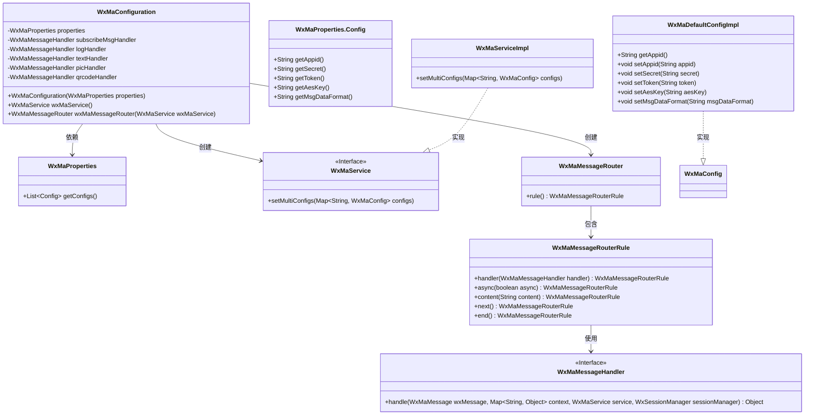
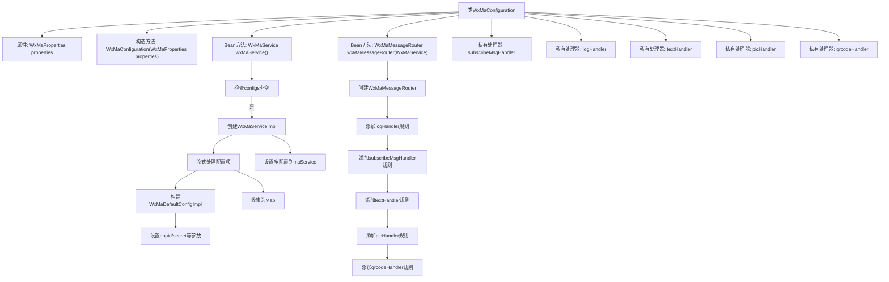
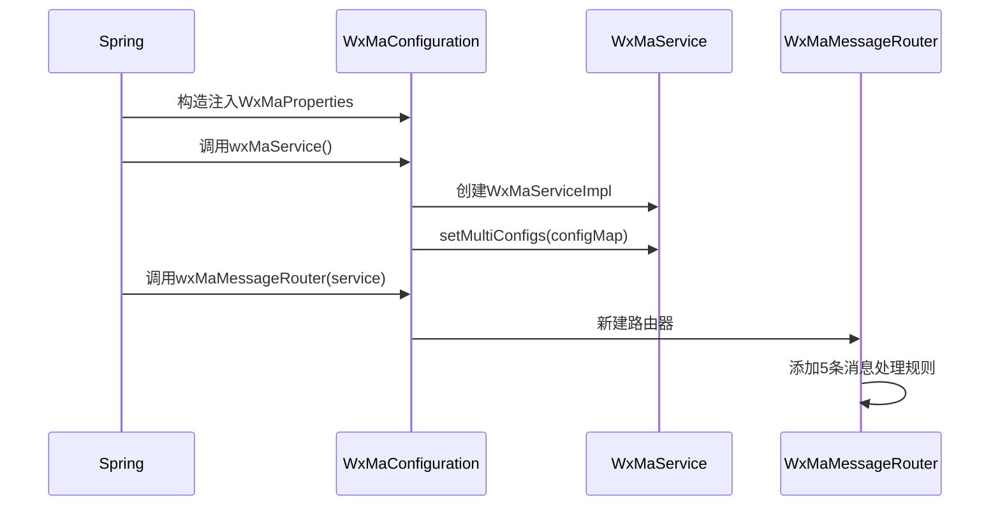

# 基础信息

|      |      |
|------|------|
| 名称 | WxMaConfiguration |
| 编码语言 | .java |
| 代码路径 | weixin-java-miniapp-demo/src/main/java/com/github/binarywang/demo/wx/miniapp/config/WxMaConfiguration.java |
| 包名 | com.github.binarywang.demo.wx.miniapp.config |
| 依赖项 | ['cn.binarywang.wx.miniapp.api.WxMaService', 'cn.binarywang.wx.miniapp.api.impl.WxMaServiceImpl', 'cn.binarywang.wx.miniapp.bean.WxMaKefuMessage', 'cn.binarywang.wx.miniapp.bean.WxMaSubscribeMessage', 'cn.binarywang.wx.miniapp.config.impl.WxMaDefaultConfigImpl', 'cn.binarywang.wx.miniapp.config.impl.WxMaRedisConfigImpl', 'cn.binarywang.wx.miniapp.message.WxMaMessageHandler', 'cn.binarywang.wx.miniapp.message.WxMaMessageRouter', 'com.google.common.collect.Lists', 'lombok.extern.slf4j.Slf4j', 'me.chanjar.weixin.common.bean.result.WxMediaUploadResult', 'me.chanjar.weixin.common.error.WxErrorException', 'me.chanjar.weixin.common.error.WxRuntimeException', 'org.springframework.beans.factory.annotation.Autowired', 'org.springframework.boot.context.properties.EnableConfigurationProperties', 'org.springframework.context.annotation.Bean', 'org.springframework.context.annotation.Configuration', 'redis.clients.jedis.JedisPool', 'java.io.File', 'java.util.List', 'java.util.stream.Collectors'] |
| 概述说明 | 这是一个微信小程序配置类，包含服务初始化和消息路由设置。通过WxMaProperties加载配置，创建WxMaService实例处理多账号配置。消息路由器定义了不同内容类型的处理逻辑，包括订阅消息、文本、图片和二维码的响应处理。 |

# 说明

这是一个微信小程序服务端的配置类，主要功能包括初始化微信小程序服务和配置消息路由。类通过构造函数注入配置属性，检查配置有效性后创建多账号的小程序服务实例。消息路由器定义了不同内容类型的处理规则，包括日志记录、订阅消息、文本、图片和二维码的处理器。每个处理器实现消息响应逻辑，例如发送客服消息、上传媒体文件或生成二维码。配置类确保服务启动时自动加载相关配置并初始化消息处理机制。

# 类列表 Class Summary

| 名称   | 类型  | 说明 |
|-------|------|-------------|
| WxMaConfiguration | class | 微信小程序配置类，初始化服务并设置消息路由规则，处理订阅、文本、图片和二维码消息。 |

## 类 WxMaConfiguration

|      |      |
|------|------|
| 访问范围 | @Slf4j;@Configuration;@EnableConfigurationProperties(WxMaProperties.class);public |
| 类型 | class |
| 名称 | WxMaConfiguration |
| 说明 | 微信小程序配置类，初始化服务并设置消息路由规则，处理订阅、文本、图片和二维码消息。 |

### UML类图

该代码是一个微信小程序后端配置类，主要功能包括初始化微信小程序服务(WxMaService)和消息路由器(WxMaMessageRouter)。WxMaConfiguration通过@Configuration注解标记为Spring配置类，依赖WxMaProperties获取配置参数。wxMaService()方法创建多账号配置的小程序服务实例，wxMaMessageRouter()方法构建消息处理路由规则，包含日志记录、订阅消息、文本/图片/二维码等多种消息处理器。类图展示了核心组件及其关系，包括配置类、服务接口、消息处理器等，体现了Spring Boot环境下微信小程序后端服务的典型架构。

### 内部方法调用关系图

该流程图展示了微信小程序配置类的核心结构，包含两个Bean初始化流程：wxMaService()会验证配置并构建多账号服务实例，wxMaMessageRouter()则创建带有多级处理规则的消息路由器。时序图描述了Spring容器如何初始化这些组件，以及配置类如何组装WxMaService和消息路由器的完整过程。私有处理器通过lambda实现不同类型的消息处理逻辑，包括日志记录、订阅消息响应和多媒体消息回复等场景。

### 字段列表 Field List

| 名称  | 类型  | 说明 |
|-------|-------|------|
| properties | WxMaProperties | 私有不可变的微信小程序配置属性对象。 |
| textHandler = (wxMessage, context, service, sessionManager) -> {        service.getMsgService().sendKefuMsg(WxMaKefuMessage.newTextBuilder().content("回复文本消息")            .toUser(wxMessage.getFromUser()).build());        return null;    } | WxMaMessageHandler | 微信小程序文本消息处理：收到用户消息后自动回复固定文本内容，通过客服接口发送给用户。 |
| logHandler = (wxMessage, context, service, sessionManager) -> {        log.info("收到消息：" + wxMessage.toString());        service.getMsgService().sendKefuMsg(WxMaKefuMessage.newTextBuilder().content("收到信息为：" + wxMessage.toJson())            .toUser(wxMessage.getFromUser()).build());        return null;    } | WxMaMessageHandler | 定义微信小程序消息处理逻辑：记录接收消息并自动回复用户原始消息内容。 |
| subscribeMsgHandler = (wxMessage, context, service, sessionManager) -> {        service.getMsgService().sendSubscribeMsg(WxMaSubscribeMessage.builder()            .templateId("此处更换为自己的模板id")            .data(Lists.newArrayList(                new WxMaSubscribeMessage.MsgData("keyword1", "339208499")))            .toUser(wxMessage.getFromUser())            .build());        return null;    } | WxMaMessageHandler | 微信小程序订阅消息处理器，使用指定模板ID和关键词数据向用户发送订阅消息。 |
| picHandler = (wxMessage, context, service, sessionManager) -> {        try {            WxMediaUploadResult uploadResult = service.getMediaService()                .uploadMedia("image", "png",                    ClassLoader.getSystemResourceAsStream("tmp.png"));            service.getMsgService().sendKefuMsg(                WxMaKefuMessage                    .newImageBuilder()                    .mediaId(uploadResult.getMediaId())                    .toUser(wxMessage.getFromUser())                    .build());        } catch (WxErrorException e) {            e.printStackTrace();        }        return null;    } | WxMaMessageHandler | 微信小程序消息处理器，上传图片并发送客服消息，异常时打印错误。 |
| qrcodeHandler = (wxMessage, context, service, sessionManager) -> {        try {            final File file = service.getQrcodeService().createQrcode("123", 430);            WxMediaUploadResult uploadResult = service.getMediaService().uploadMedia("image", file);            service.getMsgService().sendKefuMsg(                WxMaKefuMessage                    .newImageBuilder()                    .mediaId(uploadResult.getMediaId())                    .toUser(wxMessage.getFromUser())                    .build());        } catch (WxErrorException e) {            e.printStackTrace();        }        return null;    } | WxMaMessageHandler | 微信小程序消息处理器，接收消息后生成二维码图片并上传，通过客服消息接口返回给用户。异常时打印错误日志。 |

### 方法列表

| 名称  | 类型  | 说明 |
|-------|-------|------|
| wxMaService | WxMaService | 创建微信小程序服务实例，检查配置后初始化多账号配置，包括appid、密钥等参数，配置缺失则抛出异常提示。 |
| wxMaMessageRouter | WxMaMessageRouter | 创建微信小程序消息路由，配置处理订阅、文本、图片和二维码消息的处理器，并设置同步处理模式。 |

